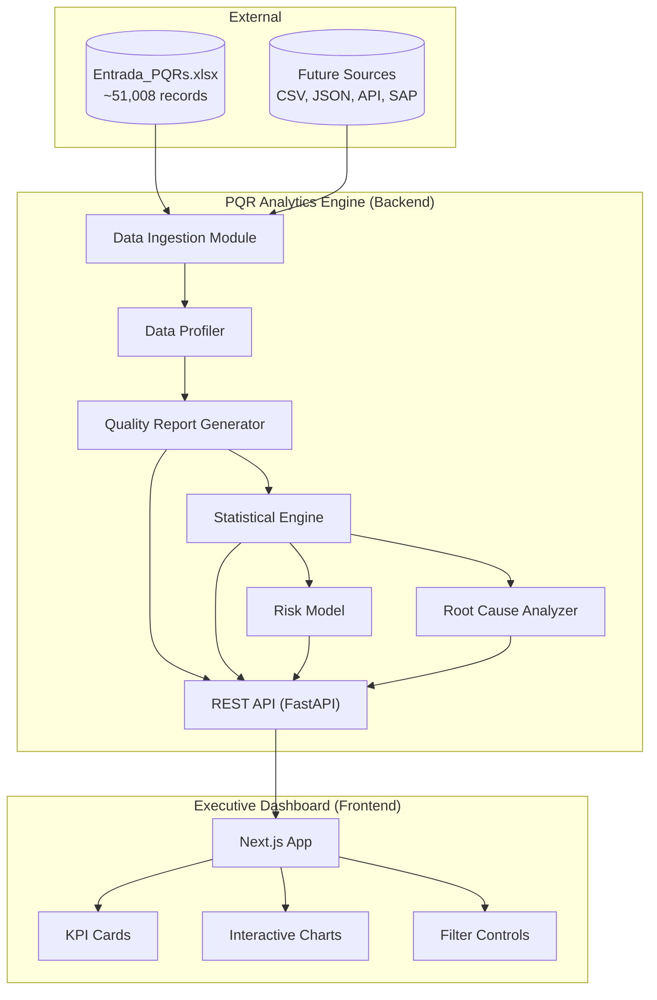
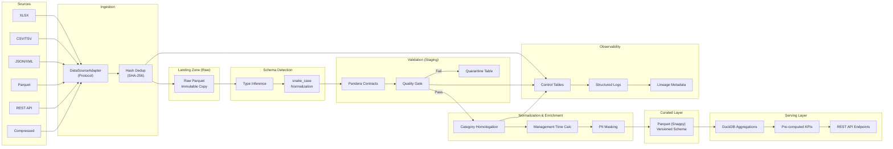

# Design Document: PQR Analytics Engine

## Overview

The PQR Analytics Engine is a data-intensive analytical platform that transforms raw PQR (Peticiones, Quejas y Reclamos) records from a natural gas utility into actionable operational insights. The system implements a multi-stage data pipeline: Excel ingestion → schema profiling → quality assessment → statistical analysis → risk modeling → root cause analysis → executive dashboard visualization.

The architecture follows a layered approach separating concerns between data processing (Python backend) and visualization (Next.js frontend), connected via a REST API serving pre-aggregated, anonymized indicators.

### Key Design Decisions

1. **Polars over Pandas**: Polars provides lazy evaluation, multi-threaded execution, and Apache Arrow memory format — critical for processing ~51K records efficiently with type-safe operations.
2. **DuckDB for analytical queries**: Enables SQL-based cross-dataset aggregation without a heavy database server, operating directly on Parquet files.
3. **Layered data architecture (Raw → Staging → Validated → Curated → Serving)**: Provides clear data lineage, quality gates, and separation of concerns at each transformation stage.
4. **Pre-aggregated API pattern**: The frontend never accesses row-level data — all API responses are aggregated metrics representing groups of ≥5 records, ensuring privacy by design.
5. **Mermaid for process diagrams**: Keeps BPMN diagrams version-controllable as text, avoiding binary diagram files.

## Architecture

### System Context Diagram



### Data Pipeline Architecture



### Data Layer Definitions

| Layer | Purpose | Format | Retention | Access |
|-------|---------|--------|-----------|--------|
| **Raw** | Immutable copy of source files | Original format + Parquet mirror | Indefinite | Pipeline only |
| **Staging** | Schema-detected, type-inferred intermediate | Parquet | 30 days | Pipeline only |
| **Validated** | Pandera-contract-passing records | Parquet | 90 days | Pipeline + Debug |
| **Curated** | Normalized, enriched, PII-masked | Parquet (Snappy) | Indefinite | API + Analytics |
| **Serving** | Pre-aggregated KPIs and chart data | DuckDB views + JSON cache | Refreshed per run | API public |

## Components and Interfaces

### Backend Components (Python)

#### 1. DataSourceAdapter Protocol

```python
from typing import Protocol, runtime_checkable
import polars as pl

@runtime_checkable
class DataSourceAdapter(Protocol):
    """Protocol interface for multi-source ingestion."""
    
    def detect(self, source: str | Path) -> bool:
        """Determine if this adapter can handle the given source."""
        ...
    
    def read(self, source: str | Path) -> pl.DataFrame:
        """Read the source and return a Polars DataFrame."""
        ...
    
    def metadata(self, source: str | Path) -> dict:
        """Extract metadata: file hash, record count, schema info."""
        ...
    
    def validate(self, source: str | Path) -> ValidationResult:
        """Validate source accessibility and basic structure."""
        ...
    
    def close(self, source: str | Path) -> None:
        """Release any resources held for the source."""
        ...
```

#### 2. ExcelIngestionAdapter

```python
class ExcelIngestionAdapter:
    """Concrete adapter for XLSX/XLS files using Polars."""
    
    def read(self, source: Path) -> dict[str, pl.DataFrame]:
        """Read all sheets, standardize column names to snake_case."""
        ...
    
    def standardize_columns(self, df: pl.DataFrame) -> pl.DataFrame:
        """Convert column names: strip whitespace, lowercase, replace 
        spaces/special chars with underscores."""
        ...
    
    def verify_integrity(
        self, source_counts: dict[str, int], output_counts: dict[str, int]
    ) -> IntegrityReport:
        """Verify zero record/column loss during ingestion."""
        ...
```

#### 3. DataProfiler

```python
class DataProfiler:
    """Performs comprehensive data profiling on ingested DataFrames."""
    
    def infer_types(self, df: pl.DataFrame) -> dict[str, ColumnTypeInfo]:
        """Infer semantic data type per column (categorical, numeric, 
        datetime, boolean, text, mixed). Threshold: 80% non-null match."""
        ...
    
    def detect_outliers_iqr(self, series: pl.Series) -> OutlierReport:
        """IQR-based outlier detection: Q1-1.5*IQR to Q3+1.5*IQR."""
        ...
    
    def find_duplicates(self, df: pl.DataFrame, id_col: str) -> DuplicateReport:
        """Identify duplicate records by PQR identifier."""
        ...
    
    def find_semantic_similarities(
        self, categories: list[str], threshold: float = 0.85
    ) -> list[list[str]]:
        """Group semantically similar categories using string similarity."""
        ...
    
    def calculate_null_stats(self, df: pl.DataFrame) -> dict[str, NullStats]:
        """Compute null count and percentage per column."""
        ...
    
    def validate_dates(self, series: pl.Series) -> DateValidationReport:
        """Validate date values against recognized formats."""
        ...
```

#### 4. QualityReportGenerator

```python
class QualityReportGenerator:
    """Generates structured quality reports with privacy guarantees."""
    
    def generate_report(self, profile: ProfileResult) -> QualityReport:
        """Produce column-level and dataset-level quality metrics."""
        ...
    
    def compute_quality_score(self, df: pl.DataFrame) -> QualityScore:
        """Compute weighted composite DQS across 6 dimensions."""
        ...
    
    def export_json(self, report: QualityReport, path: Path) -> None:
        """Export to JSON with metadata header."""
        ...
    
    def export_parquet(self, report: QualityReport, path: Path) -> None:
        """Export to Parquet with metadata header."""
        ...
    
    def flag_severity(self, null_pct: float) -> Severity:
        """high: >20%, medium: 5-20%, low: <5%."""
        ...
```

#### 5. StatisticalEngine

```python
class StatisticalEngine:
    """Computes descriptive stats, conditional probabilities, and tests."""
    
    def descriptive_stats(self, series: pl.Series) -> DescriptiveStats:
        """mean, median, mode, variance, std, Q1-Q3, P90, P95, IQR."""
        ...
    
    def conditional_probability(
        self, df: pl.DataFrame, target_col: str, 
        target_condition: Callable, group_col: str
    ) -> dict[str, ConditionalProbResult]:
        """P(target_condition | group) with confidence flags for n<30."""
        ...
    
    def pareto_analysis(self, df: pl.DataFrame, col: str) -> ParetoResult:
        """Identify minimum set of values accounting for 80% volume."""
        ...
    
    def wilson_confidence_interval(
        self, successes: int, total: int, confidence: float = 0.95
    ) -> tuple[float, float]:
        """Wilson score interval for proportion estimates."""
        ...
    
    def chi_square_test(self, contingency: pl.DataFrame) -> TestResult:
        """Chi-square test for comparing >2 groups."""
        ...
    
    def two_proportion_z_test(
        self, n1: int, p1: float, n2: int, p2: float
    ) -> TestResult:
        """Z-test for comparing exactly 2 proportions."""
        ...
```

#### 6. RiskModel

```python
class RiskModel:
    """Explainable risk model for P90 exceedance prediction."""
    
    def prepare_features(self, df: pl.DataFrame) -> pl.DataFrame:
        """Select creation-time features only, exclude leakage fields."""
        ...
    
    def train(
        self, X: pl.DataFrame, y: pl.Series, 
        test_size: float = 0.25, random_seed: int = 42
    ) -> ModelResult:
        """Train logistic regression or decision tree (max_depth=4)."""
        ...
    
    def evaluate(self, model: Any, X_test: pl.DataFrame, y_test: pl.Series) -> Metrics:
        """Compute precision, recall, F1, ROC-AUC, confusion matrix."""
        ...
    
    def feature_importance(self, model: Any) -> list[FeatureImportance]:
        """Extract and rank feature contributions."""
        ...
    
    def check_class_imbalance(self, y: pl.Series) -> bool:
        """Return True if imbalance exceeds 80/20 ratio."""
        ...
```

#### 7. RootCauseAnalyzer

```python
class RootCauseAnalyzer:
    """Structured root cause analysis with multiple methodologies."""
    
    def identify_main_cause(self, df: pl.DataFrame) -> MainCauseResult:
        """Confirm main cause via Pareto ranking (≥45% share)."""
        ...
    
    def pareto_chart_data(self, df: pl.DataFrame, col: str) -> ParetoChartData:
        """Produce ranked cause table with cumulative percentages."""
        ...
    
    def sipoc(self, main_cause: str) -> SIPOCDiagram:
        """Generate SIPOC: Suppliers, Inputs, Process, Outputs, Customers."""
        ...
    
    def five_whys(self, main_cause: str) -> list[WhyLevel]:
        """Apply 5 Whys with ≥5 levels of causal depth."""
        ...
    
    def ishikawa(self, main_cause: str) -> IshikawaDiagram:
        """Ishikawa categories: People, Process, Tech, Info, Environment."""
        ...
    
    def fmea(self, failure_modes: list[FailureMode]) -> FMEAResult:
        """Simplified FMEA: Severity(1-5), Occurrence(1-5), Detection(1-5)."""
        ...
    
    def generate_bpmn_as_is(self) -> str:
        """Mermaid-compatible BPMN for current process."""
        ...
    
    def generate_bpmn_to_be(self) -> str:
        """Mermaid-compatible BPMN for proposed improved process."""
        ...
    
    def automation_opportunity(self, main_cause_data: pl.DataFrame) -> AutomationAssessment:
        """Quantify automation potential: % eliminable, time reduction, STP volume."""
        ...
```

#### 8. PipelineOrchestrator

```python
class PipelineOrchestrator:
    """Coordinates the full data pipeline execution."""
    
    def run(self, source: Path, config: PipelineConfig) -> PipelineResult:
        """Execute full pipeline: ingest → profile → validate → enrich → serve."""
        ...
    
    def compute_file_hash(self, path: Path) -> str:
        """SHA-256 hash for idempotent processing."""
        ...
    
    def is_already_processed(self, file_hash: str) -> bool:
        """Check control table for previously processed hash."""
        ...
    
    def retry_with_backoff(
        self, operation: Callable, max_retries: int = 3, base_wait: float = 2.0
    ) -> Any:
        """Exponential backoff: 2s base, max 30s wait, max 3 retries."""
        ...
    
    def quarantine_record(self, record: dict, rule_id: str, reason: str) -> None:
        """Isolate failed record to quarantine table."""
        ...
    
    def update_control_table(self, batch: IngestionBatch) -> None:
        """Track: timestamp, hash, counts (ingested/validated/quarantined), duration."""
        ...
```

#### 9. REST API (FastAPI)

```python
# api/routes.py
@router.get("/api/kpis")
async def get_kpis(filters: FilterParams = Depends()) -> KPIResponse:
    """Return pre-aggregated KPI values, filtered if params present."""
    ...

@router.get("/api/charts/{chart_type}")
async def get_chart_data(
    chart_type: ChartType, filters: FilterParams = Depends()
) -> ChartDataResponse:
    """Return chart data for specified visualization type."""
    ...

@router.get("/api/filters/options")
async def get_filter_options() -> FilterOptionsResponse:
    """Return available filter values from dataset."""
    ...

@router.get("/api/quality/report")
async def get_quality_report() -> QualityReportResponse:
    """Return quality report metrics (aggregated only)."""
    ...

@router.get("/api/risk/model")
async def get_risk_model_results() -> RiskModelResponse:
    """Return model metrics, feature importance, predictions summary."""
    ...

@router.get("/api/rca/findings")
async def get_rca_findings() -> RCAResponse:
    """Return root cause analysis findings and diagrams."""
    ...
```

### Frontend Components (Next.js + TypeScript)

#### Component Architecture

```
app/
├── layout.tsx                    # Root layout with sidebar navigation
├── page.tsx                      # Dashboard home (KPIs + overview)
├── api/                          # API route proxies (optional BFF)
├── components/
│   ├── kpi/
│   │   ├── KPICard.tsx           # Individual KPI display card
│   │   ├── KPIGrid.tsx           # Grid layout for all KPI cards
│   │   └── KPILoadingSkeleton.tsx
│   ├── charts/
│   │   ├── ParetoChart.tsx       # Pareto with cumulative line
│   │   ├── TopCausesBar.tsx      # Top 10 horizontal bar
│   │   ├── CancellationDonut.tsx # Donut chart
│   │   ├── DistributionBar.tsx   # Company/channel/result bars
│   │   ├── TemporalTrend.tsx     # Line chart with granularity toggle
│   │   ├── ManagementTimeBox.tsx # Box plot by cause
│   │   ├── OverallBoxPlot.tsx    # Overall management time boxplot
│   │   ├── P90ByCauseBar.tsx     # P90 bar chart
│   │   ├── CauseChannelHeatmap.tsx
│   │   ├── OpenCasesHistogram.tsx
│   │   ├── QualityByFieldBar.tsx # Stacked completeness bar
│   │   ├── AnomalyMatrix.tsx     # Deviation heatmap
│   │   └── FindingsTable.tsx     # Executive findings summary
│   ├── filters/
│   │   ├── FilterPanel.tsx       # Collapsible filter sidebar
│   │   ├── DateRangePicker.tsx
│   │   ├── MultiSelect.tsx       # Reusable multi-select dropdown
│   │   ├── RangeSlider.tsx       # Numeric range slider
│   │   └── ActiveFilters.tsx     # Active filter pills + clear all
│   ├── layout/
│   │   ├── Sidebar.tsx
│   │   ├── Header.tsx
│   │   └── ErrorBoundary.tsx
│   └── shared/
│       ├── ChartWrapper.tsx      # Loading/error/empty state wrapper
│       ├── Tooltip.tsx
│       └── EmptyState.tsx
├── hooks/
│   ├── useKPIs.ts                # KPI data fetching + caching
│   ├── useChartData.ts           # Chart data with filter params
│   ├── useFilters.ts             # Filter state management
│   └── useFilterOptions.ts       # Filter option fetching
├── lib/
│   ├── api-client.ts             # Typed API client with retry
│   ├── types.ts                  # Shared TypeScript interfaces
│   └── utils.ts                  # Formatting, number display
└── styles/
    └── globals.css               # Tailwind base + custom tokens
```

#### Key TypeScript Interfaces

```typescript
// lib/types.ts

interface KPIData {
  totalPqr: number;
  closedPqr: number;
  inProcessPqr: number;
  percentageClosed: number;
  avgManagementTime: number;
  medianManagementTime: number;
  p90ManagementTime: number;
  p95ManagementTime: number;
  maxManagementTime: number;
  distinctCausesCount: number;
  mainCauseSharePct: number;
  qualityIssuesPct: number;
  dataQualityScore: number;
}

interface FilterParams {
  dateRange?: { start: string; end: string };
  companies?: string[];
  causes?: string[];
  channels?: string[];
  statuses?: string[];
  results?: string[];
  responsibleUnits?: string[];
  managementTimeRange?: { min: number; max: number };
}

interface ChartDataResponse {
  chartType: string;
  data: Record<string, unknown>[];
  metadata: { recordCount: number; lastUpdated: string };
}

interface FilterOptions {
  companies: string[];
  causes: string[];
  channels: string[];
  statuses: string[];
  results: string[];
  responsibleUnits: string[];
  managementTimeMax: number;
}

type Severity = 'critical' | 'high' | 'medium' | 'low';

interface Finding {
  description: string;
  affectedMetric: string;
  severity: Severity;
  recommendedAction: string;
}
```

## Data Models

### Core Data Schema (Curated Layer)

```python
import pandera.polars as pa
import polars as pl

class PQRSchema(pa.DataFrameModel):
    """Pandera schema contract for curated PQR records."""
    
    id_pqr: int = pa.Field(unique=True, nullable=False, description="Unique PQR identifier")
    fecha_creacion: pl.Date = pa.Field(nullable=False, ge=pl.date(2020, 1, 1))
    fecha_cierre: pl.Date = pa.Field(nullable=True)
    estado: str = pa.Field(isin=["cerrado", "en_proceso", "abierto"], nullable=False)
    causa: str = pa.Field(nullable=False)
    canal_atencion: str = pa.Field(nullable=False)
    empresa: str = pa.Field(nullable=False)
    resultado: str = pa.Field(nullable=True)
    unidad_responsable: str = pa.Field(nullable=True)
    marcacion: str = pa.Field(nullable=True)
    motivo_cierre: str = pa.Field(nullable=True)
    tiempo_gestion_dias: float = pa.Field(ge=0, nullable=True, description="Days from creation to closure")
    tipo_pqr: str = pa.Field(isin=["peticion", "queja", "reclamo"], nullable=False)
    
    class Config:
        strict = False  # Allow additional columns from source
        coerce = True   # Auto-coerce types where safe
```

### Quality Report Data Model

```python
from dataclasses import dataclass, field
from datetime import datetime
from enum import Enum

class SeverityLevel(Enum):
    CRITICAL = "critical"  # >20% violations
    HIGH = "high"          # >10-20% violations
    MEDIUM = "medium"      # >5-10% violations
    LOW = "low"            # ≤5% violations

@dataclass
class ColumnQualityMetric:
    column_name: str
    data_type: str
    null_count: int
    null_percentage: float
    unique_count: int
    outlier_count: int
    invalid_date_count: int
    semantic_similarity_groups: list[list[str]]
    severity: SeverityLevel | None

@dataclass
class DatasetMetrics:
    total_record_count: int
    total_column_count: int
    overall_completeness_pct: float
    overall_validity_pct: float
    duplication_rate: float

@dataclass
class QualityScore:
    completeness: float      # 25% weight
    validity: float          # 20% weight
    consistency: float       # 20% weight
    uniqueness: float        # 15% weight
    timeliness: float        # 10% weight
    referential_integrity: float  # 10% weight
    composite_score: float   # Weighted sum

@dataclass
class QualityReport:
    generation_timestamp: datetime
    source_record_count: int
    schema_version: str
    columns: list[ColumnQualityMetric]
    dataset_metrics: DatasetMetrics
    quality_score: QualityScore
    errors: list[dict] = field(default_factory=list)
```

### Pipeline Control Table Schema

```python
@dataclass
class IngestionBatch:
    batch_id: str
    ingestion_timestamp: datetime
    source_file_path: str
    source_file_hash: str  # SHA-256
    records_ingested: int
    records_validated: int
    records_quarantined: int
    records_rejected: int
    processing_duration_seconds: float
    status: str  # "completed", "failed", "partial"
```

### Schema Catalog Entry

```python
@dataclass
class SchemaCatalogEntry:
    dataset_id: str
    version: int
    columns: list[dict]  # [{name, type, description, nullable}]
    file_hash: str  # SHA-256
    source_file: str
    transformation_steps: list[str]
    created_at: datetime
    lineage: dict  # {parent_dataset, transformations applied}
```

### API Response Models (Pydantic)

```python
from pydantic import BaseModel

class KPIResponse(BaseModel):
    total_pqr: int
    closed_pqr: int
    in_process_pqr: int
    percentage_closed: float
    avg_management_time: float
    median_management_time: float
    p90_management_time: float
    p95_management_time: float
    max_management_time: float
    distinct_causes_count: int
    main_cause_share_pct: float
    quality_issues_pct: float
    data_quality_score: float
    record_count: int  # For filter context
    last_updated: str

class FilterOptionsResponse(BaseModel):
    companies: list[str]
    causes: list[str]
    channels: list[str]
    statuses: list[str]
    results: list[str]
    responsible_units: list[str]
    management_time_max: float
```


## Correctness Properties

*A property is a characteristic or behavior that should hold true across all valid executions of a system — essentially, a formal statement about what the system should do. Properties serve as the bridge between human-readable specifications and machine-verifiable correctness guarantees.*

### Property 1: snake_case Standardization

*For any* input column name string (with arbitrary spaces, special characters, mixed-case, leading/trailing whitespace), the `standardize_columns` function SHALL produce an output that: (a) contains only lowercase letters, digits, and underscores, (b) does not start or end with an underscore, (c) contains no consecutive underscores, and (d) is non-empty.

**Validates: Requirements 1.2**

### Property 2: Record and Column Count Preservation

*For any* valid DataFrame with N rows and M columns passed through the ingestion pipeline (schema detection + column standardization + type coercion), the output DataFrame SHALL have exactly N rows and M columns.

**Validates: Requirements 1.3**

### Property 3: Data Type Inference Threshold

*For any* column of values where a single data type accounts for at least 80% of non-null values, the `infer_types` function SHALL classify that column as that type. Conversely, for any column where no single type reaches 80% of non-null values, the function SHALL classify the column as "mixed" and report the percentage breakdown of each detected type.

**Validates: Requirements 2.1, 2.7**

### Property 4: IQR Outlier Detection Correctness

*For any* numeric series, the `detect_outliers_iqr` function SHALL flag a value as an outlier if and only if it is below Q1 − 1.5×IQR or above Q3 + 1.5×IQR, where Q1 and Q3 are the 25th and 75th percentiles and IQR = Q3 − Q1. The reported outlier count SHALL equal the number of values satisfying this condition.

**Validates: Requirements 2.3, 8.4**

### Property 5: Null Statistics Accuracy

*For any* DataFrame, the `calculate_null_stats` function SHALL report for each column a null_count equal to the actual number of null/None/NaN values in that column, and a null_percentage equal to null_count / total_rows × 100.

**Validates: Requirements 2.4**

### Property 6: Duplicate Detection Correctness

*For any* DataFrame with an identifier column, the `find_duplicates` function SHALL report as duplicates exactly those records where the identifier value appears more than once, and the duplication count SHALL equal total_records − distinct_identifiers.

**Validates: Requirements 2.5, 10.7**

### Property 7: Semantic Similarity Grouping Threshold

*For any* pair of category strings, if their normalized string similarity score (Levenshtein ratio) is ≥ 0.85, they SHALL appear in the same similarity group. If their score is < 0.85, they SHALL NOT appear in the same group.

**Validates: Requirements 2.6**

### Property 8: Quality Report Serialization Round-Trip

*For any* valid QualityReport object, serializing to JSON and deserializing back SHALL produce an equivalent object with all fields preserved (generation_timestamp, source_record_count, schema_version, column metrics, dataset metrics, quality score, errors).

**Validates: Requirements 3.2**

### Property 9: Severity Classification Thresholds

*For any* column with null_percentage > 20%, the severity SHALL be "critical" (per quality rule violations) or "high" (per column flagging). For null_percentage in (5%, 20%], severity SHALL be "medium". For null_percentage ≤ 5%, severity SHALL be "low". More generally for quality rule violations: >20% → critical, >10–20% → high, >5–10% → medium, ≤5% → low.

**Validates: Requirements 3.5, 3.7, 10.2**

### Property 10: Privacy Invariant — No Row-Level Data in Exports

*For any* quality report export, API response, or dashboard data payload, the output SHALL contain only aggregated metrics where each data point represents a group of at least 5 records. No individual PQR record values, row-level data, or field combinations capable of identifying a single record SHALL be present.

**Validates: Requirements 3.4, 5.4, 13.2**

### Property 11: KPI Value Formatting

*For any* numeric KPI value, time-based KPIs SHALL be formatted as a number with exactly one decimal place followed by " días", and percentage-based KPIs SHALL be formatted as a number with exactly one decimal place followed by "%".

**Validates: Requirements 5.1**

### Property 12: Data Quality Score Computation

*For any* set of six dimension sub-scores (each in [0, 100]), the composite Data Quality Score SHALL equal: 0.25×completeness + 0.20×validity + 0.20×consistency + 0.15×uniqueness + 0.10×timeliness + 0.10×referential_integrity, and the result SHALL always be in the range [0, 100].

**Validates: Requirements 5.5, 10.1, 10.3**

### Property 13: Filter AND Logic

*For any* combination of active filters applied simultaneously, every record in the filtered result set SHALL satisfy ALL active filter conditions. Conversely, every record excluded from the result set SHALL fail at least one active filter condition.

**Validates: Requirements 7.2**

### Property 14: Conditional Probability with Null Exclusion

*For any* DataFrame, target condition, and grouping column: (a) records with null values in the grouping column SHALL be excluded from the calculation, (b) the conditional probability P(target | group=g) SHALL equal count(target ∧ group=g) / count(group=g) computed only over non-null rows, (c) groups with fewer than 30 records SHALL be flagged as low confidence with sample size reported.

**Validates: Requirements 8.1, 8.2, 8.9**

### Property 15: Pareto Minimum Set ≥ 80%

*For any* categorical frequency distribution, the Pareto analysis SHALL return the minimum set of categories whose cumulative frequency accounts for at least 80% of total volume, ranked in descending order of frequency. Removing any single category from the set SHALL cause the cumulative share to drop below 80%.

**Validates: Requirements 8.5**

### Property 16: Wilson Confidence Interval Correctness

*For any* pair (successes, total) where 0 ≤ successes ≤ total and total > 0, the Wilson score interval at 95% confidence SHALL produce bounds (lower, upper) such that: lower ≤ successes/total ≤ upper, 0 ≤ lower, upper ≤ 1, and lower ≤ upper.

**Validates: Requirements 8.6**

### Property 17: Statistical Finding Labeling

*For any* statistical finding description generated by the Statistical_Engine, the text SHALL NOT contain the terms "causes", "leads to", or "results in" when describing statistical relationships, and SHALL use "association" or "correlation" instead.

**Validates: Requirements 8.7**

### Property 18: Stratified Split Reproducibility

*For any* dataset and fixed random seed, repeated calls to the train/test split function SHALL produce identical train and test sets. The class distribution ratio in both train and test sets SHALL be within ±2 percentage points of the overall dataset class ratio.

**Validates: Requirements 9.2**

### Property 19: Class Imbalance Detection and Handling

*For any* binary target series where the minority class represents less than 20% of records, the `check_class_imbalance` function SHALL return True, and the model training SHALL apply class_weight="balanced" or equivalent resampling.

**Validates: Requirements 9.9**

### Property 20: Consistency Contradiction Detection

*For any* PQR record, the consistency checker SHALL detect and flag the following contradictions: (a) status="cerrado" with null fecha_cierre, (b) resultado="accede" with tiempo_gestion_dias=0, (c) fecha_cierre < fecha_creacion. Every record with one or more contradictions SHALL be counted in the consistency violation total.

**Validates: Requirements 10.6**

### Property 21: Timeliness Date Range Validation

*For any* date value in the fecha_creacion field, the timeliness checker SHALL flag it as a violation if and only if it falls before 2020-01-01 or after the current processing date.

**Validates: Requirements 10.8**

### Property 22: Referential Integrity Catalog Check

*For any* categorical value in a field with a defined domain catalog, the referential integrity checker SHALL flag it as a violation if and only if the value does not appear in the catalog's list of valid entries.

**Validates: Requirements 10.9**

### Property 23: FMEA Risk Priority Number Computation

*For any* failure mode with Severity (S), Occurrence (O), and Detection (D) ratings each in [1, 5], the Risk Priority Number SHALL equal S × O × D, and the result SHALL be in the range [1, 125].

**Validates: Requirements 11.3**

### Property 24: PII Masking Transformation

*For any* string identified as PII with length ≥ 3, masking SHALL preserve the first and last characters and replace all middle characters with asterisks. For strings with length < 3, the full value SHALL be hashed using SHA-256. The masked output SHALL never equal the original input for strings of length ≥ 2.

**Validates: Requirements 13.5, 13.7**

### Property 25: Synthetic Data Distribution Fidelity

*For any* generated synthetic dataset, the category frequency distribution for each categorical column SHALL be within ±10% relative error of the original dataset's distribution, and the mean of each numeric column SHALL be within ±10% relative error of the original dataset's mean.

**Validates: Requirements 13.3**

## Error Handling

### Backend Error Strategy

| Error Category | Handling Approach | User Impact |
|---------------|-------------------|-------------|
| **Source file missing/unreadable** | Raise descriptive error with path + failure type within 5s | Pipeline halts, error logged |
| **Empty sheet** | Log warning with sheet name, skip, continue processing others | No impact on valid sheets |
| **Type inference failure** | Mark column as "mixed", include in errors section of report | Report generated with partial coverage |
| **All columns fail profiling** | Return error indication, no partial report file created | Clear error message to user |
| **Pandera validation failure** | Quarantine record with rule ID + timestamp, continue pipeline | Valid records processed normally |
| **PII masking failure** | Quarantine record, log field name + reason, exclude from output | Record never reaches export/visualization |
| **Transient source access failure** | Retry with exponential backoff (2s base, max 3 retries, max 30s) | Transparent to user if retries succeed |
| **All retries exhausted** | Log failure with source ID + error, mark batch as failed | Batch reported as failed in control table |
| **Duplicate file hash detected** | Skip re-processing, return previous result | Idempotent — no duplicate work |
| **Low confidence group (n<30)** | Flag in output, include sample size, compute anyway | Result shown with confidence warning |
| **ROC-AUC below 0.60** | Document limitation, suggest feature engineering improvements | Model output labeled with limitation |

### Frontend Error Strategy

| Error Category | Handling Approach | User Impact |
|---------------|-------------------|-------------|
| **API timeout (>10s)** | Show error indicator on affected cards, preserve previous values | Retry button available |
| **API failure (5xx)** | Display error state with descriptive message | Manual retry option |
| **Empty filter results** | Show empty state with active filter criteria listed | Clear guidance to adjust filters |
| **Chart render failure** | ErrorBoundary catches, shows fallback with chart type label | Other charts unaffected |
| **Invalid data in response** | Console warning, render with available valid fields | Partial display preferred over blank |

### Retry Logic Implementation

```python
import time
import logging

def retry_with_backoff(
    operation: Callable,
    max_retries: int = 3,
    base_wait: float = 2.0,
    max_wait: float = 30.0,
    logger: logging.Logger = None
) -> Any:
    """
    Exponential backoff retry:
    - Attempt 1: immediate
    - Attempt 2: wait 2s
    - Attempt 3: wait 4s
    - Attempt 4: wait 8s (capped at 30s)
    """
    for attempt in range(max_retries + 1):
        try:
            return operation()
        except TransientError as e:
            if attempt == max_retries:
                logger.error(f"All {max_retries} retries exhausted: {e}")
                raise
            wait = min(base_wait * (2 ** attempt), max_wait)
            logger.warning(f"Attempt {attempt+1} failed, retrying in {wait}s: {e}")
            time.sleep(wait)
```

## Testing Strategy

### Testing Approach: Dual Strategy

This feature uses a **dual testing approach** combining property-based tests (for universal invariants) and unit tests (for specific examples and edge cases).

#### Property-Based Testing

- **Library**: [Hypothesis](https://hypothesis.readthedocs.io/) for Python backend
- **Minimum iterations**: 100 per property test
- **Tag format**: `# Feature: pqr-analytics, Property {N}: {description}`
- **Scope**: All 25 correctness properties defined above

Property-based tests are ideal for this feature because:
- Core logic is pure functions (string transformations, statistical computations, threshold classifications)
- Input space is large (arbitrary strings for column names, numeric distributions, date ranges)
- Universal properties exist (counts preserved, outliers correctly bounded, intervals valid)

#### Unit Testing (Example-Based)

Unit tests cover:
- Specific dataset validation reference points (Requirement 4: ~51,008 records, ~29 columns, etc.)
- Error handling paths (missing file, empty sheet, all-fail scenarios)
- API endpoint contract validation
- UI component rendering states (loading, error, empty, populated)
- BPMN diagram structural validity
- RCA methodology output completeness

#### Integration Testing

Integration tests cover:
- Full pipeline execution from Excel → Curated Layer
- API endpoint responses with real aggregated data
- Filter application across frontend → API → DuckDB query
- Dashboard rendering with live backend data
- Performance thresholds (3s page load, 2s filter refresh)

### Test Structure

```
tests/
├── property/
│   ├── test_snake_case.py           # Property 1
│   ├── test_count_preservation.py   # Property 2
│   ├── test_type_inference.py       # Property 3
│   ├── test_outlier_detection.py    # Property 4
│   ├── test_null_stats.py           # Property 5
│   ├── test_duplicate_detection.py  # Property 6
│   ├── test_similarity_grouping.py  # Property 7
│   ├── test_report_roundtrip.py     # Property 8
│   ├── test_severity_thresholds.py  # Property 9
│   ├── test_privacy_invariant.py    # Property 10
│   ├── test_kpi_formatting.py       # Property 11
│   ├── test_dqs_computation.py      # Property 12
│   ├── test_filter_and_logic.py     # Property 13
│   ├── test_conditional_prob.py     # Property 14
│   ├── test_pareto_set.py           # Property 15
│   ├── test_wilson_interval.py      # Property 16
│   ├── test_labeling.py             # Property 17
│   ├── test_split_reproducibility.py # Property 18
│   ├── test_class_imbalance.py      # Property 19
│   ├── test_consistency.py          # Property 20
│   ├── test_timeliness.py           # Property 21
│   ├── test_referential_integrity.py # Property 22
│   ├── test_fmea_rpn.py             # Property 23
│   ├── test_pii_masking.py          # Property 24
│   └── test_synthetic_fidelity.py   # Property 25
├── unit/
│   ├── test_ingestion_errors.py
│   ├── test_profiler_edge_cases.py
│   ├── test_reference_points.py
│   ├── test_risk_model.py
│   ├── test_rca_outputs.py
│   └── test_api_contracts.py
├── integration/
│   ├── test_full_pipeline.py
│   ├── test_api_endpoints.py
│   └── test_filter_pipeline.py
└── frontend/
    ├── __tests__/
    │   ├── KPICard.test.tsx
    │   ├── FilterPanel.test.tsx
    │   ├── ChartWrapper.test.tsx
    │   └── useFilters.test.ts
    └── e2e/
        └── dashboard.spec.ts
```

### Property Test Example (Illustrative)

```python
from hypothesis import given, settings
from hypothesis import strategies as st

# Feature: pqr-analytics, Property 4: IQR Outlier Detection Correctness
@settings(max_examples=200)
@given(data=st.lists(st.floats(min_value=-1e6, max_value=1e6, allow_nan=False, allow_infinity=False), min_size=10))
def test_iqr_outlier_detection_correctness(data):
    """For any numeric series, flagged outliers are exactly those outside Q1-1.5*IQR to Q3+1.5*IQR."""
    import numpy as np
    series = pl.Series(data)
    report = profiler.detect_outliers_iqr(series)
    
    q1 = np.percentile(data, 25)
    q3 = np.percentile(data, 75)
    iqr = q3 - q1
    lower = q1 - 1.5 * iqr
    upper = q3 + 1.5 * iqr
    
    expected_outliers = [v for v in data if v < lower or v > upper]
    assert report.outlier_count == len(expected_outliers)
```

### CI/CD Integration

- Property tests run on every PR with `hypothesis` profile set to CI (reduced examples for speed)
- Full 200-example runs execute nightly
- Unit tests run on every commit
- Integration tests run on PR merge to main
- Frontend tests (Jest + React Testing Library) run on every PR
- E2E tests (Playwright) run pre-deployment

