# Design Document — VantiOps 360 Master Spec

## Overview

See Section 1 (Resumen Ejecutivo) below for the executive overview of VantiOps 360.

## Architecture

See Sections 6 (Arquitectura Actual Real), 7 (Arquitectura Objetivo), and 10 (Flujo de Datos) below.

## Components and Interfaces

See Sections 8 (Componentes Existentes Protegidos), 9 (Componentes Nuevos), 11 (Contratos y Tipos), and 12 (APIs) below.

## Data Models

See Sections 13 (Modelo de Datos) and 14 (ERD) below.

---

## 1. Resumen Ejecutivo

VantiOps 360 es una plataforma de analítica operacional para la gestión de PQR (Peticiones, Quejas y Reclamos) de Vanti. Este diseño técnico define la arquitectura, componentes, contratos, modelos de datos y estrategias de implementación para los 41 requisitos aprobados, distribuidos en 4 fases (A, B, C, D).

**Principio rector**: Lo que funciona NO se modifica. Todo cambio es incremental, aislado, reversible, compatible, cubierto por tests y validado en Preview antes de producción.

**Stack real implementado**: Next.js 14 + React 18 + TypeScript + Route Handlers + @neondatabase/serverless + Neon PostgreSQL + Vercel + Tailwind CSS + Recharts + Radix UI + Vitest + Playwright.

**Backend Python**: Motor analítico local (FastAPI + Polars + DuckDB + scikit-learn + Hypothesis) para ETL, profiling, quality scoring y risk modeling. NO sirve APIs al frontend en producción.

## 2. Alcance

### Incluido

- **Fase A** (Fundamentos): Pareto single source, clasificación de datos, modelo de riesgo, diccionario de datos, estadísticas, ETL pipeline.
- **Fase B** (Seguridad/Gobernanza): ERD, migraciones, RBAC (11 roles), auditoría, aprobaciones, máquina de estados de anulaciones, email autorizado, pruebas de acceso denegado.
- **Fase C** (Operación): Migración 600 registros, capacidad al 20%, modelo operativo 42 usuarios, gestión 2,000 emails, diseños conceptuales (SAP, Power Automate, R), onboarding, gestión del cambio, transición de contratistas.
- **Fase D** (Calidad/Despliegue): Corrección de evidencia, arquitectura as-is/to-be, suite de pruebas completa, CI/CD pipeline, Preview, Producción, matriz de compliance.
- **Requisitos no funcionales** (36–41): Rendimiento, resiliencia, seguridad, disponibilidad, mantenibilidad, escalabilidad.

### Fases de ejecución

| Fase | Bloques | Enfoque |
|------|---------|---------|
| A | A-1 a A-6 | Datos y análisis |
| B | B-1 a B-8 | Seguridad y gobernanza |
| C | C-1 a C-10 | Operación y escalamiento |
| D | D-1 a D-7 | Calidad y despliegue |

## 3. Fuera de Alcance

- Conexión productiva a SAP, Microsoft 365 o runtime R (solo CONCEPTUAL_DESIGN).
- Migración o reemplazo de la tabla `pqr_records` existente.
- Rediseño del layout, sidebar, logo, nombre, navegación, footer o estilos corporativos.
- Autenticación federada con Azure AD/Okta (futura iteración).
- Mobile-native app (solo responsive web).
- Operaciones DROP TABLE, TRUNCATE o DELETE sin WHERE en Neon.
- Cambios en el dominio de Vercel (`vantiops-360.vercel.app`).
- Procesamiento de datos de clientes reales con PII sin enmascaramiento.

## 4. Supuestos

1. La tabla `pqr_records` en Neon contiene datos representativos para desarrollo y demo.
2. Vercel mantiene soporte para Next.js 14 durante el ciclo de vida del proyecto.
3. El pool de conexiones Neon (max: 2) es suficiente para 42 usuarios concurrentes (queries rápidas, sin long polling).
4. Los 600 registros maestros están disponibles en formato Excel compatible con `openpyxl`.
5. Los dominios de email corporativo son `@vanti.com.co` y los configurados en lista blanca.
6. GitHub Actions runners estándar proveen capacidad suficiente para CI en < 15 min.
7. El backend Python se ejecuta localmente o en un runner de CI; no requiere despliegue serverless.

## 5. Restricciones

1. **No destructivo**: Ninguna operación puede eliminar datos de producción.
2. **Commits atómicos**: Un commit = un propósito = un módulo (≤ 500 líneas humanas).
3. **CI obligatorio**: PR bloqueado si lint, typecheck, tests, build o Playwright fallan.
4. **Preview antes de producción**: Siempre validar en Vercel Preview antes de merge.
5. **Proveniencia de datos**: Todo dato debe estar etiquetado (REAL/DERIVED/SIMULATED/CONCEPTUAL).
6. **Secretos en ENV**: Credenciales solo via variables de entorno, nunca en código.
7. **RBAC exclusivo**: Solo los 11 roles de la Lista Maestra.
8. **Sin métricas inventadas**: Toda evidencia debe ser verificable y reproducible.

## 6. Arquitectura Actual Real

**Proveniencia: REAL_DATA**

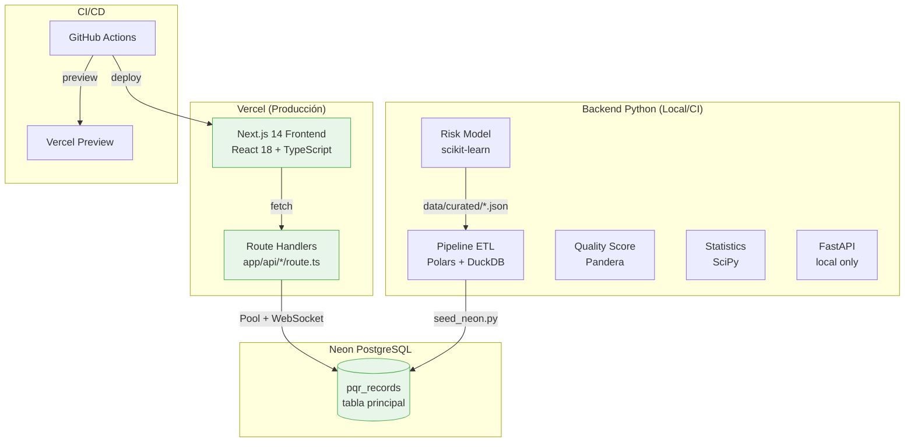

### Componentes operativos actuales

| Componente | Tecnología | Estado | Ubicación |
|---|---|---|---|
| Frontend | Next.js 14, React 18, TypeScript | ✅ Operativo | frontend/ |
| Route Handlers | Next.js API Routes | ✅ Operativo | frontend/app/api/ |
| Database Driver | @neondatabase/serverless Pool + WS | ✅ Operativo | frontend/lib/server/database.ts |
| Filtros SQL | Parameterized queries ($1, $2...) | ✅ Operativo | frontend/lib/server/query-filters.ts |
| Charts API | 9 tipos de gráficos | ✅ Operativo | frontend/app/api/charts/[chartType] |
| KPIs API | Métricas agregadas | ✅ Operativo | frontend/app/api/kpis |
| RCA API | Causa principal (SQL live) | ✅ Operativo | frontend/app/api/rca |
| Risk API | ⚠️ HARDCODED | ⚠️ Rediseñar | frontend/app/api/risk |
| Health API | Status check | ✅ Operativo | frontend/app/api/health |
| Quality API | Score de calidad | ✅ Operativo | frontend/app/api/quality |
| Filters API | Valores únicos para filtros | ✅ Operativo | frontend/app/api/filters |
| CI Pipeline | GitHub Actions | ✅ Operativo | .github/workflows/ci.yml |
| Deploy | Vercel | ✅ Operativo | vercel.json |
| Python ETL | Polars + DuckDB + Pandera | ✅ Local | backend/src/pipeline/ |
| Python Risk | scikit-learn LogReg/DT | ✅ Local | backend/src/risk/model.py |

## 7. Arquitectura Objetivo

**Proveniencia: REAL_DATA + CONCEPTUAL_DESIGN**

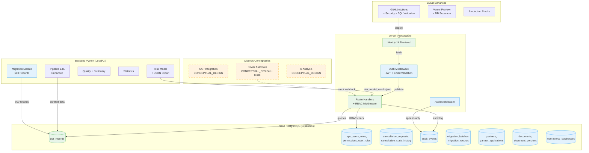

### Brechas identificadas (Gap Analysis)

| Brecha | Prioridad | Esfuerzo (días) | Dependencia |
|--------|-----------|-----------------|-------------|
| /api/risk hardcoded → datos reales | Alta | 2 | Risk model results JSON |
| RBAC middleware inexistente | Alta | 5 | Tablas auth en Neon |
| Auditoría no implementada | Alta | 4 | Tabla audit_events |
| Máquina de estados anulaciones | Alta | 5 | Tablas cancellation_* |
| Migración 600 registros | Media | 3 | Pipeline ETL validado |
| Email validation middleware | Media | 2 | Lista blanca en DB |
| Health check con DB validation | Baja | 1 | Pool ya existe |
| Evidencia dinámica en CI | Media | 3 | CI pipeline existente |

## 8. Componentes Existentes Protegidos

Los siguientes componentes están **PROTEGIDOS** y NO deben modificarse salvo extensión explícita documentada:

### Frontend (NO MODIFICAR)

| Componente | Archivo(s) | Justificación |
|---|---|---|
| Layout principal | `frontend/app/layout.tsx` | Sidebar, logo, footer, navegación |
| Sidebar | `frontend/components/layout/Sidebar.tsx` | Navegación funcional |
| Dashboard | `frontend/app/page.tsx` | KPIs y gráficos operativos |
| Filtros globales | `frontend/components/filters/*` | SessionStorage recovery |
| Gráficos | `frontend/components/charts/*` | Recharts operativos |
| KPI Cards | `frontend/components/kpi/*` | Tarjetas funcionales |
| Estilos | `frontend/styles/globals.css` | Colores corporativos |
| BPMN | `frontend/public/bpmn/*` | Imágenes AS-IS/TO-BE |
| Brand | `frontend/public/brand/*` | Logo Vanti |

### APIs (NO MODIFICAR — solo extender)

| Endpoint | Archivo | Estado |
|---|---|---|
| GET /api/charts/[chartType] | `frontend/app/api/charts/[chartType]/route.ts` | ✅ Protegido |
| GET /api/filters | `frontend/app/api/filters/route.ts` | ✅ Protegido |
| GET /api/health | `frontend/app/api/health/route.ts` | ✅ Protegido (extender) |
| GET /api/kpis | `frontend/app/api/kpis/route.ts` | ✅ Protegido |
| GET /api/quality | `frontend/app/api/quality/route.ts` | ✅ Protegido |
| GET /api/rca | `frontend/app/api/rca/route.ts` | ✅ Protegido |
| GET /api/readiness | `frontend/app/api/readiness/route.ts` | ✅ Protegido |

### Backend Python (NO MODIFICAR excepto extensiones)

| Módulo | Archivos | Estado |
|---|---|---|
| Pipeline ETL | `backend/src/pipeline/*` | ✅ Solo extender |
| RCA | `backend/src/rca/*` | ✅ Protegido |
| Quality | `backend/src/quality/*` | ✅ Protegido |
| Statistics | `backend/src/statistics/*` | ✅ Protegido |
| Risk Model | `backend/src/risk/model.py` | ✅ Protegido |
| Profiling | `backend/src/profiling/*` | ✅ Protegido |

### Configuración (NO MODIFICAR — solo extender)

| Archivo | Regla |
|---|---|
| `.github/workflows/ci.yml` | Solo agregar steps, no eliminar |
| `frontend/package.json` | Solo agregar dependencias |
| `backend/pyproject.toml` | Solo agregar dependencias |
| `vercel.json` | No modificar |
| `frontend/tailwind.config.ts` | No modificar |

## 9. Componentes Nuevos

### Frontend — Nuevos

| Componente | Ubicación | Requisito | Proveniencia |
|---|---|---|---|
| RBAC Middleware | `frontend/middleware.ts` | REQ-13 | REAL_DATA |
| Auth Guard (client) | `frontend/lib/auth/guard.tsx` | REQ-13 | REAL_DATA |
| Access Denied Page | `frontend/app/access-denied/page.tsx` | REQ-13 | REAL_DATA |
| Data Provenance Badge | `frontend/components/ui/provenance-badge.tsx` | REQ-06 | REAL_DATA |
| Anulaciones State UI | `frontend/app/anulaciones/components/*` | REQ-16 | REAL_DATA |
| Risk Model Display | `frontend/app/riesgo/components/model-metrics.tsx` | REQ-07 | DERIVED_DATA |
| Evidence Page (dynamic) | `frontend/app/evidencia/components/*` | REQ-29 | REAL_DATA |
| Capacity Dashboard | `frontend/app/operaciones/components/capacity.tsx` | REQ-20 | DERIVED_DATA |

### Backend — Nuevos módulos

| Módulo | Ubicación | Requisito | Proveniencia |
|---|---|---|---|
| Auth/RBAC | `backend/src/auth/rbac.py` | REQ-13 | REAL_DATA |
| Email Validator | `backend/src/auth/email_validator.py` | REQ-17 | REAL_DATA |
| Audit Logger | `backend/src/audit/logger.py` | REQ-14 | REAL_DATA |
| Approvals Engine | `backend/src/governance/approvals.py` | REQ-15 | REAL_DATA |
| Annulations FSM | `backend/src/annulations/state_machine.py` | REQ-16 | REAL_DATA |
| Migration 600 | `backend/src/migration/master_records.py` | REQ-19 | REAL_DATA |
| Capacity Model | `backend/src/operations/capacity.py` | REQ-20 | DERIVED_DATA |
| Email Manager | `backend/src/communications/email_mgr.py` | REQ-22 | REAL_DATA |
| PA Mock | `backend/src/integrations/pa_mock.py` | REQ-24 | CONCEPTUAL_DESIGN |
| Retry Policy | `backend/src/core/retry.py` | REQ-37 | REAL_DATA |

### Route Handlers — Nuevos endpoints

| Endpoint | Método | Archivo | Requisito |
|---|---|---|---|
| /api/risk/model | GET | `frontend/app/api/risk/model/route.ts` | REQ-07 |
| /api/annulations | GET, POST | `frontend/app/api/annulations/route.ts` | REQ-16 |
| /api/annulations/[id]/transition | POST | `frontend/app/api/annulations/[id]/transition/route.ts` | REQ-16 |
| /api/audit | GET | `frontend/app/api/audit/route.ts` | REQ-14 |
| /api/auth/validate | POST | `frontend/app/api/auth/validate/route.ts` | REQ-17 |
| /api/approvals | GET, POST | `frontend/app/api/approvals/route.ts` | REQ-15 |
| /api/webhooks/power-automate | POST | `frontend/app/api/webhooks/power-automate/route.ts` | REQ-24 |
| /api/evidence | GET | `frontend/app/api/evidence/route.ts` | REQ-29 |
| /api/capacity | GET | `frontend/app/api/capacity/route.ts` | REQ-20 |

## 10. Flujo de Datos

```mermaid
flowchart LR
    subgraph "Ingesta"
        EXCEL[Excel PQR Files]
        SEED[seed_neon.py]
    end

    subgraph "Pipeline ETL (Python)"
        INGEST[Ingest<br/>openpyxl]
        PROFILE[Profile<br/>type inference]
        VALIDATE[Validate<br/>Pandera schemas]
        ENRICH[Enrich<br/>derived fields]
        SERVE[Serve<br/>Parquet + Neon]
        QUARANTINE[Quarantine<br/>staging/quarantine.parquet]
    end

    subgraph "Almacenamiento"
        NEON[(Neon PostgreSQL<br/>pqr_records)]
        CURATED[data/curated/*.parquet]
        CONTROL[serving/control_table.json]
        RISK_JSON[data/curated/risk_model_results.json]
    end

    subgraph "Serving (Next.js Route Handlers)"
        PARETO_API[/api/charts/pareto]
        RCA_API[/api/rca]
        RISK_API[/api/risk/model]
        KPI_API[/api/kpis]
        FILTER_API[/api/filters]
    end

    subgraph "Frontend"
        DASH[Dashboard]
        RCA_PAGE[RCA Page]
        RISK_PAGE[Riesgo Page]
    end

    EXCEL --> INGEST
    INGEST --> PROFILE --> VALIDATE
    VALIDATE -->|pass| ENRICH --> SERVE
    VALIDATE -->|fail| QUARANTINE
    SERVE --> NEON
    SERVE --> CURATED
    SERVE --> CONTROL
    SEED --> NEON

    NEON --> PARETO_API
    NEON --> RCA_API
    NEON --> KPI_API
    NEON --> FILTER_API
    RISK_JSON --> RISK_API

    PARETO_API --> DASH
    PARETO_API --> RCA_PAGE
    RCA_API --> RCA_PAGE
    RISK_API --> RISK_PAGE
    KPI_API --> DASH
```

### Flujo Pareto como Fuente Única (REQ-05)

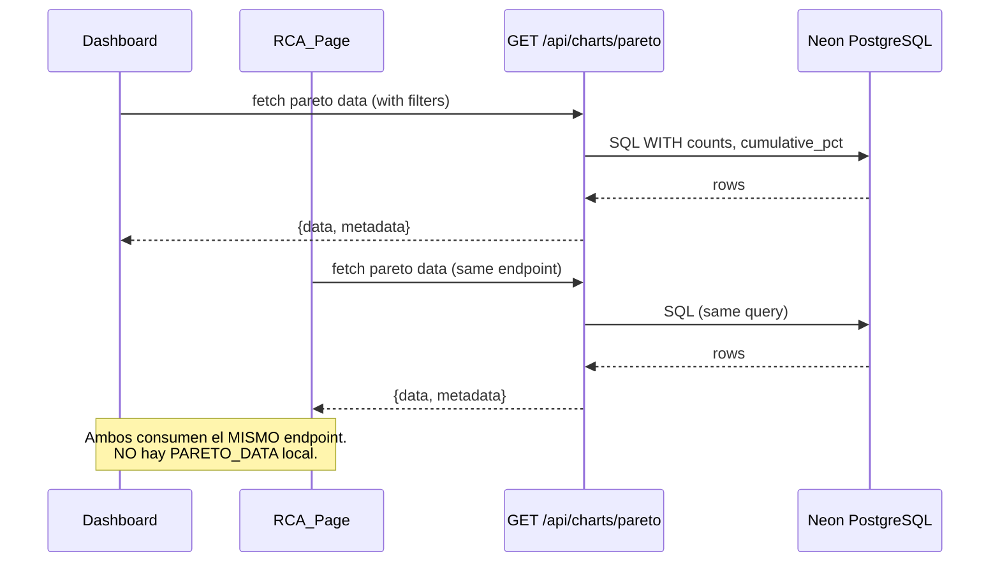

## 11. Contratos y Tipos

### TypeScript Interfaces — Frontend

```typescript
// --- Pareto Response (REQ-05) ---
interface ParetoEntry {
  causa: string;
  count: number;
  percentage: number;
  cumulative_pct: number;
  high_concentration?: boolean;
  concentration_pct?: number;
  analysis_level?: 'statistical_concentration' | 'causal_hypothesis' | 'validated_root_cause';
}

interface ParetoResponse {
  chartType: 'pareto';
  data: ParetoEntry[];
  metadata: {
    filtered: boolean;
    appliedFilters: AnalyticsFilters;
    recordCount: number;
    generatedAt: string; // ISO-8601
    datasetVersion: string;
    highConcentrationThreshold: number; // default 0.40
  };
}

// --- Risk Model Response (REQ-07) ---
interface RiskModelResponse {
  modelType: 'logistic_regression' | 'decision_tree';
  metrics: {
    precision: number;
    recall: number;
    f1Score: number;
    rocAuc: number;
  };
  featureImportance: Array<{ feature: string; importance: number }>;
  trainingSize: number;
  testSize: number;
  p90Threshold: number;
  limitations: string[];
  disclaimer: string;
  lastTrainedAt: string; // ISO-8601
  modelVersion: string;
  dataProvenance: 'DERIVED_DATA';
}

// --- Annulation State (REQ-16) ---
type AnnulationState = 'Solicitada' | 'En_Revisión' | 'Aprobada' | 'Ejecutada' | 'Cerrada' | 'Rechazada';

interface AnnulationTransition {
  from: AnnulationState;
  to: AnnulationState;
  userId: string;
  userRole: string;
  timestamp: string; // ISO-8601 UTC
  justification: string; // min 10 chars
}

interface AnnulationRequest {
  id: string; // UUID
  radicado: string;
  currentState: AnnulationState;
  history: AnnulationTransition[];
  createdAt: string;
  updatedAt: string;
}

// --- Audit Event (REQ-14) ---
interface AuditEvent {
  id: string;
  timestamp: string; // ISO-8601 UTC
  userId: string;
  action: string;
  resource: string;
  result: 'success' | 'failure';
  ipAddress: string;
  details?: Record<string, unknown>;
}

// --- RBAC (REQ-13) ---
type RoleName = 
  | 'SYSTEM_ADMIN' | 'OPERATIONS_LEAD' | 'ANALYST'
  | 'LEGAL_APPROVER' | 'VP_APPROVER' | 'BUSINESS_OWNER'
  | 'AUDITOR' | 'PARTNER_ADMIN' | 'PARTNER_OPERATOR'
  | 'CONTRACTOR_OPERATOR' | 'INTERN_READONLY';

interface AppUser {
  id: string;
  email: string;
  role: RoleName;
  isActive: boolean;
  expiresAt?: string; // ISO-8601, nullable for permanent users
  createdAt: string;
  lastLoginAt?: string;
}

// --- Approval (REQ-15) ---
type ApprovalStatus = 'pending' | 'approved' | 'expired' | 'rejected';

interface ApprovalRecord {
  id: string;
  operation: string;
  requesterId: string;
  approverId?: string;
  approverRole: 'LEGAL_APPROVER' | 'VP_APPROVER';
  justification?: string; // min 10 chars
  status: ApprovalStatus;
  requestedAt: string;
  approvedAt?: string;
  expiresAt: string; // requestedAt + 72h
}

// --- Capacity (REQ-20) ---
interface CapacityMetrics {
  totalAnalysts: number;
  monthlyHoursBase: number; // 160
  pqrDedication: number; // 0.20
  netCapacityHours: number;
  currentDemandHours: number;
  utilization: number; // demand / capacity
  alertLevel: 'green' | 'yellow' | 'orange' | 'red';
  dataProvenance: 'DERIVED_DATA';
}

// --- Data Provenance (REQ-06) ---
type DataProvenance = 'REAL_DATA' | 'DERIVED_DATA' | 'SIMULATED_DATA' | 'CONCEPTUAL_DESIGN';
```

## 12. APIs

### Endpoints existentes (PROTEGIDOS — no modificar)

| Método | Ruta | Descripción | Estado |
|--------|------|-------------|--------|
| GET | /api/charts/{chartType} | 9 tipos de gráficos con filtros | ✅ Operativo |
| GET | /api/filters | Valores únicos para filtros | ✅ Operativo |
| GET | /api/health | Health check básico | ✅ Operativo |
| GET | /api/kpis | KPIs agregados | ✅ Operativo |
| GET | /api/quality | Score de calidad | ✅ Operativo |
| GET | /api/rca | Causa principal | ✅ Operativo |
| GET | /api/readiness | Readiness check | ✅ Operativo |
| GET | /api/risk | ⚠️ Hardcoded — Rediseñar | ⚠️ Pendiente |

### Endpoints nuevos

#### GET /api/risk/model (REQ-07)

Reemplaza la respuesta hardcoded de /api/risk leyendo `data/curated/risk_model_results.json`.

```
Response 200:
{
  "modelType": "logistic_regression",
  "metrics": { "precision": 0.72, "recall": 0.65, "f1Score": 0.68, "rocAuc": 0.80 },
  "featureImportance": [{"feature": "...", "importance": 0.342}],
  "p90Threshold": 45.2,
  "trainingSize": 450,
  "testSize": 150,
  "limitations": ["..."],
  "disclaimer": "Analytical demonstration — not a production-grade model",
  "lastTrainedAt": "2024-01-15T10:30:00Z",
  "modelVersion": "1.0.0",
  "dataProvenance": "DERIVED_DATA"
}

Response 404 (archivo no encontrado):
{ "error": { "code": "MODEL_NOT_TRAINED", "message": "Risk model results not available" } }
```

#### POST /api/annulations (REQ-16)

Crea nueva solicitud de anulación.

```
Request Body:
{ "radicado": "string", "justification": "string (min 10 chars)" }

Response 201:
{ "id": "uuid", "radicado": "...", "currentState": "Solicitada", "createdAt": "..." }

Response 400:
{ "error": { "code": "VALIDATION_ERROR", "message": "justification must be at least 10 characters" } }
```

#### POST /api/annulations/{id}/transition (REQ-16)

Ejecuta transición de estado.

```
Request Body:
{ "targetState": "En_Revisión", "justification": "string (min 10 chars)" }

Response 200:
{ "id": "...", "currentState": "En_Revisión", "transition": {...} }

Response 422 (transición inválida):
{ "error": { "code": "INVALID_TRANSITION", "message": "Cannot transition from Solicitada to Ejecutada. Valid transitions: [En_Revisión]" } }

Response 403 (sin permiso):
{ "error": { "code": "FORBIDDEN", "message": "Role INTERN_READONLY cannot approve cancellations" } }
```

#### GET /api/audit (REQ-14)

```
Query Params: date_start, date_end, user_id, action, resource, page, page_size
Response 200:
{ "data": [AuditEvent], "pagination": { "page": 1, "pageSize": 50, "total": 234 } }
```

#### POST /api/webhooks/power-automate (REQ-24)

Mock endpoint para simulación de integración Power Automate.

```
Headers: Authorization: Bearer {token}
Request Body: { "flowId": "...", "action": "...", "payload": {...} }
Response 200: { "received": true, "timestamp": "...", "correlationId": "uuid" }
Response 401: { "error": { "code": "UNAUTHORIZED", "message": "Invalid bearer token" } }
```

#### GET /api/evidence (REQ-29)

```
Response 200:
{
  "commitHash": "abc123",
  "buildDate": "2024-01-15T10:30:00Z",
  "stack": { "nextjs": "14.2.21", "react": "18.3.1", "typescript": "5.7.3" },
  "tests": { "unit": { "total": 45, "passed": 44, "failed": 1 } },
  "coverage": { "statements": 82.3, "branches": 78.1 },
  "playwright": { "total": 12, "passed": 12 },
  "environment": "production",
  "dataProvenance": "REAL_DATA"
}
```

## 13. Modelo de Datos

### Tabla existente (PROTEGIDA — NO MODIFICAR)

```sql
-- pqr_records (ya existe en Neon, NO DROP/TRUNCATE)
-- Campos principales observados:
--   id, causa, empresa, canal_atencion, estado, resultado,
--   motivo_cierre, marcacion, unidad_responsable, fecha_creacion,
--   tiempo_gestion_dias, tipo_pqr
```

### Tablas nuevas (migraciones incrementales)

```sql
-- =====================================================
-- RBAC & Auth (REQ-13, REQ-17)
-- =====================================================

CREATE TABLE IF NOT EXISTS roles (
  id UUID PRIMARY KEY DEFAULT gen_random_uuid(),
  name VARCHAR(50) UNIQUE NOT NULL, -- 11 roles de Lista Maestra
  description TEXT,
  permissions JSONB NOT NULL DEFAULT '[]',
  created_at TIMESTAMPTZ NOT NULL DEFAULT NOW()
);

CREATE TABLE IF NOT EXISTS permissions (
  id UUID PRIMARY KEY DEFAULT gen_random_uuid(),
  code VARCHAR(100) UNIQUE NOT NULL, -- e.g. 'READ_DASHBOARD', 'APPROVE_CANCELLATION'
  description TEXT,
  resource VARCHAR(200) NOT NULL,
  action VARCHAR(50) NOT NULL -- 'read', 'write', 'approve', 'admin'
);

CREATE TABLE IF NOT EXISTS app_users (
  id UUID PRIMARY KEY DEFAULT gen_random_uuid(),
  email VARCHAR(320) UNIQUE NOT NULL,
  display_name VARCHAR(200),
  is_active BOOLEAN NOT NULL DEFAULT true,
  expires_at TIMESTAMPTZ, -- NULL = no expiration
  created_at TIMESTAMPTZ NOT NULL DEFAULT NOW(),
  last_login_at TIMESTAMPTZ
);

CREATE TABLE IF NOT EXISTS user_roles (
  user_id UUID NOT NULL REFERENCES app_users(id),
  role_id UUID NOT NULL REFERENCES roles(id),
  assigned_at TIMESTAMPTZ NOT NULL DEFAULT NOW(),
  assigned_by UUID REFERENCES app_users(id),
  PRIMARY KEY (user_id, role_id)
);
-- Constraint: max 1 active role per user enforced by application logic + unique partial index
CREATE UNIQUE INDEX idx_user_active_role ON user_roles(user_id) WHERE TRUE;

CREATE TABLE IF NOT EXISTS role_permissions (
  role_id UUID NOT NULL REFERENCES roles(id),
  permission_id UUID NOT NULL REFERENCES permissions(id),
  PRIMARY KEY (role_id, permission_id)
);

-- =====================================================
-- Partners (REQ aliados)
-- =====================================================

CREATE TABLE IF NOT EXISTS partners (
  id UUID PRIMARY KEY DEFAULT gen_random_uuid(),
  name VARCHAR(200) NOT NULL,
  tax_id VARCHAR(20) UNIQUE,
  contact_email VARCHAR(320),
  status VARCHAR(20) NOT NULL DEFAULT 'active' CHECK (status IN ('active','inactive','suspended')),
  created_at TIMESTAMPTZ NOT NULL DEFAULT NOW(),
  updated_at TIMESTAMPTZ NOT NULL DEFAULT NOW()
);

CREATE TABLE IF NOT EXISTS partner_authorized_emails (
  id UUID PRIMARY KEY DEFAULT gen_random_uuid(),
  partner_id UUID NOT NULL REFERENCES partners(id),
  email VARCHAR(320) NOT NULL,
  domain VARCHAR(200),
  expires_at TIMESTAMPTZ,
  is_active BOOLEAN NOT NULL DEFAULT true,
  created_at TIMESTAMPTZ NOT NULL DEFAULT NOW(),
  UNIQUE (partner_id, email)
);
```

```sql
-- =====================================================
-- Partner Applications & Approvals (REQ-15)
-- =====================================================

CREATE TABLE IF NOT EXISTS partner_applications (
  id UUID PRIMARY KEY DEFAULT gen_random_uuid(),
  partner_id UUID NOT NULL REFERENCES partners(id),
  application_type VARCHAR(100) NOT NULL,
  status VARCHAR(30) NOT NULL DEFAULT 'draft' 
    CHECK (status IN ('draft','submitted','under_review','approved','rejected','expired')),
  submitted_at TIMESTAMPTZ,
  created_at TIMESTAMPTZ NOT NULL DEFAULT NOW(),
  updated_at TIMESTAMPTZ NOT NULL DEFAULT NOW()
);

CREATE TABLE IF NOT EXISTS partner_application_versions (
  id UUID PRIMARY KEY DEFAULT gen_random_uuid(),
  application_id UUID NOT NULL REFERENCES partner_applications(id),
  version_number INT NOT NULL DEFAULT 1,
  content JSONB NOT NULL,
  created_at TIMESTAMPTZ NOT NULL DEFAULT NOW(),
  created_by UUID REFERENCES app_users(id),
  UNIQUE (application_id, version_number)
);

CREATE TABLE IF NOT EXISTS approval_steps (
  id UUID PRIMARY KEY DEFAULT gen_random_uuid(),
  application_id UUID NOT NULL REFERENCES partner_applications(id),
  step_order INT NOT NULL,
  approver_role VARCHAR(50) NOT NULL, -- 'LEGAL_APPROVER' | 'VP_APPROVER'
  status VARCHAR(20) NOT NULL DEFAULT 'pending'
    CHECK (status IN ('pending','approved','rejected','expired')),
  approved_by UUID REFERENCES app_users(id),
  justification TEXT, -- min 10 chars when approved
  approved_at TIMESTAMPTZ,
  expires_at TIMESTAMPTZ NOT NULL, -- created_at + 72h
  created_at TIMESTAMPTZ NOT NULL DEFAULT NOW()
);

CREATE TABLE IF NOT EXISTS approval_events (
  id UUID PRIMARY KEY DEFAULT gen_random_uuid(),
  step_id UUID NOT NULL REFERENCES approval_steps(id),
  event_type VARCHAR(30) NOT NULL CHECK (event_type IN ('requested','approved','rejected','expired','reminded')),
  actor_id UUID REFERENCES app_users(id),
  actor_role VARCHAR(50),
  justification TEXT,
  timestamp TIMESTAMPTZ NOT NULL DEFAULT NOW(),
  ip_address INET
);

-- =====================================================
-- Cancellation Requests / Anulaciones (REQ-16)
-- =====================================================

CREATE TABLE IF NOT EXISTS cancellation_requests (
  id UUID PRIMARY KEY DEFAULT gen_random_uuid(),
  radicado VARCHAR(50) UNIQUE NOT NULL,
  pqr_id VARCHAR(50) REFERENCES pqr_records(id),
  current_state VARCHAR(20) NOT NULL DEFAULT 'Solicitada'
    CHECK (current_state IN ('Solicitada','En_Revisión','Aprobada','Ejecutada','Cerrada','Rechazada')),
  requested_by UUID NOT NULL REFERENCES app_users(id),
  created_at TIMESTAMPTZ NOT NULL DEFAULT NOW(),
  updated_at TIMESTAMPTZ NOT NULL DEFAULT NOW()
);

CREATE INDEX idx_cancellation_state ON cancellation_requests(current_state);
CREATE INDEX idx_cancellation_radicado ON cancellation_requests(radicado);

CREATE TABLE IF NOT EXISTS cancellation_state_history (
  id UUID PRIMARY KEY DEFAULT gen_random_uuid(),
  request_id UUID NOT NULL REFERENCES cancellation_requests(id),
  from_state VARCHAR(20) NOT NULL,
  to_state VARCHAR(20) NOT NULL,
  transitioned_by UUID NOT NULL REFERENCES app_users(id),
  transitioned_by_role VARCHAR(50) NOT NULL,
  justification TEXT NOT NULL CHECK (char_length(justification) >= 10),
  timestamp TIMESTAMPTZ NOT NULL DEFAULT NOW(),
  ip_address INET
);

CREATE INDEX idx_history_request ON cancellation_state_history(request_id);
CREATE INDEX idx_history_timestamp ON cancellation_state_history(timestamp);

-- =====================================================
-- Audit (REQ-14)
-- =====================================================

CREATE TABLE IF NOT EXISTS audit_events (
  id UUID PRIMARY KEY DEFAULT gen_random_uuid(),
  timestamp TIMESTAMPTZ NOT NULL DEFAULT NOW(),
  user_id VARCHAR(100) NOT NULL,
  action VARCHAR(100) NOT NULL,
  resource VARCHAR(500) NOT NULL,
  result VARCHAR(10) NOT NULL CHECK (result IN ('success','failure')),
  ip_address INET,
  details JSONB,
  correlation_id UUID
);

-- Append-only: revoke UPDATE/DELETE on audit_events
-- (enforced via application + DB policy)
CREATE INDEX idx_audit_timestamp ON audit_events(timestamp);
CREATE INDEX idx_audit_user ON audit_events(user_id);
CREATE INDEX idx_audit_action ON audit_events(action);
CREATE INDEX idx_audit_resource ON audit_events(resource);

-- =====================================================
-- Migration Batches (REQ-19)
-- =====================================================

CREATE TABLE IF NOT EXISTS migration_batches (
  id UUID PRIMARY KEY DEFAULT gen_random_uuid(),
  source_file_hash VARCHAR(64) NOT NULL, -- SHA-256
  status VARCHAR(20) NOT NULL DEFAULT 'running'
    CHECK (status IN ('running','completed','failed')),
  records_ingested INT NOT NULL DEFAULT 0,
  records_validated INT NOT NULL DEFAULT 0,
  records_quarantined INT NOT NULL DEFAULT 0,
  processing_duration_seconds FLOAT,
  errors JSONB,
  started_at TIMESTAMPTZ NOT NULL DEFAULT NOW(),
  completed_at TIMESTAMPTZ
);

CREATE TABLE IF NOT EXISTS migration_records (
  id UUID PRIMARY KEY DEFAULT gen_random_uuid(),
  batch_id UUID NOT NULL REFERENCES migration_batches(id),
  source_record_id VARCHAR(100) NOT NULL,
  status VARCHAR(20) NOT NULL CHECK (status IN ('migrated','quarantined','rejected')),
  error_details JSONB,
  migrated_at TIMESTAMPTZ NOT NULL DEFAULT NOW(),
  UNIQUE (batch_id, source_record_id)
);

-- =====================================================
-- Documents (REQ general)
-- =====================================================

CREATE TABLE IF NOT EXISTS documents (
  id UUID PRIMARY KEY DEFAULT gen_random_uuid(),
  title VARCHAR(500) NOT NULL,
  document_type VARCHAR(50) NOT NULL,
  owner_id UUID REFERENCES app_users(id),
  status VARCHAR(20) NOT NULL DEFAULT 'draft',
  created_at TIMESTAMPTZ NOT NULL DEFAULT NOW(),
  updated_at TIMESTAMPTZ NOT NULL DEFAULT NOW()
);

CREATE TABLE IF NOT EXISTS document_versions (
  id UUID PRIMARY KEY DEFAULT gen_random_uuid(),
  document_id UUID NOT NULL REFERENCES documents(id),
  version_number INT NOT NULL DEFAULT 1,
  content JSONB,
  file_path VARCHAR(500),
  created_by UUID REFERENCES app_users(id),
  created_at TIMESTAMPTZ NOT NULL DEFAULT NOW(),
  UNIQUE (document_id, version_number)
);

-- =====================================================
-- Operational Businesses (REQ-21)
-- =====================================================

CREATE TABLE IF NOT EXISTS operational_businesses (
  id UUID PRIMARY KEY DEFAULT gen_random_uuid(),
  name VARCHAR(200) NOT NULL,
  sector VARCHAR(100),
  contact_email VARCHAR(320),
  assigned_users INT NOT NULL DEFAULT 0,
  status VARCHAR(20) NOT NULL DEFAULT 'active' CHECK (status IN ('active','inactive')),
  created_at TIMESTAMPTZ NOT NULL DEFAULT NOW(),
  updated_at TIMESTAMPTZ NOT NULL DEFAULT NOW()
);
```

## 14. ERD

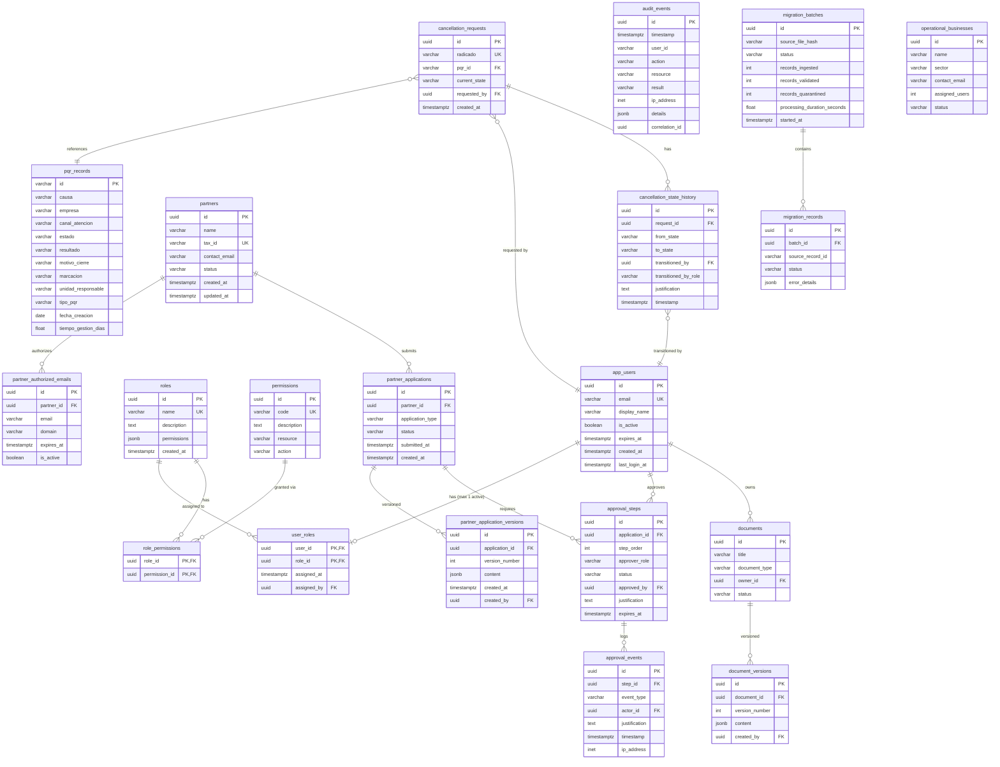

## 15. Migraciones

### Principios de migración

1. **No destructivas**: NUNCA DROP TABLE, TRUNCATE o DELETE sin WHERE.
2. **Versionadas**: Archivos numerados secuencialmente (`001_create_roles.sql`, `002_create_users.sql`, ...).
3. **Reversibles**: Cada `up` tiene un `down` correspondiente.
4. **Idempotentes**: `CREATE TABLE IF NOT EXISTS`, `CREATE INDEX IF NOT EXISTS`.
5. **Transaccionales**: Cada migración ejecuta dentro de una transacción.
6. **Validadas en Preview primero**: Obligatorio antes de producción.
7. **Con backup**: Snapshot de Neon antes de migración en producción.
8. **Con dry run**: Validar SQL con `EXPLAIN` antes de ejecución real.

### Orden de ejecución

| # | Archivo | Descripción | Dependencia |
|---|---------|-------------|-------------|
| 001 | `001_create_roles.sql` | Tabla roles + seed 11 roles | Ninguna |
| 002 | `002_create_permissions.sql` | Tabla permissions + seed permisos base | Ninguna |
| 003 | `003_create_app_users.sql` | Tabla app_users | Ninguna |
| 004 | `004_create_user_roles.sql` | Tabla user_roles + index | 001, 003 |
| 005 | `005_create_role_permissions.sql` | Tabla role_permissions | 001, 002 |
| 006 | `006_create_partners.sql` | Tablas partners + authorized_emails | Ninguna |
| 007 | `007_create_partner_applications.sql` | Applications + versions | 006, 003 |
| 008 | `008_create_approval_steps.sql` | Approval steps + events | 007, 003 |
| 009 | `009_create_cancellation_requests.sql` | Anulaciones + history | 003 |
| 010 | `010_create_audit_events.sql` | Audit events (append-only) | Ninguna |
| 011 | `011_create_migration_batches.sql` | Migration tracking | Ninguna |
| 012 | `012_create_documents.sql` | Documents + versions | 003 |
| 013 | `013_create_operational_businesses.sql` | Businesses | Ninguna |

### Proceso de ejecución

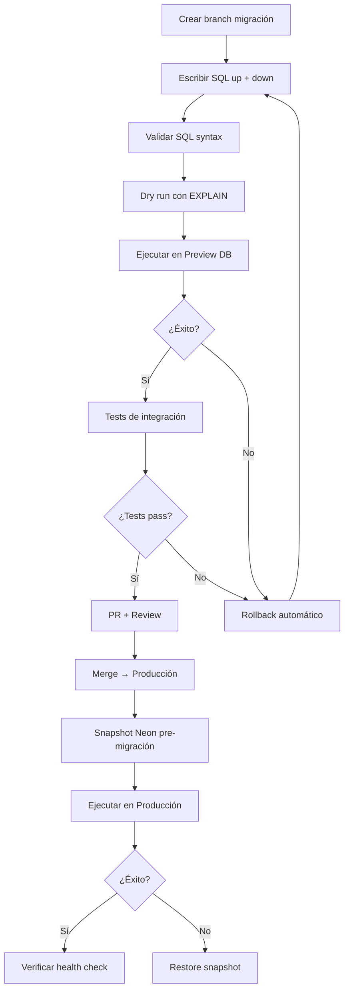

### Template de migración

```sql
-- Migration 009: Create cancellation_requests
-- Author: [autor]
-- Date: [fecha]
-- Requirement: REQ-16

-- === UP ===
BEGIN;

CREATE TABLE IF NOT EXISTS cancellation_requests (...);
CREATE TABLE IF NOT EXISTS cancellation_state_history (...);
CREATE INDEX IF NOT EXISTS idx_cancellation_state ON ...;

COMMIT;

-- === DOWN ===
BEGIN;

DROP INDEX IF EXISTS idx_cancellation_state;
DROP TABLE IF EXISTS cancellation_state_history;
DROP TABLE IF EXISTS cancellation_requests;

COMMIT;
```

## 16. RBAC

### Matriz de permisos (Lista Maestra — 11 roles)

| Rol | Dashboard | Análisis | Reportes | Gestión | Aprobaciones | Auditoría | Admin |
|-----|-----------|----------|----------|---------|--------------|-----------|-------|
| SYSTEM_ADMIN | ✅ | ✅ | ✅ | ✅ | ✅ | ✅ | ✅ |
| OPERATIONS_LEAD | ✅ | ✅ | ✅ | ✅ | ❌ | ✅ | ❌ |
| ANALYST | ✅ | ✅ | ✅ | ❌ | ❌ | ❌ | ❌ |
| LEGAL_APPROVER | ✅ | ❌ | ❌ | ❌ | ✅ Legal | ❌ | ❌ |
| VP_APPROVER | ✅ | ❌ | ❌ | ❌ | ✅ VP | ❌ | ❌ |
| BUSINESS_OWNER | ✅ | ❌ | ✅ | ❌ | ✅ Ops | ❌ | ❌ |
| AUDITOR | ✅ | ❌ | ❌ | ❌ | ❌ | ✅ | ❌ |
| PARTNER_ADMIN | ✅ | ❌ | ❌ | ✅ (org) | ❌ | ❌ | ❌ |
| PARTNER_OPERATOR | ✅ | ❌ | ❌ | ❌ | ❌ | ❌ | ❌ |
| CONTRACTOR_OPERATOR | ✅ | ✅ | ❌ | ❌ | ❌ | ❌ | ❌ |
| INTERN_READONLY | ✅ | ❌ | ❌ | ❌ | ❌ | ❌ | ❌ |

### Permisos granulares

```typescript
const PERMISSIONS = {
  // Dashboard
  READ_DASHBOARD: ['SYSTEM_ADMIN','OPERATIONS_LEAD','ANALYST','LEGAL_APPROVER',
    'VP_APPROVER','BUSINESS_OWNER','AUDITOR','PARTNER_ADMIN','PARTNER_OPERATOR',
    'CONTRACTOR_OPERATOR','INTERN_READONLY'],
  // Analysis
  READ_ANALYSIS: ['SYSTEM_ADMIN','OPERATIONS_LEAD','ANALYST','CONTRACTOR_OPERATOR'],
  // Reports
  READ_REPORTS: ['SYSTEM_ADMIN','OPERATIONS_LEAD','ANALYST','BUSINESS_OWNER'],
  GENERATE_REPORTS: ['SYSTEM_ADMIN','OPERATIONS_LEAD','ANALYST','BUSINESS_OWNER'],
  // Management
  MANAGE_CAPACITY: ['SYSTEM_ADMIN','OPERATIONS_LEAD'],
  MANAGE_USERS: ['SYSTEM_ADMIN','PARTNER_ADMIN'],
  // Approvals
  APPROVE_LEGAL: ['SYSTEM_ADMIN','LEGAL_APPROVER'],
  APPROVE_VP: ['SYSTEM_ADMIN','VP_APPROVER'],
  APPROVE_OPERATIONAL: ['SYSTEM_ADMIN','BUSINESS_OWNER'],
  APPROVE_CANCELLATION: ['SYSTEM_ADMIN','OPERATIONS_LEAD','LEGAL_APPROVER'],
  // Audit
  READ_AUDIT: ['SYSTEM_ADMIN','OPERATIONS_LEAD','AUDITOR'],
  // Admin
  ADMIN_SYSTEM: ['SYSTEM_ADMIN'],
  MANAGE_ROLES: ['SYSTEM_ADMIN'],
  // Data
  INGEST_DATA: ['SYSTEM_ADMIN','OPERATIONS_LEAD','INTERN_READONLY'],
  // Annulations
  CREATE_ANNULATION: ['SYSTEM_ADMIN','OPERATIONS_LEAD','ANALYST','BUSINESS_OWNER'],
  TRANSITION_ANNULATION: ['SYSTEM_ADMIN','OPERATIONS_LEAD','LEGAL_APPROVER'],
} as const;
```

### Implementación en middleware (Next.js)

```typescript
// frontend/middleware.ts
import { NextResponse } from 'next/server';
import type { NextRequest } from 'next/server';

const PROTECTED_ROUTES: Record<string, string[]> = {
  '/api/audit': ['SYSTEM_ADMIN', 'OPERATIONS_LEAD', 'AUDITOR'],
  '/api/annulations': ['SYSTEM_ADMIN', 'OPERATIONS_LEAD', 'ANALYST', 'BUSINESS_OWNER'],
  '/api/approvals': ['SYSTEM_ADMIN', 'LEGAL_APPROVER', 'VP_APPROVER'],
  '/api/capacity': ['SYSTEM_ADMIN', 'OPERATIONS_LEAD'],
};

export function middleware(request: NextRequest) {
  // Extract user role from JWT/session
  // Validate against PROTECTED_ROUTES
  // Return 403 if unauthorized
  // Log denied attempts to audit
}
```

### Validación de acceso (< 500ms)

1. JWT contiene `role` claim → validación local sin DB query.
2. Si token expirado → refresh via /api/auth/refresh.
3. Si sin rol → redirect a `/access-denied`.
4. Cada intento denegado → registro en `audit_events`.

## 17. Auditoría

### Arquitectura de auditoría

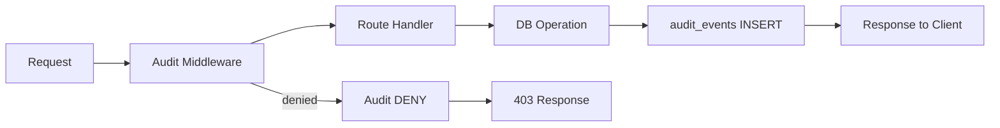

### Campos del registro de auditoría (REQ-14)

| Campo | Tipo | Obligatorio | Descripción |
|-------|------|-------------|-------------|
| id | UUID | ✅ | PK auto-generado |
| timestamp | TIMESTAMPTZ | ✅ | UTC, generado server-side |
| user_id | VARCHAR(100) | ✅ | Email o UUID del usuario |
| action | VARCHAR(100) | ✅ | Verbo: READ, CREATE, UPDATE, TRANSITION, DENY, LOGIN, EXPORT |
| resource | VARCHAR(500) | ✅ | Path o entidad: `/api/annulations/123` |
| result | VARCHAR(10) | ✅ | 'success' o 'failure' |
| ip_address | INET | ✅ | IP de origen |
| details | JSONB | ❌ | Contexto adicional (filtros, parámetros) |
| correlation_id | UUID | ❌ | Para trazar operaciones relacionadas |

### Reglas de inmutabilidad

1. **Append-only**: Solo INSERT permitido. UPDATE y DELETE prohibidos.
2. **Retención**: Mínimo 12 meses accesible para consulta.
3. **Síncrono**: El audit log se escribe ANTES de retornar la respuesta.
4. **No-PII**: Los detalles no contienen credenciales ni datos personales.
5. **Enforcement**: Revocar permisos UPDATE/DELETE a nivel DB para el rol de conexión de la app.

### Consultas de auditoría

```sql
-- Filtrado por rango de fecha + usuario + acción + recurso
SELECT * FROM audit_events
WHERE timestamp BETWEEN $1 AND $2
  AND ($3 IS NULL OR user_id = $3)
  AND ($4 IS NULL OR action = $4)
  AND ($5 IS NULL OR resource LIKE $5)
ORDER BY timestamp DESC
LIMIT $6 OFFSET $7;
```

## 18. Máquinas de Estados

### Anulaciones (REQ-16)

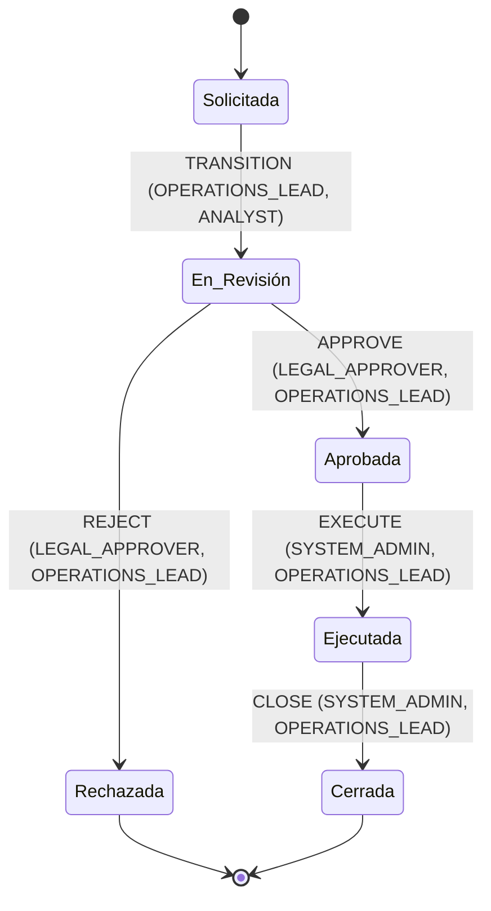

### Tabla de transiciones válidas

| Estado Origen | Estado Destino | Roles Autorizados | Validaciones |
|---|---|---|---|
| Solicitada | En_Revisión | OPERATIONS_LEAD, ANALYST, SYSTEM_ADMIN | Justificación ≥ 10 chars |
| En_Revisión | Aprobada | LEGAL_APPROVER, OPERATIONS_LEAD, SYSTEM_ADMIN | Justificación ≥ 10 chars, email autorizado |
| En_Revisión | Rechazada | LEGAL_APPROVER, OPERATIONS_LEAD, SYSTEM_ADMIN | Justificación ≥ 10 chars |
| Aprobada | Ejecutada | OPERATIONS_LEAD, SYSTEM_ADMIN | Justificación ≥ 10 chars |
| Ejecutada | Cerrada | OPERATIONS_LEAD, SYSTEM_ADMIN | Justificación ≥ 10 chars |

### Estados terminales

- **Cerrada**: Anulación ejecutada y cerrada satisfactoriamente.
- **Rechazada**: Anulación rechazada durante revisión.

Ninguna transición es válida desde estados terminales.

### Validaciones en cada transición

1. **Email autorizado**: El email del usuario que aprueba debe pertenecer al dominio corporativo o lista blanca.
2. **Justificación obligatoria**: Mínimo 10 caracteres (REQ-16.6).
3. **Rechazo automático**: Si el email no es autorizado → HTTP 403, estado sin cambio, intento auditado.
4. **Radicado**: Generado automáticamente al crear la solicitud.
5. **Historial**: Cada transición se registra en `cancellation_state_history`.
6. **Comunicación proactiva**: Notificación al solicitante en cada cambio de estado.
7. **Reloj ANS**: Se inicia en "Solicitada" y se mide hasta "Cerrada" o "Rechazada".
8. **Permisos**: Validados contra la matriz RBAC antes de permitir la transición.

### Test de seguridad obligatorio (REQ-18)

> **Test**: Usuario con rol `INTERN_READONLY` intenta aprobar una solicitud en estado `En_Revisión`.
> **Resultado esperado**: HTTP 403, estado permanece `En_Revisión`, intento auditado en `audit_events`, no se registra transición en `cancellation_state_history`.

```typescript
// test: access-denied-annulation-approve.spec.ts
test('INTERN_READONLY cannot approve cancellation', async () => {
  // Setup: create cancellation in En_Revisión state
  // Action: POST /api/annulations/{id}/transition with targetState=Aprobada
  //         using INTERN_READONLY token
  // Assert: response.status === 403
  // Assert: cancellation still in En_Revisión
  // Assert: audit_events contains DENY record
  // Assert: cancellation_state_history has no new entry
});
```

## 19. Pareto como Fuente Única

### Principio (REQ-05)

El endpoint `GET /api/charts/pareto` es la **única fuente de verdad** para identificación de causa principal. Dashboard y RCA consumen el mismo endpoint, sin copias locales.

### Implementación actual (PROTEGIDA)

```sql
-- Consulta real en frontend/app/api/charts/[chartType]/route.ts
WITH counts AS (
  SELECT causa, COUNT(*)::int AS count FROM pqr_records
  WHERE causa IS NOT NULL
  GROUP BY causa HAVING COUNT(*) >= 5 ORDER BY count DESC
), total AS (SELECT SUM(count) AS total FROM counts)
SELECT causa, count,
  ROUND(count * 100.0 / total.total, 2) AS percentage,
  ROUND(SUM(count) OVER (ORDER BY count DESC) * 100.0 / total.total, 2) AS cumulative_pct
FROM counts, total ORDER BY count DESC
```

### Extensiones requeridas

1. **Campo `high_concentration`**: Cuando `percentage > highConcentrationThreshold` (default 40%), retornar `high_concentration: true`.
2. **Campo `concentration_pct`**: Porcentaje observado de la causa con mayor frecuencia.
3. **Campo `analysis_level`**: Uno de tres valores:
   - `statistical_concentration`: Solo dato estadístico (default).
   - `causal_hypothesis`: Triangulación con evidencia (requiere validación de proceso).
   - `validated_root_cause`: Validado por expertos de negocio.
4. **Threshold configurable**: Variable de entorno `PARETO_HIGH_CONCENTRATION_THRESHOLD` (default 0.40).

### Consistencia RCA ↔ Dashboard (REQ-05.8)

```typescript
// Test automatizado CI:
// 1. Fetch /api/charts/pareto → top causa, porcentaje
// 2. Fetch /api/rca → mainCause, mainCauseShare
// 3. Assert top causa === mainCause
// 4. Assert porcentaje === mainCauseShare (tolerance ±0.01)
// 5. Apply filter → repeat → assert consistency
```

### Error handling (REQ-05.7)

Si `/api/charts/pareto` falla:
1. Retornar estado de indisponibilidad (no cifras inventadas).
2. Aplicar Política_Reintentos (REQ-37): max 3 retries, exponential backoff 2s, jitter ±500ms.
3. Frontend muestra: "Datos de Pareto temporalmente no disponibles. Reintentando..."

## 20. Riesgo Analítico

### Estado actual

El endpoint `GET /api/risk` retorna datos **HARDCODED**. Esto viola REQ-03.3.

### Rediseño (REQ-07)

#### Arquitectura

```mermaid
flowchart LR
    subgraph "Python Backend (local/CI)"
        RM[RiskModel.train()]
        JSON_OUT[risk_model_results.json]
    end

    subgraph "Next.js Route Handler"
        RISK_ROUTE[GET /api/risk/model]
        FS_READ[fs.readFile]
    end

    subgraph "Frontend"
        RISK_PAGE[/riesgo page]
    end

    RM -->|writes| JSON_OUT
    RISK_ROUTE -->|reads| JSON_OUT
    RISK_PAGE -->|fetch| RISK_ROUTE
```

#### Modelo de riesgo — Especificación

| Aspecto | Valor |
|---------|-------|
| **Target variable** | `tiempo_gestion_dias > P90` (binario: 1 = excede P90) |
| **Features** | causa, canal_atencion, empresa, tipo_pqr, unidad_responsable, marcacion |
| **Leakage prevention** | Excluir: fecha_cierre, resultado, tiempo_gestion_dias, motivo_cierre |
| **Split** | Stratified 75/25, seed=42 |
| **Algoritmo primario** | Logistic Regression (class_weight='balanced' si imbalance) |
| **Algoritmo fallback** | Decision Tree max_depth=4 (si ROC-AUC < 0.60) |
| **Métricas** | precision, recall, F1-score, ROC-AUC (calculadas, NO inventadas) |
| **Feature importance** | Coeficientes abs (LogReg) o feature_importances_ (DT) |
| **Validación** | Holdout test set 25%, confusion matrix |
| **Limitaciones** | Documentadas en output JSON |
| **Proveniencia** | DERIVED_DATA |

#### Disclaimer obligatorio

> "Analytical demonstration — not a production-grade model. Las métricas presentadas son resultado de un ejercicio de modelación exploratoria sobre datos de demostración. No debe usarse para toma de decisiones automatizada en producción."

#### Formato de salida (`data/curated/risk_model_results.json`)

```json
{
  "modelType": "logistic_regression",
  "modelVersion": "1.0.0",
  "trainedAt": "2024-01-15T10:30:00Z",
  "metrics": { "precision": 0.72, "recall": 0.65, "f1Score": 0.68, "rocAuc": 0.80 },
  "confusionMatrix": [[120, 15], [30, 35]],
  "featureImportance": [{"feature": "causa_cancela_servihogar", "importance": 0.342}],
  "p90Threshold": 45.2,
  "trainingSize": 450,
  "testSize": 150,
  "classBalance": {"0": 0.82, "1": 0.18},
  "limitations": ["Imbalanced dataset", "Limited feature set"],
  "disclaimer": "Analytical demonstration — not a production-grade model",
  "dataProvenance": "DERIVED_DATA"
}
```

**NOTA**: No se permiten métricas inventadas ni confusion matrix hardcodeada. Los valores se generan exclusivamente al ejecutar `backend/run_pipeline.py`.

## 21. Calidad y Diccionario de Datos

### Diccionario de datos (REQ-08)

Ubicación: `docs/data-dictionary.md`

#### Estructura por campo

| Atributo | Descripción |
|----------|-------------|
| name | Nombre del campo (snake_case) |
| type | Tipo de dato (varchar, int, float, date, boolean, jsonb) |
| description | Descripción semántica del campo |
| origin | REAL_DATA / DERIVED_DATA / SIMULATED_DATA / CONCEPTUAL_DESIGN |
| validation_rule | Regla de validación (regex, rango, enum, not null) |
| example | Valor de ejemplo |
| last_verified | Fecha de última verificación |

#### Ejemplo de entrada

```markdown
| Campo | Tipo | Descripción | Origen | Validación | Ejemplo |
|-------|------|-------------|--------|------------|---------|
| causa | varchar(200) | Causa clasificada del PQR | REAL_DATA | NOT NULL, enum conocido | "Cancela ServiHogar" |
| tiempo_gestion_dias | float | Días de gestión calculados | DERIVED_DATA | >= 0 | 12.5 |
| risk_probability | float | Probabilidad de escalamiento | DERIVED_DATA | [0.0, 1.0] | 0.73 |
```

### Calidad de datos — 6 dimensiones

| Dimensión | Métrica | Umbral | REQ |
|-----------|---------|--------|-----|
| Completitud | % campos no-null | ≥ 95% | REQ-08 |
| Unicidad | % registros sin duplicados por id | = 100% | REQ-08 |
| Validez | % registros conformes a reglas | ≥ 98% | REQ-08 |
| Consistencia | % relaciones FK válidas | = 100% | REQ-08 |
| Oportunidad | Antigüedad máx. del dato | ≤ 24h tras ingesta | REQ-10 |
| Precisión | % valores dentro de dominio | ≥ 99% | REQ-08 |

### Proceso de actualización

1. Inventariar campos actuales de `pqr_records`.
2. Crear diccionario inicial (`docs/data-dictionary.md`).
3. Clasificar cada campo (REAL/DERIVED/SIMULATED/CONCEPTUAL).
4. Implementar cambios al modelo de datos.
5. Actualizar diccionario en el mismo PR (REQ-08.3).

**Sin dependencia circular**: El diccionario es un artefacto de documentación independiente del pipeline. El pipeline valida contra las reglas del diccionario, pero el diccionario no requiere que el pipeline esté ejecutándose.

## 22. ETL

### Pipeline ETL (REQ-10)

**Proveniencia**: REAL_DATA → DERIVED_DATA

#### Etapas secuenciales

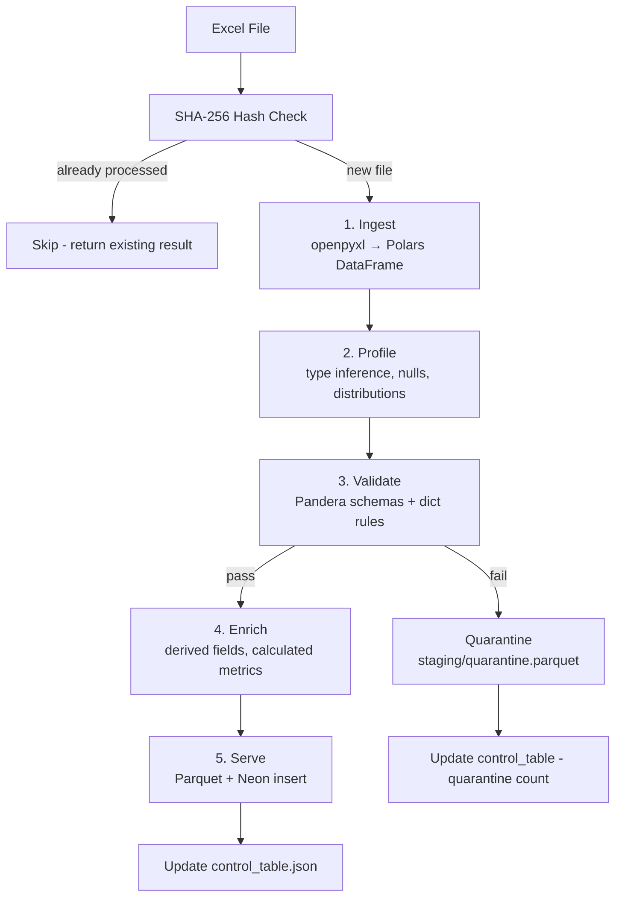

#### Idempotencia (REQ-10.1)

```python
# Pseudo-code
file_hash = sha256(source_file).hexdigest()
existing = control_table.lookup(file_hash)
if existing and existing.status == "completed":
    return AlreadyProcessedResult(existing)
# else: proceed with pipeline
```

#### Tabla de control (`serving/control_table.json`)

```json
{
  "batches": [
    {
      "batch_id": "uuid-v4",
      "source_file_hash": "sha256hex",
      "records_ingested": 600,
      "records_validated": 585,
      "records_quarantined": 15,
      "processing_duration_seconds": 42.3,
      "status": "completed",
      "started_at": "2024-01-15T10:00:00Z",
      "completed_at": "2024-01-15T10:00:42Z"
    }
  ]
}
```

#### Cuarentena (REQ-10.3)

Registros que fallan validación van a `staging/quarantine.parquet` con:
- `rule_id`: Identificador de la regla violada.
- `reason`: Descripción de la falla.
- `quarantine_timestamp`: ISO-8601 UTC.

#### Reintentos (REQ-37)

- Errores transitorios de I/O: 3 retries, backoff exponencial 2s, jitter ±500ms.
- Errores de validación: NO se reintentan → cuarentena directa.
- Si agotan reintentos: status "failed", preservar datos curados previos.

#### Diferenciación ETL vs Migración

| Aspecto | ETL Pipeline (REQ-10) | Migración 600 (REQ-19) |
|---------|----------------------|------------------------|
| Propósito | Procesar nuevos archivos Excel | Migrar registros maestros existentes |
| Entrada | Archivos Excel nuevos | 600 registros pre-existentes |
| Frecuencia | Cada nueva fuente de datos | Una vez (idempotente) |
| Destino | data/curated/*.parquet + Neon | Neon (esquema normalizado) |
| Criterio éxito | Batch completo sin error | ≥ 95% migrados (570/600) |

## 23. Migración

### Migración de 600 Registros Maestros (REQ-19)

**Proveniencia**: REAL_DATA

#### Proceso end-to-end

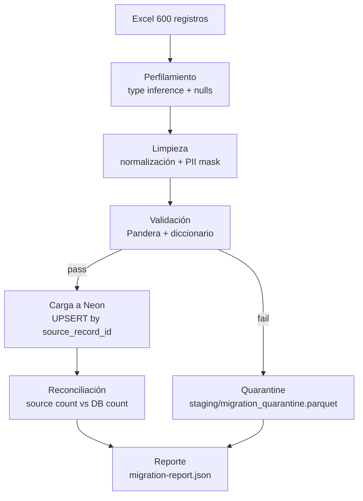

#### Idempotencia estricta (REQ-19.7)

```python
# UPSERT pattern — NO duplicados, NO modificación de exitosos
INSERT INTO pqr_records (id, causa, empresa, ...)
VALUES ($1, $2, $3, ...)
ON CONFLICT (id) DO NOTHING;
-- Registros ya migrados NO se tocan, incluso si los datos fuente cambiaron
```

#### Criterio de éxito

- Tasa ≥ 95% (570 de 600 migrados sin error).
- Duración ≤ 10 minutos en CI/Preview.
- Registros fallidos documentados en quarantine con detalle.

#### Reporte post-migración

```json
{
  "total_source_records": 600,
  "total_migrated": 585,
  "total_quarantined": 10,
  "total_rejected": 5,
  "success_rate": 97.5,
  "duration_seconds": 45.2,
  "batch_id": "uuid",
  "started_at": "2024-01-15T10:00:00Z",
  "completed_at": "2024-01-15T10:00:45Z"
}
```

#### Manejo de errores

- Conexión Neon falla → Política_Reintentos (3 retries, backoff 2s, jitter ±500ms).
- Validación falla → Cuarentena (NO reintento).
- Pipeline fallido → Status "failed" en `migration_batches`, datos previos preservados.

## 24. Operaciones

### Modelo operativo (REQ-20, REQ-21)

**Proveniencia**: DERIVED_DATA (métricas de capacidad) + REAL_DATA (usuarios)

#### Distribución de personal

| Tipo | Cantidad | Rol RBAC | Dedicación PQR |
|------|----------|----------|----------------|
| Pasantes | 12 | INTERN_READONLY | 20% (32h/mes) |
| Contratistas | 20 | CONTRACTOR_OPERATOR | 20% (32h/mes) |
| Empleados Negocio | 10 | BUSINESS_OWNER | 20% (32h/mes) |
| **Total** | **42** | — | — |

#### Modelo de capacidad (REQ-20.1)

```
Capacidad Bruta = Jornada mensual (160h) × Dedicación PQR (0.20) = 32h/mes/persona
Capacidad Neta = Horas disponibles × Factor productividad (configurable, default 0.85)
Utilización = Demanda estimada / Capacidad disponible
```

#### Alertas por umbral (REQ-20.3)

| Nivel | Umbral | Color | Acción |
|-------|--------|-------|--------|
| Controlada | ≤ 85% | 🟢 Verde | Operación normal |
| En riesgo | > 85% ≤ 100% | 🟡 Amarillo | Monitoreo cercano |
| Sobrecarga | > 100% ≤ 120% | 🟠 Naranja | Redistribución |
| Escalamiento crítico | > 120% | 🔴 Rojo | Notificación OPERATIONS_LEAD |

#### Modelo celular

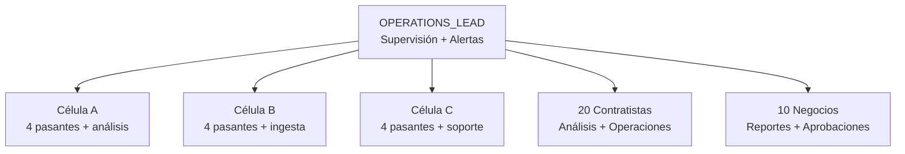

#### Gobernanza y RACI

| Actividad | SYSTEM_ADMIN | OPERATIONS_LEAD | ANALYST | INTERN |
|-----------|:---:|:---:|:---:|:---:|
| Configurar capacidad | R,A | C | I | I |
| Asignar PQR | I | R,A | C | I |
| Analizar PQR | I | A | R | I |
| Ingestar datos | I | A | I | R |
| Generar reportes | I | A | R | I |
| Aprobar cambios | R,A | C | I | I |

#### Expiración automática (REQ-21.4)

- INTERN_READONLY y CONTRACTOR_OPERATOR tienen `expires_at` configurable.
- Al alcanzar fecha de expiración → desactivación automática + audit log.
- BUSINESS_OWNER NO tiene expiración automática.

## 25. Automatizaciones Conceptuales

### SAP Scripting (REQ-23) — CONCEPTUAL_DESIGN

> ⚠️ **Diseño conceptual de integración SAP; no conectado a sistema SAP productivo.**

#### Casos de automatización

| Caso | Entrada | Salida | Frecuencia | Aprobación |
|------|---------|--------|------------|------------|
| Liquidación de ventas | CSV ventas | Asiento contable | Diario | LEGAL_APPROVER |
| Pagos | Listado proveedores | Confirmación pago | Semanal | VP_APPROVER |
| Notas de ajuste | Diferencias detectadas | Nota contable | A demanda | BUSINESS_OWNER |
| Consultas | Criterios búsqueda | Resultados | A demanda | Ninguna |
| Extracción reportes | Parámetros reporte | PDF/Excel | Mensual | OPERATIONS_LEAD |
| Conciliación | Saldos sistema vs banco | Diferencias | Mensual | LEGAL_APPROVER |

#### Controles de seguridad

- Credenciales SAP: exclusivamente variables de entorno.
- Segregación de funciones: quien ejecuta ≠ quien aprueba.
- Logging: cada ejecución registrada en audit_events.
- Reintentos: Política_Reintentos (REQ-37).
- Idempotencia: identificador único por transacción.
- Rollback: pseudocódigo de reversa documentado por cada flujo.

#### Pseudocódigo — Liquidación

```python
# CONCEPTUAL_DESIGN — No ejecutar contra SAP real
def liquidar_ventas(csv_path: str, context: SAPContext) -> LiquidationResult:
    """Liquidación de ventas conceptual."""
    # 1. Validar CSV contra schema esperado
    # 2. Verificar aprobación LEGAL_APPROVER vigente (< 72h)
    # 3. Conectar via SAP GUI Scripting (env vars)
    # 4. Para cada línea: crear asiento con retry policy
    # 5. Verificar posting exitoso
    # 6. Log resultado en audit_events
    # 7. Si error irrecuperable: rollback parcial
    raise NotImplementedError("CONCEPTUAL_DESIGN - SAP no conectado")
```

### Power Automate (REQ-24) — CONCEPTUAL_DESIGN

> ⚠️ **Diseño conceptual; no conectado a Microsoft 365 productivo.**

#### Flujos diseñados

| Flujo | Trigger | Acción | Endpoint Mock |
|-------|---------|--------|---------------|
| Ingesta de correos | Nuevo email en buzón PQR | Crear ticket | POST /api/webhooks/power-automate |
| Validación remitente | Email recibido | Verificar dominio | POST /api/auth/validate |
| Adjuntos | Email con archivos | Almacenar en blob | POST /api/webhooks/power-automate |
| Creación ticket PQR | Email validado | INSERT pqr_records | POST /api/webhooks/power-automate |
| Aprobaciones | Ticket requiere legal | Notificar aprobador | POST /api/webhooks/power-automate |
| Recordatorios cierre | SLA próximo a vencer | Email recordatorio | POST /api/webhooks/power-automate |
| Escalamiento SLA | SLA excedido | Notificar OPERATIONS_LEAD | POST /api/webhooks/power-automate |
| Notificaciones estado | Cambio de estado | Email al solicitante | POST /api/webhooks/power-automate |

#### Mock funcional

```typescript
// frontend/app/api/webhooks/power-automate/route.ts
export async function POST(request: Request) {
  const auth = request.headers.get('Authorization');
  if (!auth?.startsWith('Bearer ') || !validateToken(auth.slice(7))) {
    return NextResponse.json({ error: { code: 'UNAUTHORIZED' } }, { status: 401 });
  }
  const body = await request.json();
  const correlationId = crypto.randomUUID();
  // Log invocation to audit_events
  await logWebhookInvocation(correlationId, body);
  return NextResponse.json({ received: true, timestamp: new Date().toISOString(), correlationId });
}
```

### Análisis en R (REQ-25) — CONCEPTUAL_DESIGN

> ⚠️ **Diseño analítico conceptual; no requiere runtime R productivo.**

#### Casos de uso

| Caso | Input (Parquet) | Output (JSON) | Paquetes R | R Version |
|------|-----------------|---------------|------------|-----------|
| Forecast demanda | pqr_monthly_counts.parquet | forecast_results.json | forecast, tseries | ≥ 4.3.0 |
| Dimensionamiento equipo | capacity_metrics.parquet | staffing_plan.json | lpSolve, ggplot2 | ≥ 4.3.0 |
| Control estadístico procesos | process_times.parquet | spc_results.json | qcc, MASS | ≥ 4.3.0 |
| Detección anomalías | daily_volumes.parquet | anomaly_flags.json | anomalize, tibbletime | ≥ 4.3.0 |
| Análisis backlog | open_cases.parquet | backlog_analysis.json | dplyr, lubridate | ≥ 4.3.0 |
| Productividad analista | analyst_metrics.parquet | productivity_report.json | tidyverse, scales | ≥ 4.3.0 |

#### Formato de intercambio

- **Entrada**: Parquet (generado por pipeline Python).
- **Salida**: JSON (consumible por Route Handlers).
- **Sin integración productiva**: Solo diseño + scripts de referencia.

## 26. Seguridad

### Controles de seguridad (REQ-38)

| Control | Implementación | Verificación |
|---------|---------------|--------------|
| TLS 1.3 | Vercel (automático HTTPS) | Health check + Lighthouse |
| No PII en APIs | MIN_GROUP_SIZE ≥ 5 en todas las queries | Test: grupos < 5 excluidos |
| SQL Injection | Parameterized queries ($1, $2...) — NUNCA concatenación | Review + test de inyección |
| XSS | React escaping (default) + sanitización inputs | Playwright + security scan |
| Secretos en ENV | Solo `process.env.DATABASE_URL` — nunca en código | grep secretos en CI |
| Rotación 90 días | Alerta 15 días antes al SYSTEM_ADMIN | Cron check fecha expiración |
| RBAC | Middleware + JWT validation | Tests de acceso denegado |
| Append-only audit | REVOKE UPDATE/DELETE en audit_events | Integration test |
| Email autorizado | Validación dominio @vanti.com.co + whitelist | Unit test + E2E |
| No datos destructivos | NO DROP/TRUNCATE/DELETE sin WHERE | CI grep check |

### Gestión de emails (REQ-22)

- Directorio: hasta 2,000 emails con estado (activo/inactivo/suspendido).
- Operaciones bulk: requieren SYSTEM_ADMIN.
- Envío masivo: lotes de máximo 100/minuto (throttling).
- Log de comunicaciones vinculado a audit_events.

### Validación de email corporativo (REQ-17)

```typescript
const AUTHORIZED_DOMAINS = ['vanti.com.co']; // + whitelist from DB

function isAuthorizedEmail(email: string): boolean {
  const domain = email.split('@')[1]?.toLowerCase();
  if (AUTHORIZED_DOMAINS.includes(domain)) return true;
  // Check whitelist (with expiration)
  return checkWhitelist(email);
}
```

## 27. Resiliencia

### Política centralizada de reintentos (REQ-37)

| Parámetro | Valor | Justificación |
|-----------|-------|---------------|
| Max retries | 3 | Balance entre resiliencia y latencia |
| Backoff inicial | 2 segundos | Suficiente para errores transitorios |
| Backoff máximo | 30 segundos | Evitar espera excesiva |
| Jitter | ±500ms | Prevenir thundering herd |
| Errores retriable | timeout, conexión rechazada, 5xx, error de red | Solo transitorios |
| Errores NO retriable | 4xx, 401, 403, errores de negocio | Zero retries enforced |

### Implementación

```python
# backend/src/core/retry.py
import random
import time
from functools import wraps

TRANSIENT_ERRORS = (ConnectionError, TimeoutError, IOError)

def retry_policy(max_retries=3, base_delay=2.0, max_delay=30.0, jitter=0.5):
    """Centralized retry policy per REQ-37."""
    def decorator(func):
        @wraps(func)
        def wrapper(*args, **kwargs):
            last_error = None
            for attempt in range(max_retries + 1):
                try:
                    return func(*args, **kwargs)
                except TRANSIENT_ERRORS as e:
                    last_error = e
                    if attempt == max_retries:
                        # Log to audit, send to DLQ/quarantine
                        raise
                    delay = min(base_delay * (2 ** attempt), max_delay)
                    delay += random.uniform(-jitter, jitter)
                    time.sleep(delay)
                except (ValueError, PermissionError):
                    raise  # Non-retriable errors — zero retries
            raise last_error
        return wrapper
    return decorator
```

### TypeScript equivalent (frontend)

```typescript
// frontend/lib/server/retry.ts
interface RetryConfig {
  maxRetries: number;   // 3
  baseDelay: number;    // 2000ms
  maxDelay: number;     // 30000ms
  jitter: number;       // 500ms
}

async function withRetry<T>(fn: () => Promise<T>, config: RetryConfig): Promise<T> {
  let lastError: Error | undefined;
  for (let attempt = 0; attempt <= config.maxRetries; attempt++) {
    try {
      return await fn();
    } catch (error) {
      if (!isTransientError(error) || attempt === config.maxRetries) throw error;
      lastError = error as Error;
      const delay = Math.min(config.baseDelay * 2 ** attempt, config.maxDelay);
      const jitter = (Math.random() - 0.5) * 2 * config.jitter;
      await sleep(delay + jitter);
    }
  }
  throw lastError;
}
```

### Idempotencia (REQ-37.4)

- ETL: SHA-256 del archivo fuente como identificador de batch.
- Migración: `source_record_id` con ON CONFLICT DO NOTHING.
- Anulaciones: UUID por transición, check duplicados before insert.
- Aprobaciones: UUID por solicitud, estado machine prevents double-approve.

### Dead Letter Queue / Cuarentena

- ETL failures → `staging/quarantine.parquet`
- Migration failures → `staging/migration_quarantine.parquet`
- Webhook failures → `audit_events` con `correlation_id` + details

## 28. Observabilidad

### Health Checks (REQ-34, REQ-39)

```typescript
// GET /api/health (extender sin romper contrato existente)
export async function GET() {
  const dbStatus = await checkDatabaseConnectivity();
  const version = process.env.VERCEL_GIT_COMMIT_SHA?.slice(0, 7) || 'local';
  
  return NextResponse.json({
    status: dbStatus ? 'ok' : 'degraded',
    service: 'vantiops-360',
    timestamp: new Date().toISOString(),
    version,
    database: dbStatus ? 'connected' : 'unreachable',
    uptime: process.uptime(),
  });
}
```

### Métricas de observabilidad

| Métrica | Fuente | Umbral alerta | Acción |
|---------|--------|---------------|--------|
| Latencia P95 | Vercel Analytics | > 500ms | Monitor |
| Latencia P95 sostenida | Vercel Analytics | > 2s por 3 min | Modo degradado |
| Tasa de error 5xx | Vercel Logs | > 1% en 5 min | Alerta OPERATIONS_LEAD |
| Disponibilidad | Health checks 60s | < 99.5% mensual | Escalamiento |
| DB connections | Pool metrics | > 80% pool | Monitor |
| Pipeline duration | control_table.json | > 60s para 600 records | Warning |

### Modo degradado (REQ-39.3)

Cuando latencia P95 > 2s o error rate > 1% durante 3 minutos:
1. Activar caché de respuestas recientes (cuando sea aplicable).
2. Retornar datos del último fetch exitoso con flag `stale: true`.
3. Notificar OPERATIONS_LEAD via canal configurado.
4. Continuar intentando requests a la fuente.
5. Restaurar modo normal cuando métricas se recuperen.

### Logging estructurado

```typescript
// Formato de log estandarizado
interface StructuredLog {
  level: 'info' | 'warn' | 'error';
  timestamp: string;
  correlationId?: string;
  service: 'vantiops-360';
  module: string;
  message: string;
  metadata?: Record<string, unknown>;
  // NEVER include: passwords, tokens, PII
}
```

## 29. Estrategia de Pruebas

### Pirámide de tests

```mermaid
graph BT
    UNIT[Unit Tests<br/>Vitest + pytest<br/>80% cobertura módulos críticos]
    INTEGRATION[Integration Tests<br/>Frontend ↔ API ↔ DB]
    API_TEST[API Tests<br/>Contract + RBAC + State Machine]
    PROPERTY[Property Tests<br/>Hypothesis (Python)]
    MIGRATION[Migration Tests<br/>Up/Down verification]
    E2E[E2E Tests<br/>Playwright]
    VISUAL[Visual Regression<br/>Screenshot comparison 0.1%]
    SECURITY[Security Tests<br/>Access denied + injection]

    UNIT --> INTEGRATION
    INTEGRATION --> API_TEST
    API_TEST --> PROPERTY
    PROPERTY --> MIGRATION
    MIGRATION --> E2E
    E2E --> VISUAL
    VISUAL --> SECURITY
```

### Tests por componente nuevo

| Componente | Test File | Positivos | Negativos | Boundary |
|---|---|---|---|---|
| RBAC Middleware | `test_rbac.py` | Acceso con rol correcto | 403 sin permisos | Sin rol asignado |
| Annulation FSM | `test_state_machine.py` | Transiciones válidas | Transiciones inválidas (422) | Justificación = 10 chars |
| Audit Logger | `test_audit.py` | Log creado correctamente | Campos requeridos faltantes | Log sin PII |
| Email Validator | `test_email_auth.py` | @vanti.com.co acepta | @gmail.com rechaza | Whitelist expirada |
| Retry Policy | `test_retry.py` | Éxito en reintento 2 | Falla tras 3 reintentos | Error no-retriable |
| Migration 600 | `test_migration_600.py` | ≥ 95% éxito | Registro inválido → quarantine | Duplicado → skip |
| Risk Model API | `test_risk_api.py` | JSON con métricas reales | 404 si no entrenado | Disclaimer presente |
| Pareto consistency | `test_pareto_consistency.py` | RCA = Dashboard causa | Endpoint caído → error controlado | Threshold 40% |
| Capacity Model | `test_capacity.py` | Cálculo correcto | Utilización > 120% → alert | 0 analistas |
| PA Mock Webhook | `test_pa_mock.py` | 200 con Bearer válido | 401 sin token | Payload vacío |

### Property-based tests (Python — Hypothesis)

| Property | Módulo | Iteraciones | Requisito |
|----------|--------|-------------|-----------|
| ETL idempotency | pipeline | 100 | REQ-10.1 |
| State machine validity | annulations | 100 | REQ-16.2 |
| Retry backoff bounds | core/retry | 100 | REQ-37.1 |
| Quality score range [0,100] | quality | 100 | REQ-09 |
| Capacity formula consistency | operations | 100 | REQ-20.1 |
| Risk target computation | risk | 100 | REQ-07 |

### Visual regression (REQ-01.1)

- Capturas de pantalla de todas las rutas protegidas.
- Comparación con baseline: tolerancia máxima 0.1% diferencia de píxeles.
- Stored en `frontend/artifacts/screenshots/`.

### Pruebas de acceso denegado (REQ-18)

```typescript
// Para cada endpoint protegido:
const ACCESS_DENIED_TESTS = [
  { endpoint: '/api/audit', deniedRoles: ['INTERN_READONLY', 'CONTRACTOR_OPERATOR'] },
  { endpoint: '/api/approvals', deniedRoles: ['INTERN_READONLY', 'ANALYST'] },
  { endpoint: '/api/annulations/*/transition', deniedRoles: ['INTERN_READONLY'] },
  { endpoint: '/api/capacity', deniedRoles: ['INTERN_READONLY', 'CONTRACTOR_OPERATOR', 'AUDITOR'] },
];
```

## 30. CI/CD

### Pipeline actual (PROTEGIDO — solo extender)

```yaml
# .github/workflows/ci.yml — secuencia existente
quality job:
  1. npm ci
  2. Lint (eslint)
  3. Typecheck (tsc --noEmit)
  4. Unit Tests (vitest run)
  5. Coverage (vitest run --coverage)
  6. Build (next build)
  7. Playwright local smoke
  8. Upload artifacts

production-smoke job:
  9. Playwright against vantiops-360.vercel.app
```

### Extensiones planificadas

| Step nuevo | Posición | Propósito | REQ |
|---|---|---|---|
| `ruff check backend/` | Antes de lint frontend | Lint Python | REQ-32.1 |
| `pyright backend/` | Después de lint Python | Typecheck Python | REQ-32.1 |
| `pytest backend/tests/` | Después de unit tests frontend | Tests Python | REQ-31.1 |
| SQL validation | Después de build | Validar migrations | REQ-12 |
| Security grep | Después de build | Buscar secretos/patterns peligrosos | REQ-38 |
| Evidence generation | Final | Generar evidence.json | REQ-29 |
| Screenshot baseline | Pre-tests | Capturar baseline visual | REQ-01.3 |

### Quality Gates (REQ-32)

| Gate | Criterio | Bloquea merge |
|------|----------|:---:|
| Lint (ruff + eslint) | 0 errores | ✅ |
| Typecheck (pyright + tsc) | 0 errores | ✅ |
| Unit tests | 100% pass | ✅ |
| Coverage | ≥ 80% módulos críticos | ✅ |
| Build | Exit 0 | ✅ |
| Playwright | 100% pass | ✅ |
| SQL validation | Syntax válida | ✅ |
| Security scan | 0 secretos expuestos | ✅ |
| Access denied tests | Todos pass | ✅ |
| Evidence generated | Archivo válido | ❌ (warning) |

### Tiempo máximo

- Pipeline total: ≤ 15 minutos (REQ-01.2).
- Deploy a Preview: ≤ 5 minutos tras CI verde (REQ-32.3).
- Deploy a Producción: ≤ 10 minutos tras merge (REQ-32.5).

## 31. Despliegue

### Flujo de despliegue (REQ-32, REQ-33, REQ-34)

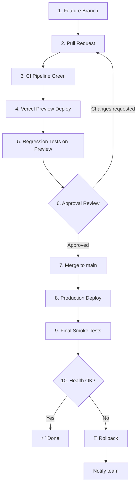

### Tres condiciones obligatorias para producción (REQ-34.5)

1. **CI Verde**: Todos los quality gates aprobados.
2. **Preview Validado**: Tests E2E pasan en URL de Preview.
3. **Regresión Aprobada**: Comparación visual + functional tests pass.

### Entornos

| Entorno | URL | Base de datos | Propósito |
|---------|-----|---------------|-----------|
| Local | http://localhost:3000 | .env.local DB | Desarrollo |
| Preview | https://{branch}.vantiops-360.vercel.app | DB Preview (separada) | Validación |
| Producción | https://vantiops-360.vercel.app | Neon PostgreSQL prod | Usuarios finales |

## 32. Rollback

### Estrategia de rollback

| Tipo | Trigger | Acción | Tiempo máximo |
|------|---------|--------|---------------|
| Automático (deploy) | Health check falla en 2 min post-deploy | Revert a versión anterior | 3 min |
| Automático (CI) | Rollback automático falla | Notificación crítica al equipo | Inmediato |
| Manual (regresión) | Regresión detectada en producción | Revert commit + redeploy | 1 hora |
| DB (migración) | Migración falla en producción | Restore snapshot Neon | 5 min |

### Proceso de rollback de deploy

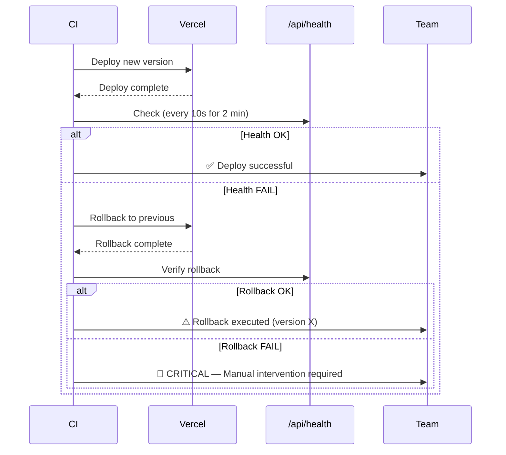

### Rollback de migraciones

1. Ejecutar script `down` de la migración fallida.
2. Si `down` falla → restore snapshot de Neon.
3. Registrar evento en audit_events.
4. Notificar a SYSTEM_ADMIN.

## 33. Control de Regresiones

### Definición

Una regresión es un fallo en funcionalidad previamente operativa causado por un cambio nuevo.

### Mecanismos de detección

| Mecanismo | Qué detecta | Cuándo ejecuta | REQ |
|-----------|-------------|----------------|-----|
| Visual regression | Cambios visuales > 0.1% píxeles | En CI, cada PR | REQ-01.1 |
| Playwright E2E | Flujos rotos (navegación, filtros, datos) | En CI + Preview | REQ-01.2 |
| Unit tests | Funciones que cambian comportamiento | En CI, cada PR | REQ-31 |
| API contract tests | Respuestas que cambian estructura | En CI, cada PR | REQ-05.8 |
| Pareto consistency | RCA ≠ Dashboard | En CI, cada PR | REQ-05.8 |
| TypeScript strict | Tipos incompatibles | Typecheck en CI | REQ-32.1 |
| ruff + eslint | Code patterns problemáticos | Lint en CI | REQ-40.2 |

### Baseline de screenshots

```
frontend/artifacts/screenshots/
├── dashboard.png
├── rca.png
├── riesgo.png
├── calidad.png
├── operaciones.png
├── migracion.png
├── anulaciones.png
├── evidencia.png
├── arquitectura.png
├── aliados.png
├── proveedores.png
├── plan-30-60-90.png
└── about.png
```

### Proceso de actualización de baseline

1. PR introduce cambio visual intencionado.
2. CI detecta diferencia > 0.1%.
3. Reviewer inspecciona screenshots nuevos.
4. Si aprobado → actualizar baseline con `npm run update-screenshots`.
5. Si no aprobado → revertir cambio visual.

## 34. Trazabilidad Requisito-Diseño

### Matriz de Trazabilidad Completa

| ID Req | Bloque | Componente | API | Tabla | Test | Evidencia | Riesgo |
|--------|--------|-----------|-----|-------|------|-----------|--------|
| REQ-01 | Constraint | Layout, CI | Todas existentes | — | Playwright, visual | screenshots/ | Regresión visual |
| REQ-02 | Constraint | Git workflow, CI | — | — | CI self-test | ci-execution.json | Branch corruption |
| REQ-03 | Constraint | Pipeline, DB | Todas | pqr_records | grep secretos, tests | security-scan.json | Data leak |
| REQ-04 | Constraint | Docs, CI | — | — | Checklist automation | phase-report.json | Incomplete phase |
| REQ-05 | A-1 | charts/pareto, rca | /api/charts/pareto, /api/rca | pqr_records | test_pareto_consistency | pareto-screenshots | Source of truth drift |
| REQ-06 | A-2 | provenance-badge | Todos endpoints | — | test_data_classification | data-dict.md | Mislabeled data |
| REQ-07 | A-3 | risk model | /api/risk/model | — | test_risk_model, test_risk_api | risk-metrics.json | Overfitting |
| REQ-08 | A-4 | docs/data-dictionary | — | Todas | test_validators | data-dictionary.md | Stale dictionary |
| REQ-09 | A-5 | statistics modules | /api/kpis, /api/charts/* | pqr_records | test_descriptive, test_inference | stats-report.json | Statistical error |
| REQ-10 | A-6 | pipeline orchestrator | — | pqr_records | test_pipeline | control_table.json | Data corruption |
| REQ-11 | B-1 | docs/erd.md | — | Todas | — (doc) | erd-diagram.png | Stale ERD |
| REQ-12 | B-2 | migrations/ | — | Todas nuevas | test_migrations | migration-log.json | Schema break |
| REQ-13 | B-3 | auth/rbac, middleware | Todas protegidas | app_users, roles, user_roles | test_rbac | rbac-matrix.json | Unauthorized access |
| REQ-14 | B-4 | audit/logger | /api/audit | audit_events | test_audit | audit-sample.json | Lost audit trail |
| REQ-15 | B-5 | governance/approvals | /api/approvals | approval_steps, approval_events | test_approvals | approval-evidence.json | Unapproved action |
| REQ-16 | B-6 | annulations/fsm | /api/annulations | cancellation_requests, _history | test_state_machine | state-transitions.json | Invalid transition |
| REQ-17 | B-7 | auth/email_validator | /api/auth/validate | partner_authorized_emails | test_email_auth | email-report.json | Unauthorized email |
| REQ-18 | B-8 | tests/ | Todos protegidos | — | test_access_denied | access-denied-screenshots/ | RBAC bypass |
| REQ-19 | C-1 | migration/master_records | — | pqr_records, migration_batches | test_migration_600 | migration-report.json | Data loss |
| REQ-20 | C-2 | operations/capacity | /api/capacity | — | test_capacity | capacity-metrics.json | Wrong alerts |
| REQ-21 | C-3 | auth/rbac (42 users) | — | app_users, user_roles | test_roles_42_users | roles-report.json | Role conflict |
| REQ-22 | C-4 | communications/email | — | — | test_email_mgr | email-stats.json | Throttling fail |
| REQ-23 | C-5 | docs/sap-design.md | — | — | — (conceptual) | sap-review.json | N/A (conceptual) |
| REQ-24 | C-6 | integrations/pa_mock | /api/webhooks/power-automate | audit_events | test_pa_mock | pa-webhook.json | Mock drift |
| REQ-25 | C-7 | docs/r-analysis.md | — | — | — (conceptual) | r-review.json | N/A (conceptual) |
| REQ-26 | C-8 | docs/onboarding, scripts/setup | — | — | — (script test) | onboarding-log | Setup failure |
| REQ-27 | C-9 | docs/change-management | — | — | — (process) | change-log.json | Untracked change |
| REQ-28 | C-10 | docs/transition-plan | — | app_users | — (process) | transition-checklist | Knowledge loss |
| REQ-29 | D-1 | CI evidence gen | /api/evidence | — | test_evidence | evidence-report.json | Fake evidence |
| REQ-30 | D-2 | docs/architecture-*.md | — | — | — (doc) | gap-analysis.json | Stale architecture |
| REQ-31 | D-3 | all test suites | Todas | Todas | All suites | coverage-report | Low coverage |
| REQ-32 | D-4 | .github/workflows/ci.yml | — | — | CI self-test | ci-evidence.json | Pipeline break |
| REQ-33 | D-5 | vercel.json, preview | — | Preview DB | E2E on preview | preview-screenshot | Preview down |
| REQ-34 | D-6 | vercel.json, prod | /api/health | Prod DB | E2E production | health-check.json | Production down |
| REQ-35 | D-7 | compliance matrix | — | — | CI matrix gen | compliance-final.json | Incomplete matrix |
| REQ-36 | NF | Todas APIs | Todas | pqr_records | Perf tests | latency-report | Slow response |
| REQ-37 | NF | core/retry | Todas con retry | — | test_retry | retry-metrics.json | Infinite retry |
| REQ-38 | NF | middleware, queries | Todas | — | security tests | security-scan.json | Vulnerability |
| REQ-39 | NF | health, degraded mode | /api/health | — | availability tests | uptime-report | Downtime |
| REQ-40 | NF | all code | — | — | lint + typecheck | lint-report | Technical debt |
| REQ-41 | NF | all components | Todas | pqr_records | load tests | scalability-report | Bottleneck |

## 35. Riesgos Técnicos

| # | Riesgo | Probabilidad | Impacto | Mitigación |
|---|--------|:---:|:---:|---|
| 1 | Regresión visual tras cambios | Media | Alto | Visual regression CI, 0.1% threshold |
| 2 | Conexión Neon timeout en producción | Baja | Alto | Pool con retry policy, health checks 60s |
| 3 | Migración 600 registros corrompe datos | Baja | Crítico | Snapshot pre-migración, ON CONFLICT DO NOTHING |
| 4 | RBAC bypass por middleware mal configurado | Baja | Crítico | Tests acceso denegado en CI, JWT validation |
| 5 | CI excede 15 min timeout | Media | Medio | Paralelización, caché npm, steps selectivos |
| 6 | Risk model overfitting | Media | Bajo | Holdout validation, disclaimer visible |
| 7 | Audit log disk overflow | Baja | Medio | Retención 12 meses, archivado posterior |
| 8 | State machine deadlock | Baja | Alto | Estados terminales definidos, no cycles |
| 9 | Email whitelist expiration silenciosa | Media | Medio | Alerta 15 días antes, cron check |
| 10 | Secretos committed accidentalmente | Baja | Crítico | CI grep, .gitignore, pre-commit hook |
| 11 | Neon connection string rotada sin update | Baja | Crítico | ENV only, rotación documentada, alerta 15 días |
| 12 | Pipeline ETL procesa archivo corrupto | Media | Medio | SHA-256 validation, quarantine mechanism |
| 13 | Preview DB contamina producción | Baja | Crítico | DB separadas, environment isolation |
| 14 | Aprobación expira sin notificación | Media | Medio | Cron check 72h, recordatorio automático |
| 15 | Contratista sale sin transferencia | Media | Alto | Checklist 10 días, cobertura alternativa obligatoria |

## 36. Decisiones Arquitectónicas

### ADR-001: Next.js Full Stack (sin FastAPI en producción)

| Aspecto | Decisión |
|---------|----------|
| **Contexto** | El frontend usa Route Handlers para APIs; el backend Python es un motor analítico local. |
| **Decisión** | Mantener Next.js Route Handlers como API en producción. Python backend para ETL/ML local. |
| **Justificación** | Simplifica deploy (un solo artefacto en Vercel), reduce latencia (sin hop extra), mantiene lo que funciona. |
| **Alternativas descartadas** | FastAPI desplegado en Railway/Render; API Gateway con Lambda. |
| **Consecuencias** | El backend Python no sirve requests de usuario. Risk model exporta JSON estático. |

### ADR-002: Pareto como Fuente Única de Verdad

| Aspecto | Decisión |
|---------|----------|
| **Contexto** | Dashboard y RCA necesitan la misma causa principal con los mismos filtros. |
| **Decisión** | GET /api/charts/pareto es la ÚNICA fuente. RCA y Dashboard la consumen. |
| **Justificación** | Elimina drift entre módulos. Un solo SQL, un solo contrato, un solo test de consistencia. |
| **Alternativas descartadas** | Caché local con invalidación; materialización en tabla separada. |
| **Consecuencias** | Cualquier cambio en la query de Pareto se refleja inmediato en todo el sistema. |

### ADR-003: RBAC con JWT + Middleware Next.js

| Aspecto | Decisión |
|---------|----------|
| **Contexto** | Se necesita control de acceso para 11 roles sin auth provider externo (inicialmente). |
| **Decisión** | JWT con role claim + Next.js middleware + validación < 500ms. |
| **Justificación** | Sin dependencia externa, validación local rápida, compatible con Vercel Edge. |
| **Alternativas descartadas** | NextAuth.js con adapter DB; Auth0/Okta federated; cookie-based sessions. |
| **Consecuencias** | Token refresh necesario; secreto JWT en ENV; sin SSO federado (futuro). |

### ADR-004: Auditoría Append-Only en PostgreSQL

| Aspecto | Decisión |
|---------|----------|
| **Contexto** | REQ-14 exige logs inmutables con retención 12 meses. |
| **Decisión** | Tabla audit_events append-only en Neon con REVOKE UPDATE/DELETE. |
| **Justificación** | Mismo DB (sin servicio extra), inmutabilidad enforced a nivel DB, queries SQL estándar. |
| **Alternativas descartadas** | CloudWatch Logs; tabla en DynamoDB; archivo JSON append. |
| **Consecuencias** | Crece con el tiempo; necesita archivado después de 12 meses; sin delete posible. |

### ADR-005: Máquina de Estados Anulaciones

| Aspecto | Decisión |
|---------|----------|
| **Contexto** | REQ-16 define un FSM con 6 estados y transiciones específicas. |
| **Decisión** | Implementar FSM en código con validación de transiciones + historial en DB. |
| **Justificación** | Control total sobre validaciones, audit integrado, sin dependencia de servicio externo. |
| **Alternativas descartadas** | AWS Step Functions; Temporal.io; tabla de transiciones en DB sin lógica. |
| **Consecuencias** | Lógica de negocio en código, testeable con property tests, historial completo en DB. |

### ADR-006: Migraciones No Destructivas

| Aspecto | Decisión |
|---------|----------|
| **Contexto** | pqr_records ya tiene datos en producción; REQ-03 prohíbe DROP/TRUNCATE. |
| **Decisión** | Solo CREATE IF NOT EXISTS, ADD COLUMN; snapshot antes de producción; reversible con DOWN. |
| **Justificación** | Protege datos existentes, compatible con Neon branching, auditable. |
| **Alternativas descartadas** | Prisma migrate (puede generar destructivas); raw SQL sin control. |
| **Consecuencias** | Esquema solo crece; columnas deprecated se marcan pero no se eliminan. |

### ADR-007: Proveniencia de Datos con Labels

| Aspecto | Decisión |
|---------|----------|
| **Contexto** | REQ-06 exige distinguir datos reales de simulados en el dashboard. |
| **Decisión** | Cada endpoint retorna `dataProvenance` field; UI muestra badge con icono. |
| **Justificación** | Transparencia para auditoría; el usuario sabe qué es real vs demo. |
| **Alternativas descartadas** | Solo documentación; colores distintos sin label; metadata en headers. |
| **Consecuencias** | Overhead mínimo (1 campo extra); requiere consistencia en todos los endpoints. |

### ADR-008: Evidencia Dinámica (no hardcoded)

| Aspecto | Decisión |
|---------|----------|
| **Contexto** | REQ-29 prohíbe métricas inventadas; toda evidencia debe ser verificable. |
| **Decisión** | CI genera evidence.json con datos reales (commit SHA, test results, coverage, timestamps). |
| **Justificación** | Reproducible, verificable, generado automáticamente sin intervención manual. |
| **Alternativas descartadas** | Valores hardcoded en página /evidencia; screenshots manuales. |
| **Consecuencias** | Requiere step en CI; la página /evidencia lee JSON generado; si CI no corre, no hay evidencia. |

### ADR-009: Conceptualización SAP / Power Automate / R

| Aspecto | Decisión |
|---------|----------|
| **Contexto** | REQ-23, 24, 25 requieren diseños pero NO conexión productiva. |
| **Decisión** | Documentos de diseño + contratos + pseudocódigo + mock webhook PA. |
| **Justificación** | Cumple requisitos sin inventar conexiones; el mock permite demo funcional. |
| **Alternativas descartadas** | Implementar stubs completos; ignorar estos requisitos. |
| **Consecuencias** | Claramente marcado CONCEPTUAL_DESIGN; mock PA testeable; sin runtime R ni SAP. |

## Correctness Properties

*A property is a characteristic or behavior that should hold true across all valid executions of a system — essentially, a formal statement about what the system should do. Properties serve as the bridge between human-readable specifications and machine-verifiable correctness guarantees.*

### Property 1: Pareto high concentration threshold correctness

*For any* set of PQR records where the top cause's frequency exceeds the configurable `highConcentrationThreshold` (default 40%) of total records, the Pareto endpoint response SHALL include `high_concentration: true` and `concentration_pct` equal to the observed percentage; conversely, when below the threshold, `high_concentration` SHALL be `false`.

**Validates: Requirements 5.5**

### Property 2: Annulation state machine transition validity

*For any* pair `(currentState, targetState)`, the annulation transition SHALL succeed if and only if the pair is in the set of valid transitions `{(Solicitada, En_Revisión), (En_Revisión, Aprobada), (En_Revisión, Rechazada), (Aprobada, Ejecutada), (Ejecutada, Cerrada)}`; for any pair not in this set, the system SHALL reject with HTTP 422 and include the list of valid target states from the current state.

**Validates: Requirements 16.2, 16.5**

### Property 3: Annulation transition requires valid justification and produces audit

*For any* annulation transition attempt, if the justification string has fewer than 10 characters the system SHALL reject with HTTP 400; if the justification is valid (≥ 10 chars) and the transition is valid, the system SHALL create an audit entry in `cancellation_state_history` containing the user ID, role, timestamp, and full justification.

**Validates: Requirements 16.3, 16.6**

### Property 4: RBAC denies unauthorized access

*For any* user with a role not present in the endpoint's authorized role list, accessing that protected endpoint SHALL result in HTTP 403 with the state unchanged and the denied attempt recorded in `audit_events`.

**Validates: Requirements 13.3, 18.1**

### Property 5: ETL pipeline idempotency

*For any* valid input file, processing it through the ETL pipeline a second time (after a first successful run) SHALL return an "already processed" result without modifying any curated data, verified by matching the SHA-256 hash against the control table.

**Validates: Requirements 10.1**

### Property 6: ETL quarantine completeness

*For any* record that fails validation against the data dictionary rules, the pipeline SHALL place it in quarantine with all three required fields present: `rule_id` (non-empty string), `reason` (non-empty string), and `quarantine_timestamp` (valid ISO-8601 UTC).

**Validates: Requirements 10.3**

### Property 7: Retry policy bounds and classification

*For any* transient error (timeout, connection refused, 5xx), the system SHALL retry at most 3 times with delays bounded by `[baseDelay * 2^attempt - jitter, min(baseDelay * 2^attempt + jitter, maxDelay)]`; *for any* non-transient error (4xx, 401, 403, validation error), the system SHALL propagate immediately with zero retries.

**Validates: Requirements 37.1, 37.2**

### Property 8: Migration idempotency

*For any* set of PQR records migrated to Neon, re-executing the migration with the same source data SHALL NOT insert duplicate records, NOT modify previously migrated records, and the total record count SHALL remain unchanged from the first successful migration.

**Validates: Requirements 19.7**

### Property 9: Descriptive statistics correctness

*For any* non-empty array of positive floating-point values representing `tiempo_gestion_dias`, the computed mean SHALL equal the sum divided by count, the median SHALL be the middle value of the sorted array, P90 SHALL be the value at the 90th percentile, and standard deviation SHALL be the square root of variance.

**Validates: Requirements 9.1**

### Property 10: MIN_GROUP_SIZE privacy exclusion

*For any* dataset where a group (by causa, empresa, canal, etc.) has fewer than 5 records, that group SHALL NOT appear in any API response; groups with exactly 0 records are also excluded.

**Validates: Requirements 9.3, 38.2**

### Property 11: Audit log immutability

*For any* existing audit event record in `audit_events`, attempting an UPDATE or DELETE operation SHALL fail (enforced at database level), preserving the original record unchanged.

**Validates: Requirements 14.2, 14.4**

### Property 12: Unauthorized email denial with audit

*For any* email address whose domain is not in the authorized domains list (`@vanti.com.co` or configured whitelist) and is not in the active whitelist entries, authentication SHALL be denied with HTTP 403 and an audit event SHALL be created with the email, timestamp, IP, and rejection reason.

**Validates: Requirements 17.2**

### Property 13: Capacity model formula enforcement

*For any* positive values of `hoursAvailable` and `productivityFactor` (in range (0,1]), the computed `netCapacity` SHALL equal `hoursAvailable × productivityFactor`, and `utilization` SHALL equal `demandHours / netCapacity`; the alert level SHALL be 'green' when utilization ≤ 0.85, 'yellow' when ≤ 1.0, 'orange' when ≤ 1.20, and 'red' when > 1.20.

**Validates: Requirements 20.1, 20.3**

### Property 14: Risk model metrics validity

*For any* valid training dataset with sufficient samples (≥ 50 records with both classes represented), the risk model SHALL produce metrics where precision, recall, F1-score, and ROC-AUC are all within the range [0.0, 1.0], feature importance list is non-empty, and the disclaimer string is present.

**Validates: Requirements 7.2, 7.3, 7.4**

## Error Handling

### Error response contract (all APIs)

```typescript
interface ApiErrorResponse {
  error: {
    code: string;          // Machine-readable: 'VALIDATION_ERROR', 'FORBIDDEN', etc.
    message: string;       // Human-readable description
    details?: unknown;     // Additional context (field errors, valid transitions, etc.)
  };
}
```

### Error codes and HTTP status mapping

| HTTP Status | Code | When | Retry |
|---|---|---|---|
| 400 | VALIDATION_ERROR | Invalid input (justification < 10 chars, bad params) | ❌ |
| 401 | UNAUTHORIZED | Missing or invalid auth token | ❌ |
| 403 | FORBIDDEN | Valid user, insufficient permissions | ❌ |
| 404 | NOT_FOUND | Resource doesn't exist | ❌ |
| 422 | INVALID_TRANSITION | State machine invalid transition | ❌ |
| 429 | RATE_LIMITED | Too many requests | ✅ (backoff) |
| 500 | INTERNAL_ERROR | Unhandled server error | ✅ (retry policy) |
| 503 | SERVICE_UNAVAILABLE | DB unreachable, dependency down | ✅ (retry policy) |

### Error handling by module

| Module | Error Type | Handling | User Impact |
|--------|-----------|----------|-------------|
| Pareto API | DB timeout | Retry 3x → 503 with controlled message | "Datos temporalmente no disponibles" |
| Risk API | File not found | 404 MODEL_NOT_TRAINED | Show "Model not yet trained" |
| Annulations | Invalid transition | 422 with valid transitions listed | Show allowed actions only |
| RBAC | No permissions | 403 + audit log | Redirect to /access-denied |
| ETL Pipeline | Validation error | Quarantine record, continue processing | Log in control_table |
| ETL Pipeline | I/O error | Retry 3x → fail batch | Batch status "failed" |
| Migration | Neon connection fail | Retry 3x → abort, preserve existing | Report partial success |
| Audit | Write failure | Critical alert — cannot lose audit | Escalate to SYSTEM_ADMIN |

### Frontend error boundaries

```typescript
// frontend/app/error.tsx — already exists
// Catches unhandled errors at route level
// Shows user-friendly message without exposing internals

// Per-component error handling:
// - Fetch failures → retry with exponential backoff
// - 403 → redirect to /access-denied
// - 500/503 → show "Servicio temporalmente no disponible"
// - Network offline → show cached data with stale indicator
```

### Sanitized error logging

- NEVER log: passwords, tokens, PII, full stack traces to client
- ALWAYS log server-side: correlation_id, timestamp, module, error type, sanitized message
- Console.error for development; structured JSON for production

## Testing Strategy

### Dual approach: Unit Tests + Property Tests

| Layer | Framework | Purpose | Min Coverage |
|-------|-----------|---------|:---:|
| Unit (Frontend) | Vitest + Testing Library | Component behavior, hooks, utils | 80% critical |
| Unit (Backend) | pytest | Pipeline, quality, risk, stats, RCA | 80% critical |
| Property (Backend) | Hypothesis | Universal correctness properties | 100 iterations each |
| Integration | Vitest + real DB | Frontend ↔ API ↔ Neon | Key flows |
| API Contract | Vitest | Response structure, status codes | All endpoints |
| E2E | Playwright | User flows, navigation, filters | Critical paths |
| Visual | Playwright screenshots | Regression detection (0.1% threshold) | All routes |
| Security | Custom + Playwright | Access denied, injection, RBAC | All protected |
| Migration | pytest + test DB | Up/down, idempotency, rollback | All migrations |

### Property-based testing configuration

- **Library**: Hypothesis 6.119.3 (Python backend)
- **Minimum iterations**: 100 per property test
- **Tag format**: `# Feature: vantiops-360-master-spec, Property {N}: {description}`

### Property test mapping

| Property # | Test File | Module Under Test |
|---|---|---|
| 1 | `backend/tests/property/test_pareto_threshold.py` | charts/pareto logic |
| 2 | `backend/tests/property/test_annulation_fsm.py` | annulations/state_machine |
| 3 | `backend/tests/property/test_annulation_fsm.py` | annulations/state_machine |
| 4 | `backend/tests/property/test_rbac_deny.py` | auth/rbac |
| 5 | `backend/tests/property/test_etl_idempotency.py` | pipeline/orchestrator |
| 6 | `backend/tests/property/test_etl_quarantine.py` | pipeline/orchestrator |
| 7 | `backend/tests/property/test_retry_policy.py` | core/retry |
| 8 | `backend/tests/property/test_migration_idempotency.py` | migration/master_records |
| 9 | `backend/tests/property/test_descriptive_stats.py` | statistics/descriptive |
| 10 | `backend/tests/property/test_min_group_size.py` | API query layer |
| 11 | `backend/tests/property/test_audit_immutability.py` | audit/logger |
| 12 | `backend/tests/property/test_email_validation.py` | auth/email_validator |
| 13 | `backend/tests/property/test_capacity_model.py` | operations/capacity |
| 14 | `backend/tests/property/test_risk_model_metrics.py` | risk/model |

### CI integration

```yaml
# Added to .github/workflows/ci.yml (extension, not replacement)
- name: Property Tests (Python)
  run: pytest backend/tests/property/ -v --hypothesis-seed=0
  working-directory: .
```

### Test execution order in CI

1. Lint (ruff + eslint) — fast feedback
2. Typecheck (pyright + tsc) — catch type errors
3. Unit tests (pytest + vitest) — logic correctness
4. Property tests (hypothesis) — universal correctness
5. Coverage report — quality gate ≥ 80%
6. Build (next build) — compilation check
7. SQL validation — migration safety
8. Security scan — no secrets/patterns
9. Playwright E2E — user flows
10. Visual regression — screenshot comparison
11. Evidence generation — artifacts

## Data Provenance Labels

### Module provenance declarations

| Module | Provenance | Justification |
|--------|-----------|---------------|
| /api/charts/pareto | REAL_DATA | Direct SQL query to Neon pqr_records |
| /api/rca | REAL_DATA | Direct SQL query to Neon pqr_records |
| /api/kpis | DERIVED_DATA | Aggregated from pqr_records |
| /api/risk/model | DERIVED_DATA | ML model results from real data |
| /api/quality | DERIVED_DATA | Quality score computed from pqr_records |
| /api/filters | REAL_DATA | Distinct values from pqr_records |
| /api/health | REAL_DATA | Live system status |
| /api/capacity | DERIVED_DATA | Formula-based capacity metrics |
| /api/annulations | REAL_DATA | State from cancellation_requests table |
| /api/audit | REAL_DATA | Events from audit_events table |
| /api/evidence | REAL_DATA | CI-generated artifacts |
| /api/webhooks/power-automate | CONCEPTUAL_DESIGN | Mock endpoint for demo |
| Pipeline ETL (Python) | REAL_DATA → DERIVED_DATA | Transforms raw Excel to curated |
| Risk Model (Python) | DERIVED_DATA | ML model training on real data |
| SAP Integration docs | CONCEPTUAL_DESIGN | Design only, no SAP connection |
| Power Automate docs | CONCEPTUAL_DESIGN | Design only, no M365 connection |
| R Analysis docs | CONCEPTUAL_DESIGN | Design only, no R runtime |
| Test data generators | SIMULATED_DATA | Hypothesis/synthetic for testing |

### Badge display in UI

```typescript
// frontend/components/ui/provenance-badge.tsx
const PROVENANCE_CONFIG: Record<DataProvenance, { label: string; icon: string; color: string }> = {
  REAL_DATA: { label: 'Dato Real', icon: '✓', color: 'green' },
  DERIVED_DATA: { label: 'Dato Derivado', icon: '∑', color: 'blue' },
  SIMULATED_DATA: { label: 'Dato Simulado', icon: '◊', color: 'amber' },
  CONCEPTUAL_DESIGN: { label: 'Diseño Conceptual', icon: '◇', color: 'gray' },
};
```

---

## Appendix: Rutas Protegidas (Existentes)

| Ruta | Página | Protegida |
|------|--------|:---------:|
| `/` | Dashboard | ✅ |
| `/rca` | Root Cause Analysis | ✅ |
| `/riesgo` | Risk | ✅ |
| `/calidad` | Quality | ✅ |
| `/operaciones` | Operations | ✅ |
| `/migracion` | Migration | ✅ |
| `/anulaciones` | Annulations | ✅ |
| `/evidencia` | Evidence | ✅ |
| `/arquitectura` | Architecture | ✅ |
| `/aliados` | Partners | ✅ |
| `/proveedores` | Providers | ✅ |
| `/plan-30-60-90` | Plan | ✅ |
| `/about` | About | ✅ |

---

*Document generated for VantiOps 360 Master Spec. Copyright © 2026 Carlos Alberto Figueroa Martínez.*

