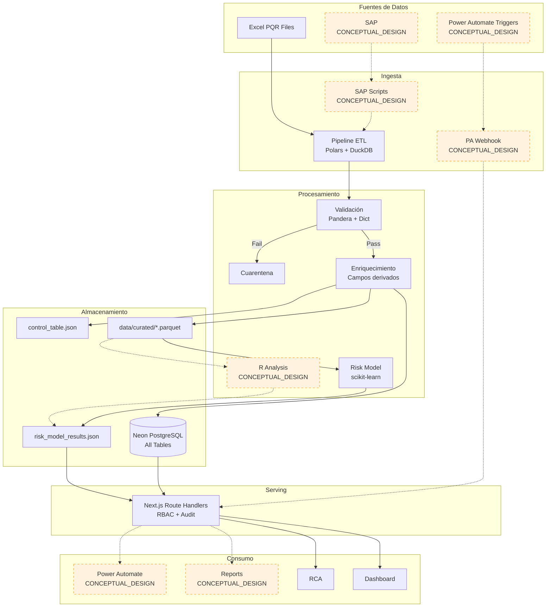

# Arquitectura Objetivo (To-Be) — VantiOps 360

**Proveniencia:** CONCEPTUAL_DESIGN  
**Última actualización:** 2025-01-15  
**Versión:** 1.0.0

> ⚠️ **CONCEPTUAL_DESIGN**: Este documento describe la arquitectura objetivo planificada.
> Los elementos marcados como CONCEPTUAL_DESIGN no están implementados en producción
> y representan diseños técnicos para iteraciones futuras.

---

## Resumen

La arquitectura objetivo de VantiOps 360 evoluciona la plataforma actual hacia un sistema empresarial completo con autenticación federada, integraciones productivas con SAP y Microsoft 365, análisis estadístico avanzado con R, y capacidades de auto-recuperación y observabilidad mejoradas.

---

## Diagrama de Arquitectura Objetivo

```mermaid
graph TB
    subgraph "Usuarios"
        USER_INT[Usuarios Internos<br/>42 concurrentes]
        USER_EXT[Partners Externos<br/>Socios autorizados]
    end

    subgraph "Autenticación — CONCEPTUAL_DESIGN"
        AZURE_AD[Azure Active Directory<br/>SSO Federado]
        MFA[Multi-Factor Auth<br/>Conditional Access]
    end

    subgraph "Vercel — Producción (Mejorado)"
        direction TB
        subgraph "Security Layer"
            WAF[WAF<br/>Rate Limiting]
            AUTH_MW[Auth Middleware<br/>Azure AD JWT + Email Validation]
            RBAC_MW[RBAC Middleware<br/>11 Roles]
            AUDIT_MW[Audit Middleware<br/>Append-only sync]
        end

        subgraph "Next.js 14 Frontend (Extendido)"
            LAYOUT[Layout Principal<br/>PROTEGIDO]
            DASH[Dashboard<br/>PROTEGIDO]
            RCA_UI[RCA Page<br/>PROTEGIDO]
            RISK_UI[Riesgo Page]
            ANULACIONES_UI[Anulaciones Page]
            CAPACITY_UI[Capacity Dashboard]
            EVIDENCE_UI[Evidence Page<br/>Dinámico]
            PROVENANCE_UI[Data Provenance Badges]
        end

        subgraph "Route Handlers — Completos"
            API_CHARTS[/api/charts/:type]
            API_KPIS[/api/kpis]
            API_RCA[/api/rca]
            API_RISK[/api/risk/model]
            API_ANNUL[/api/annulations]
            API_AUDIT[/api/audit]
            API_AUTH[/api/auth/validate]
            API_APPROVALS[/api/approvals]
            API_CAPACITY[/api/capacity]
            API_EVIDENCE[/api/evidence<br/>Dinámico]
            API_HEALTH[/api/health<br/>DB + Degraded Mode]
        end
    end

    subgraph "Neon PostgreSQL (Expandido + HA)"
        direction TB
        DB_PQR[(pqr_records)]
        DB_AUTH[(Auth Tables<br/>roles, users, permissions)]
        DB_ANNUL[(Annulation Tables<br/>requests + history)]
        DB_AUDIT[(audit_events<br/>Immutable)]
        DB_MIG[(migration Tables)]
        DB_PART[(Partner Tables)]
        DB_DOCS[(Documents)]
        DB_REPLICA[(Read Replica<br/>CONCEPTUAL_DESIGN)]
    end

    subgraph "Backend Python — Enhanced"
        direction TB
        ETL_ENH[Pipeline ETL<br/>Enhanced + Monitoring]
        RISK_ENH[Risk Model<br/>Retrained periodically]
        QUALITY_ENH[Quality Score<br/>6 dimensions]
        STATS_ENH[Statistics<br/>Descriptive + Inferential]
        MIG_MOD[Migration Module<br/>600+ records]
        CAPACITY_MOD[Capacity Model]
    end

    subgraph "Integraciones — CONCEPTUAL_DESIGN"
        direction TB
        SAP[SAP Integration<br/>6 automation cases<br/>CONCEPTUAL_DESIGN]
        PA_PROD[Power Automate<br/>8 flows productivos<br/>CONCEPTUAL_DESIGN]
        R_ENGINE[R Analysis Engine<br/>6 use cases<br/>CONCEPTUAL_DESIGN]
        EMAIL_BULK[Email Service<br/>2000 emails<br/>100/min throttle]
    end

    subgraph "CI/CD — Enhanced"
        direction TB
        GHA_FULL[GitHub Actions<br/>Full Pipeline ≤ 15 min]
        SEC_SCAN[Security Scan<br/>Secret detection]
        SQL_VAL[SQL Validation<br/>Migration check]
        VIS_REG[Visual Regression<br/>0.1% threshold]
        SMOKE[Post-Deploy Smoke<br/>10s × 12 checks]
        ROLLBACK[Auto-Rollback<br/>< 3 min]
    end

    subgraph "Observabilidad — CONCEPTUAL_DESIGN"
        METRICS[Metrics Dashboard<br/>P95 latency, error rate]
        ALERTS[Alert System<br/>Degradation → OPERATIONS_LEAD]
        LOGS_AGG[Log Aggregation<br/>Structured JSON]
    end

    %% Flujos de usuario
    USER_INT --> AZURE_AD
    USER_EXT --> AZURE_AD
    AZURE_AD --> AUTH_MW
    AUTH_MW --> RBAC_MW --> AUDIT_MW

    %% Security → Frontend
    AUDIT_MW --> LAYOUT
    LAYOUT --> DASH
    LAYOUT --> RCA_UI
    LAYOUT --> RISK_UI
    LAYOUT --> ANULACIONES_UI
    LAYOUT --> CAPACITY_UI
    LAYOUT --> EVIDENCE_UI

    %% Frontend → APIs
    DASH --> API_CHARTS
    DASH --> API_KPIS
    RCA_UI --> API_RCA
    RISK_UI --> API_RISK
    ANULACIONES_UI --> API_ANNUL
    CAPACITY_UI --> API_CAPACITY
    EVIDENCE_UI --> API_EVIDENCE

    %% APIs → Database
    API_CHARTS --> DB_PQR
    API_KPIS --> DB_PQR
    API_RCA --> DB_PQR
    API_ANNUL --> DB_ANNUL
    API_AUDIT --> DB_AUDIT
    API_AUTH --> DB_AUTH
    API_HEALTH --> DB_PQR
    API_HEALTH --> DB_REPLICA

    %% Backend → DB
    ETL_ENH --> DB_PQR
    MIG_MOD --> DB_PQR
    RISK_ENH --> API_RISK

    %% Integraciones conceptuales
    SAP -.->|Scripting<br/>6 casos| DB_PQR
    PA_PROD -.->|8 flows<br/>Bearer token| API_CHARTS
    R_ENGINE -.->|Parquet in<br/>JSON out| STATS_ENH

    %% CI/CD
    GHA_FULL --> SEC_SCAN
    GHA_FULL --> SQL_VAL
    GHA_FULL --> VIS_REG
    GHA_FULL --> SMOKE
    SMOKE -->|fail| ROLLBACK

    %% Observabilidad
    API_HEALTH --> METRICS
    METRICS --> ALERTS

    %% Estilos
    classDef protected fill:#e8f5e9,stroke:#4caf50,stroke-width:2px
    classDef implemented fill:#e3f2fd,stroke:#2196f3
    classDef conceptual fill:#fff3e0,stroke:#ff9800,stroke-dasharray:5 5
    classDef database fill:#fce4ec,stroke:#e91e63
    classDef ci fill:#f3e5f5,stroke:#9c27b0

    class LAYOUT,DASH,RCA_UI,API_CHARTS,API_KPIS,API_RCA protected
    class AUTH_MW,RBAC_MW,AUDIT_MW,RISK_UI,ANULACIONES_UI,CAPACITY_UI,EVIDENCE_UI,API_RISK,API_ANNUL,API_AUDIT,API_AUTH,API_APPROVALS,API_CAPACITY,API_EVIDENCE,API_HEALTH implemented
    class AZURE_AD,MFA,WAF,SAP,PA_PROD,R_ENGINE,DB_REPLICA,METRICS,ALERTS,LOGS_AGG,ROLLBACK,VIS_REG,SEC_SCAN conceptual
    class DB_PQR,DB_AUTH,DB_ANNUL,DB_AUDIT,DB_MIG,DB_PART,DB_DOCS database
    class GHA_FULL,SQL_VAL,SMOKE ci
```

---

## Mejoras Planificadas por Categoría

### 1. Autenticación y Seguridad — CONCEPTUAL_DESIGN

| Mejora | Descripción | Justificación Técnica |
|--------|-------------|----------------------|
| Azure Active Directory SSO | Autenticación federada con SSO corporativo | Elimina gestión local de credenciales, cumplimiento con políticas corporativas Vanti |
| Multi-Factor Authentication | Acceso condicional con MFA para operaciones críticas | Requisito de seguridad para sector energético regulado |
| WAF / Rate Limiting | Protección contra ataques DDoS y abuso de API | Hardening de seguridad para exposición pública |
| Session Management | Sesiones con timeout configurable y revocación | Control de acceso temporal para contratistas e internos |

### 2. Integraciones Productivas — CONCEPTUAL_DESIGN

| Integración | Casos de Uso | Estado Actual |
|-------------|--------------|---------------|
| **SAP Scripting** | 6 casos: liquidación, pagos, notas crédito, consultas, reportes, conciliación | Diseño documentado en `docs/sap-design.md` |
| **Power Automate** | 8 flujos: notificaciones, escalamiento, reportes, aprobaciones, sync, alerts, reminders, digest | Mock webhook implementado; flujos en `docs/power-automate-design.md` |
| **R Analysis Engine** | 6 casos: forecast, staffing, SPC, anomalías, backlog, productividad | Diseño en `docs/r-analysis.md`; requiere R ≥ 4.3.0 |
| **Email Service** | Gestión 2,000 emails, throttle 100/min, bulk operations | Módulo `email_mgr.py` parcialmente implementado |

### 3. Observabilidad y Resiliencia — CONCEPTUAL_DESIGN

| Capacidad | Descripción | Beneficio |
|-----------|-------------|-----------|
| Health Check con DB Validation | `/api/health` verifica conectividad real a Neon | Detección temprana de problemas de infraestructura |
| Modo Degradado | Cache stale cuando P95 > 2s o error rate > 1% por 3 min | Continuidad de servicio parcial durante incidentes |
| Auto-Rollback Post-Deploy | Health check cada 10s × 2 min; rollback automático < 3 min | Recuperación sin intervención humana |
| Alertas al OPERATIONS_LEAD | Notificación automática en degradación | Respuesta rápida a incidentes |
| Métricas de Observabilidad | Dashboard de latencia P95, error rate, uptime | Visibilidad operacional continua |

### 4. CI/CD Avanzado — Parcialmente CONCEPTUAL_DESIGN

| Mejora | Estado | Descripción |
|--------|--------|-------------|
| Security Scan (secrets) | Por implementar | Grep de patrones de secretos en código |
| SQL Migration Validation | Por implementar | Validación automática de archivos SQL |
| Visual Regression | CONCEPTUAL_DESIGN | Comparación screenshots con 0.1% threshold |
| Post-Deploy Smoke | CONCEPTUAL_DESIGN | 12 health checks × 10s tras deploy |
| Auto-Rollback | CONCEPTUAL_DESIGN | Rollback si smoke falla, < 3 min |
| Evidence Generation | Por implementar | Commit hash, versiones, coverage en artifacts |

### 5. Escalabilidad — CONCEPTUAL_DESIGN

| Mejora | Descripción | Justificación |
|--------|-------------|---------------|
| Read Replica (Neon) | Réplica de lectura para queries pesados | Separar carga analítica de operacional |
| Connection Pooling expandido | > 2 conexiones para picos de carga | Soporte para > 42 usuarios en futuro |
| CDN para Assets Estáticos | Cache edge para imágenes BPMN, brand assets | Reducir latencia global |
| Queue para ETL | Cola de procesamiento para múltiples archivos | Procesamiento paralelo de lotes |

---

## Flujo de Datos — Arquitectura Objetivo



---

## Gap Analysis — Brecha entre Arquitectura Actual y Objetivo

La siguiente tabla documenta las brechas identificadas entre la arquitectura actual (as-is) y la arquitectura objetivo (to-be), con prioridad, esfuerzo estimado y dependencias.

| # | Brecha | Descripción | Prioridad | Esfuerzo (días) | Dependencias | Estado |
|---|--------|-------------|-----------|-----------------|--------------|--------|
| 1 | Autenticación Federada (Azure AD) | Reemplazar JWT local por SSO con Azure AD + MFA | Alta | 8 | Tenant Azure AD corporativo, configuración de app registration, migración de sesiones | CONCEPTUAL_DESIGN |
| 2 | Integración SAP Productiva | Conectar los 6 casos de automatización con SAP real | Alta | 15 | Credenciales SAP, VPN/red corporativa, permisos transaccionales, testing en sandbox | CONCEPTUAL_DESIGN |
| 3 | Power Automate en Producción | Migrar 8 flujos del mock a conexión real con M365 | Media | 10 | Licencia Power Automate Premium, tenant M365, conectores configurados | CONCEPTUAL_DESIGN |
| 4 | R Analysis Engine | Desplegar runtime R con 6 casos de análisis | Media | 8 | R ≥ 4.3.0 instalado en servidor/CI, paquetes (forecast, ggplot2, qcc), datos curados | CONCEPTUAL_DESIGN |
| 5 | Health Check con DB + Modo Degradado | Extender /api/health con conectividad DB y modo degradado automático | Alta | 2 | Pool de conexiones existente, lógica de cache stale | Por implementar |
| 6 | Auto-Rollback Post-Deploy | Smoke tests cada 10s × 2 min con rollback automático < 3 min | Alta | 3 | Vercel API para rollback, health endpoint mejorado | CONCEPTUAL_DESIGN |
| 7 | Evidencia Dinámica en CI | Generar artifacts con commit hash, build date, stack versions, coverage real | Media | 3 | CI pipeline existente, acceso a test results y coverage reports | Por implementar |
| 8 | Visual Regression Testing | Comparación de screenshots con threshold 0.1% | Media | 4 | Playwright screenshots baseline, storage en artifacts | CONCEPTUAL_DESIGN |
| 9 | Security Scan en CI | Detección de secretos y patrones vulnerables en código | Alta | 1 | Patrones regex definidos, step adicional en GitHub Actions | Por implementar |
| 10 | SQL Migration Validation | Validación automática de archivos SQL en CI | Media | 1 | Parser SQL, reglas de validación definidas | Por implementar |
| 11 | Read Replica (Neon) | Réplica de lectura para separar carga analítica | Baja | 2 | Plan Neon con soporte de replicas, configuración de connection string | CONCEPTUAL_DESIGN |
| 12 | Email Service Completo | Gestión bulk de 2,000 emails con throttle 100/min | Media | 3 | SMTP/SendGrid configurado, cola de envío, audit logging | Parcialmente implementado |
| 13 | Modelo Operativo 42 Usuarios | Expiración automática de INTERN/CONTRACTOR + audit | Media | 2 | Cron job o trigger temporal, tabla app_users con expires_at | Parcialmente implementado |
| 14 | WAF / Rate Limiting | Protección contra abuso de API | Baja | 2 | Vercel Edge Middleware o servicio WAF externo | CONCEPTUAL_DESIGN |
| 15 | Observabilidad Centralizada | Dashboard de métricas, alertas automáticas | Baja | 5 | Servicio de métricas (Datadog/Grafana), instrumentación de endpoints | CONCEPTUAL_DESIGN |
| 16 | Connection Pooling Expandido | Más de 2 conexiones simultáneas a Neon | Baja | 1 | Upgrade plan Neon, ajuste de pool configuration | CONCEPTUAL_DESIGN |

---

## Priorización de Implementación

### Prioridad Alta (Semanas 1-4)

1. **Health Check + Modo Degradado** (2 días) — Resiliencia operacional inmediata
2. **Security Scan en CI** (1 día) — Prevención de exposición de secretos
3. **Auto-Rollback** (3 días) — Recuperación automática post-deploy
4. **Azure AD SSO** (8 días) — Seguridad corporativa (requiere coordinación con IT)

### Prioridad Media (Semanas 5-10)

5. **Evidencia Dinámica** (3 días) — Trazabilidad de builds
6. **SQL Validation** (1 día) — Prevención de migraciones inválidas
7. **Visual Regression** (4 días) — Protección de UI
8. **Power Automate Producción** (10 días) — Automatización de flujos
9. **R Analysis Engine** (8 días) — Análisis avanzado
10. **Email Service** (3 días) — Comunicaciones operativas

### Prioridad Baja (Semanas 11+)

11. **Read Replica** (2 días) — Escalabilidad futura
12. **WAF** (2 días) — Hardening adicional
13. **Observabilidad** (5 días) — Visibilidad operacional
14. **Connection Pooling** (1 día) — Escalabilidad de DB
15. **SAP Integración** (15 días) — Mayor esfuerzo, requiere coordinación multi-equipo

---

## Notas de Implementación

1. **Principio de no-disrupción**: Todas las mejoras se implementan de forma incremental sin afectar funcionalidad existente.
2. **Feature flags**: Las integraciones conceptuales deben habilitarse vía feature flags antes de activarse en producción.
3. **Backward compatibility**: Las APIs nuevas no modifican contratos existentes; solo extienden.
4. **Data provenance**: Toda nueva fuente de datos debe clasificarse según el esquema REAL_DATA / DERIVED_DATA / SIMULATED_DATA / CONCEPTUAL_DESIGN.
5. **Testing obligatorio**: Cada mejora requiere tests antes de merge (unit + integration mínimo).
