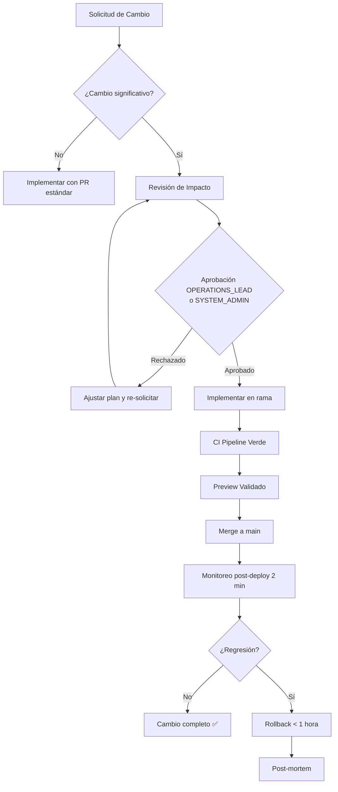

# Gestión del Cambio — VantiOps 360

> **Requisito:** REQ-27 (Bloque C-9)  
> **Nivel de datos:** REAL_DATA (proceso)  
> **Última actualización:** 2025-01-15

## 1. Introducción

Este documento define el proceso formal de gestión del cambio para VantiOps 360. Todo cambio significativo en la plataforma debe seguir este proceso para minimizar el impacto en la operación y garantizar la trazabilidad.

## 2. Definición de Cambio Significativo

Un cambio se considera **significativo** cuando cumple al menos uno de los siguientes criterios:

| Criterio | Umbral |
|----------|--------|
| Archivos modificados | > 3 archivos |
| Módulos afectados | > 2 módulos (frontend, backend, CI, docs, database) |
| Impacto en usuarios | Afecta flujo de trabajo de cualquier rol |
| Cambio de esquema | Cualquier migración de base de datos |
| Cambio de seguridad | Permisos, RBAC, auditoría, autenticación |
| Dependencias | Adición o actualización de dependencia externa |

## 3. Proceso de Cambio

### 3.1 Flujo de Aprobación



### 3.2 Etapas del Proceso

| Etapa | Descripción | Responsable | Tiempo máximo |
|-------|-------------|-------------|---------------|
| 1. Solicitud | Crear RFC (Request for Change) con plantilla | Solicitante | — |
| 2. Clasificación | Determinar si es cambio significativo | OPERATIONS_LEAD | 1 día hábil |
| 3. Revisión de impacto | Evaluar archivos, módulos, riesgos | OPERATIONS_LEAD / SYSTEM_ADMIN | 2 días hábiles |
| 4. Aprobación | Aprobar o rechazar con justificación | OPERATIONS_LEAD / SYSTEM_ADMIN | 1 día hábil |
| 5. Implementación | Desarrollar en rama separada | Desarrollador asignado | Según complejidad |
| 6. Validación CI | Pipeline completo verde | Automático (GitHub Actions) | 15 minutos |
| 7. Preview | Verificar en Vercel Preview | QA / Solicitante | 1 día hábil |
| 8. Deploy | Merge a main → producción | SYSTEM_ADMIN | Inmediato |
| 9. Monitoreo | Health checks post-deploy | Automático + OPERATIONS_LEAD | 2 minutos |
| 10. Cierre | Registrar en changelog | Desarrollador | Mismo día |

## 4. Revisión de Impacto

### 4.1 Criterios de Evaluación

Cada cambio significativo requiere evaluar:

| Dimensión | Preguntas clave | Peso |
|-----------|----------------|------|
| **Disponibilidad** | ¿Requiere downtime? ¿Afecta endpoints operativos? | Alto |
| **Seguridad** | ¿Modifica RBAC, auth o auditoría? | Alto |
| **Datos** | ¿Altera esquema o integridad de datos? | Alto |
| **Rendimiento** | ¿Impacta latencia P95 (< 2s)? | Medio |
| **Usuarios** | ¿Cambia flujos de trabajo de algún rol? | Medio |
| **Reversibilidad** | ¿Existe plan de rollback probado? | Alto |
| **Dependencias** | ¿Introduce nuevas dependencias externas? | Bajo |

### 4.2 Plantilla de Revisión de Impacto

```markdown
## Revisión de Impacto — [Título del Cambio]

**Fecha:** YYYY-MM-DD
**Solicitante:** [nombre / rol]
**Aprobador:** [OPERATIONS_LEAD o SYSTEM_ADMIN]

### Descripción del cambio
[Qué se va a hacer y por qué]

### Archivos y módulos afectados
- [ ] frontend/ (especificar)
- [ ] backend/ (especificar)
- [ ] database/ (especificar)
- [ ] .github/ (especificar)
- [ ] docs/ (especificar)

### Impacto esperado
[Descripción del efecto en usuarios y operación]

### Plan de rollback
[Pasos específicos para revertir si hay regresión]

### Responsable de ejecución
[Nombre y rol]

### Fecha de ejecución planificada
[YYYY-MM-DD]

### Riesgos identificados
| Riesgo | Probabilidad | Mitigación |
|--------|-------------|------------|
| ... | Alta/Media/Baja | ... |

### Decisión
- [ ] Aprobado
- [ ] Rechazado — Razón: ___
```

## 5. Matriz RACI

### 5.1 Procesos de Cambio

| Actividad | SYSTEM_ADMIN | OPERATIONS_LEAD | ANALYST | LEGAL_APPROVER | VP_APPROVER | CONTRACTOR_OPERATOR | AUDITOR |
|-----------|:---:|:---:|:---:|:---:|:---:|:---:|:---:|
| Solicitar cambio | R/A | R/A | R | I | I | R | I |
| Clasificar cambio | C | R/A | — | — | — | — | I |
| Revisar impacto | R/A | R/A | C | C* | C* | I | I |
| Aprobar cambio | A | A | — | A** | A** | — | I |
| Implementar | R | C | R | — | — | R | — |
| Validar en Preview | C | R/A | R | — | — | R | — |
| Deploy a producción | R/A | C | — | — | — | — | I |
| Ejecutar rollback | R/A | R | — | — | — | — | I |
| Auditar cambio | I | I | — | — | — | — | R/A |

**Leyenda:** R = Responsable, A = Aprobador (Accountable), C = Consultado, I = Informado

\* Solo cuando el cambio afecta ámbito legal o VP.  
\** Solo para cambios que requieren aprobación de gobernanza (REQ-15).

### 5.2 Procesos de Operación Diaria

| Actividad | SYSTEM_ADMIN | OPERATIONS_LEAD | ANALYST | BUSINESS_OWNER | PARTNER_ADMIN | INTERN_READONLY |
|-----------|:---:|:---:|:---:|:---:|:---:|:---:|
| Ejecutar pipeline ETL | R/A | C | R | I | — | R (ingesta) |
| Gestionar anulaciones | C | R/A | R | C | — | — |
| Revisar auditoría | C | I | — | — | — | — |
| Gestionar usuarios RBAC | R/A | C | — | — | C | — |
| Gestionar partners | R/A | C | — | C | R | — |
| Generar reportes | I | R/A | R | R | R | — |
| Monitorear capacidad | C | R/A | I | I | — | — |

## 6. Conventional Commits y Changelog

### 6.1 Formato de Commits

VantiOps 360 adopta el estándar [Conventional Commits](https://www.conventionalcommits.org/) para mantener un historial de cambios trazable y generar changelogs automáticos.

#### Estructura del mensaje de commit

```
<tipo>(<alcance>): <descripción>

[cuerpo opcional]

[notas de pie opcionales]
```

#### Tipos permitidos

| Tipo | Descripción | Ejemplo |
|------|-------------|---------|
| `feat` | Nueva funcionalidad | `feat(rbac): add PARTNER_ADMIN role` |
| `fix` | Corrección de bug | `fix(pareto): correct threshold calculation` |
| `docs` | Solo documentación | `docs(erd): update entity relationships` |
| `style` | Formato, sin cambio lógico | `style(dashboard): fix indentation` |
| `refactor` | Refactorización sin cambio funcional | `refactor(etl): extract validation stage` |
| `perf` | Mejora de rendimiento | `perf(api): optimize pareto query` |
| `test` | Adición o corrección de tests | `test(rbac): add access denied scenarios` |
| `ci` | Cambios en CI/CD | `ci: add SQL validation step` |
| `chore` | Mantenimiento general | `chore: update dependencies` |
| `revert` | Revertir un commit previo | `revert: feat(rbac): add PARTNER_ADMIN role` |

#### Alcances (scopes) definidos

| Alcance | Módulo |
|---------|--------|
| `frontend` | Frontend Next.js general |
| `backend` | Backend Python general |
| `api` | Route Handlers (endpoints) |
| `rbac` | Sistema de roles y permisos |
| `audit` | Sistema de auditoría |
| `etl` | Pipeline ETL |
| `pareto` | Motor Pareto |
| `risk` | Modelo de riesgo |
| `annulations` | Máquina de estados de anulaciones |
| `migration` | Migración 600 registros |
| `capacity` | Modelo de capacidad |
| `ci` | Pipeline CI/CD |
| `db` | Migraciones de base de datos |
| `docs` | Documentación |
| `auth` | Autenticación y email |

#### Breaking Changes

Los breaking changes se indican con `!` después del tipo/alcance o con `BREAKING CHANGE:` en el pie:

```
feat(api)!: change pareto response contract

BREAKING CHANGE: field `causa_pct` renamed to `concentration_pct`
```

### 6.2 Changelog vinculado a tickets

El changelog se genera automáticamente a partir de los commits convencionales y se vincula a tickets de trabajo:

```markdown
# Changelog

## [Unreleased]

### Features
- **rbac:** implement 11 roles from Lista Maestra (#ticket-123)
- **etl:** add quarantine mechanism for failed records (#ticket-145)

### Bug Fixes
- **pareto:** fix threshold comparison using >= instead of > (#ticket-156)

### Documentation
- **docs:** create data dictionary (#ticket-100)
```

### 6.3 Generación automática de changelog

Para generar el changelog desde los commits convencionales:

```bash
# Generar changelog desde el último tag
git log --oneline --format="%s" v0.1.0..HEAD | grep -E "^(feat|fix|docs|perf|refactor)" > CHANGELOG_DRAFT.md
```

Se recomienda integrar una herramienta de generación automática (e.g., `conventional-changelog`) cuando el equipo interno lo requiera. Por ahora, el proceso es:

1. El desarrollador escribe commits siguiendo el formato Conventional Commits
2. Al completar una fase, se genera el changelog recopilando los commits
3. El changelog se vincula al ticket/issue correspondiente en el cuerpo del commit o PR

### 6.4 Vinculación con tickets

Cada commit o PR debe referenciar el ticket asociado:

```
feat(rbac): implement email validation

Implement @vanti.com.co domain check with whitelist support.
Expires entries after configured date.

Refs: #VOPS-234
Requirement: REQ-17
```

## 7. Procedimiento de Rollback

### 7.1 Tiempo máximo de rollback

| Escenario | Tiempo máximo | Método |
|-----------|---------------|--------|
| Regresión detectada por CI | 1 hora | Revert commit + re-deploy |
| Regresión reportada por usuario | 1 hora desde detección | Revert commit + re-deploy |
| Fallo de migración DB | Inmediato | Ejecutar script DOWN |
| Fallo en producción post-deploy | 3 minutos | Automático via health check |

### 7.2 Pasos de rollback

1. **Identificar** — Confirmar regresión (CI rojo o reporte verificado)
2. **Comunicar** — Notificar a OPERATIONS_LEAD y SYSTEM_ADMIN
3. **Revertir** — Ejecutar `git revert <commit>` del cambio causante
4. **Deploy** — Push del revert activa CI y deploy automático
5. **Verificar** — Confirmar que health check retorna a estado verde
6. **Documentar** — Registrar incidente con causa, impacto y resolución
7. **Post-mortem** — Análisis de causa raíz dentro de 48 horas

### 7.3 Rollback automático (post-deploy)

El sistema ejecuta health checks cada 10 segundos durante 2 minutos después de cada deploy. Si el health check falla:

1. Se revierte automáticamente a la versión anterior de Vercel
2. Si el rollback automático falla → notificación crítica al equipo
3. Se bloquea el merge hasta que se resuelva el issue

## 8. Registro de Cambios

### 8.1 Campos obligatorios por cambio

Cada cambio significativo debe registrarse con:

| Campo | Descripción | Ejemplo |
|-------|-------------|---------|
| `id` | Identificador único | `CHG-2025-001` |
| `description` | Descripción del cambio | "Implementar RBAC middleware" |
| `impact` | Impacto esperado | "Restricción de acceso a endpoints protegidos" |
| `rollback_plan` | Plan de reversión | "Remover middleware.ts y revert commit" |
| `responsible` | Rol responsable | SYSTEM_ADMIN |
| `planned_date` | Fecha planificada | 2025-01-20 |
| `executed_date` | Fecha de ejecución real | 2025-01-20 |
| `status` | Estado actual | completed / rolled_back / pending |
| `pr_link` | Link al Pull Request | `#PR-45` |
| `commits` | Commits asociados | `abc123, def456` |

### 8.2 Ejemplo de registro

```json
{
  "id": "CHG-2025-001",
  "description": "Implementar sistema RBAC con 11 roles de Lista Maestra",
  "impact": "Todos los endpoints protegidos requieren autenticación y rol válido",
  "rollback_plan": "Eliminar frontend/middleware.ts, revert migrations 001-005",
  "responsible": "SYSTEM_ADMIN",
  "planned_date": "2025-01-15",
  "executed_date": "2025-01-15",
  "status": "completed",
  "pr_link": "#PR-12",
  "commits": ["a1b2c3d", "e4f5g6h"],
  "modules_affected": ["frontend", "backend", "database"],
  "files_modified": 8,
  "ci_result": "passed",
  "regression_detected": false
}
```

## 9. Comunicación de Cambios

### 9.1 Notificaciones por tipo de cambio

| Tipo de cambio | Notificar a | Canal | Timing |
|----------------|-------------|-------|--------|
| Deploy a producción | Todo el equipo | Chat / Email | Antes del deploy |
| Cambio de RBAC | Usuarios afectados | Email | 24h antes |
| Migración de DB | OPERATIONS_LEAD, DBA | Chat | Antes de ejecutar |
| Rollback | Todo el equipo | Chat (urgente) | Inmediato |
| Nuevo endpoint | Desarrolladores | PR description | Al merge |

## 10. Métricas de Gestión del Cambio

| Métrica | Objetivo | Medición |
|---------|----------|----------|
| Tasa de éxito de cambios | ≥ 95% | Cambios completados sin rollback / total |
| Tiempo medio de rollback | < 30 minutos | Tiempo desde detección hasta resolución |
| Cambios con revisión de impacto | 100% (significativos) | Cambios con revisión / cambios significativos |
| Regresiones por fase | ≤ 1 | Regresiones detectadas por fase |
| Cumplimiento Conventional Commits | 100% | Commits conformes / total commits |

---

*Documento generado como parte de REQ-27 (Gestión del Cambio). Actualizar al completar cada fase.*
