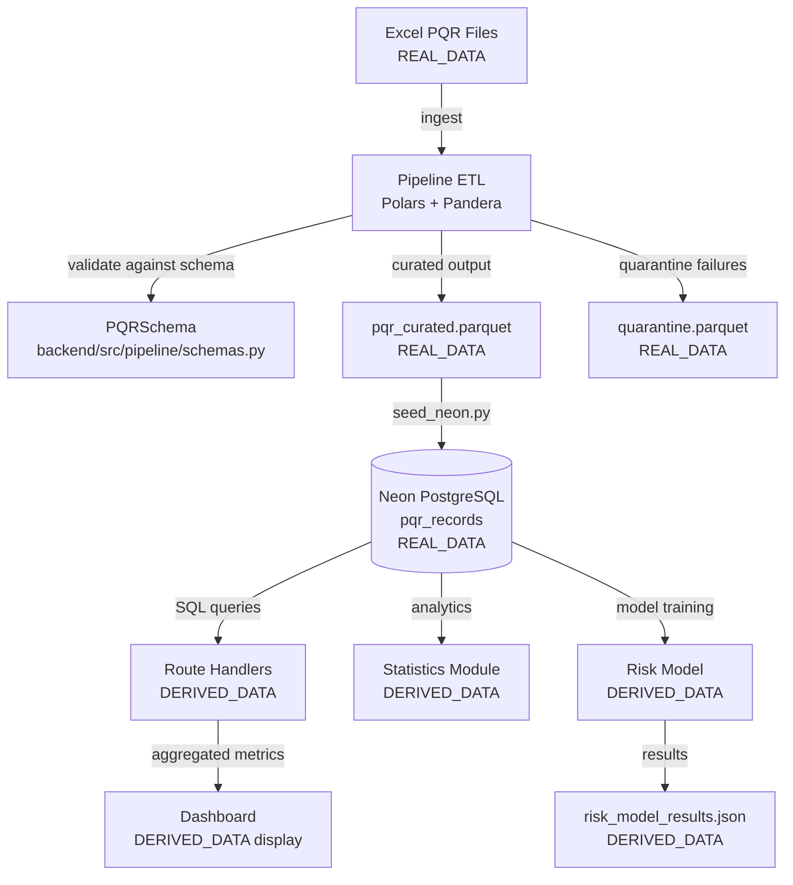

# Data Dictionary — VantiOps 360

## Overview

This document defines the data dictionary for the `pqr_records` table in the Neon PostgreSQL database. Each field is documented with its name, type, description, origin, validation rule, and example value. Fields are classified according to the data provenance taxonomy defined in the project requirements.

**Last verified:** 2025-01-15  
**Schema version:** 1.0.0  
**Source of truth:** `backend/src/pipeline/schemas.py` (Pandera DataFrameModel)

---

## Data Classification Categories

| Category | Code | Description |
|----------|------|-------------|
| Real Data | `REAL_DATA` | Data sourced from actual Vanti operational systems (Excel PQR files ingested via ETL pipeline and stored in Neon PostgreSQL) |
| Derived Data | `DERIVED_DATA` | Data computed from real data through verifiable transformations (statistics, scores, model outputs) |
| Simulated Data | `SIMULATED_DATA` | Synthetically generated data for testing, demos, or development (preserves statistical distributions but contains no real customer information) |
| Conceptual Design | `CONCEPTUAL_DESIGN` | Documented technical design representing a planned future solution not yet connected to production systems |

### Integrity Rules

- Simulated data MUST NOT be presented as real data.
- Conceptual architecture MUST NOT be presented as implemented.
- Future integrations MUST NOT be presented as productive.
- All evidence must contain only verifiable metrics.
- Assumptions must be visible and configurable.

---

## Table: `pqr_records`

**Database:** Neon PostgreSQL  
**Status:** ✅ Operational (protected — no destructive modifications allowed)  
**Record count:** 51,008 registros del dataset Entrada_PQRs suministrado para el assessment  
**Note:** Estos datos corresponden al dataset suministrado para la prueba técnica. No representan una integración productiva en tiempo real con sistemas internos de Grupo Vanti.
**Indexes:** `causa`, `estado`, `empresa`, `canal_atencion`, `fecha_creacion`, `tiempo_gestion_dias`

---

## Field Definitions

### 1. `id` (Primary Key)

| Attribute | Value |
|-----------|-------|
| **Name** | `id` |
| **Type** | `SERIAL` (PostgreSQL) / `int` (Pandera: `id_pqr`) |
| **Description** | Unique auto-incremented identifier for each PQR record in the database. Serves as the primary key for all query operations. |
| **Origin** | Database-generated sequence |
| **Classification** | `REAL_DATA` |
| **Validation Rule** | Non-nullable, unique, auto-incremented |
| **Example** | `1`, `245`, `600` |

---

### 2. `fecha_creacion`

| Attribute | Value |
|-----------|-------|
| **Name** | `fecha_creacion` |
| **Type** | `DATE` (PostgreSQL) / `date` (Python) |
| **Description** | Date when the PQR (Petición, Queja, Reclamo) was created/registered in the system. Represents the start of the management lifecycle. |
| **Origin** | Original PQR registration system (Excel source files from Vanti operations) |
| **Classification** | `REAL_DATA` |
| **Validation Rule** | Non-nullable. Must be ≥ 2020-01-01. Format: ISO-8601 date (`YYYY-MM-DD`). |
| **Example** | `2023-05-15` |

---

### 3. `fecha_cierre`

| Attribute | Value |
|-----------|-------|
| **Name** | `fecha_cierre` |
| **Type** | `DATE` (PostgreSQL) / `date` (Python) |
| **Description** | Date when the PQR was closed/resolved. Null for records that remain open or in process. Used together with `fecha_creacion` to derive `tiempo_gestion_dias`. |
| **Origin** | Original PQR registration system (Excel source files from Vanti operations) |
| **Classification** | `REAL_DATA` |
| **Validation Rule** | Nullable (null for open/in-process PQRs). When present, must be ≥ `fecha_creacion`. |
| **Example** | `2023-05-22`, `null` |

---

### 4. `estado`

| Attribute | Value |
|-----------|-------|
| **Name** | `estado` |
| **Type** | `VARCHAR(50)` (PostgreSQL) / `str` (Python) |
| **Description** | Current status of the PQR in its lifecycle. Normalized to lowercase with underscores replacing spaces during ETL ingestion. |
| **Origin** | Original PQR registration system (Excel source files from Vanti operations) |
| **Classification** | `REAL_DATA` |
| **Validation Rule** | Non-nullable. Must be one of: `cerrado`, `en_proceso`, `abierto`. |
| **Example** | `cerrado` |

---

### 5. `causa`

| Attribute | Value |
|-----------|-------|
| **Name** | `causa` |
| **Type** | `TEXT` (PostgreSQL) / `str` (Python) |
| **Description** | Root cause category assigned to the PQR. Used as the primary dimension for Pareto analysis and statistical concentration detection. Critical field for the Motor_Pareto (single source of truth for cause identification). |
| **Origin** | Original PQR registration system (Excel source files from Vanti operations) |
| **Classification** | `REAL_DATA` |
| **Validation Rule** | Non-nullable. Free text, indexed for query performance. |
| **Example** | `Cancela Servihogar a solicitud cliente`, `Facturacion`, `Revision instalaciones internas` |

---

### 6. `canal_atencion`

| Attribute | Value |
|-----------|-------|
| **Name** | `canal_atencion` |
| **Type** | `VARCHAR(100)` (PostgreSQL) / `str` (Python) |
| **Description** | Communication channel through which the PQR was received. Used for channel distribution analysis and operational capacity planning. |
| **Origin** | Original PQR registration system (Excel source files from Vanti operations) |
| **Classification** | `REAL_DATA` |
| **Validation Rule** | Non-nullable. Expected values include: `telefono`, `verbal`, `escrito`, `web`, `presencial`, `email`. |
| **Example** | `telefono` |

---

### 7. `empresa`

| Attribute | Value |
|-----------|-------|
| **Name** | `empresa` |
| **Type** | `VARCHAR(200)` (PostgreSQL) / `str` (Python) |
| **Description** | Company/business unit within the Vanti group that the PQR is associated with. Used for segmentation and organizational filtering. |
| **Origin** | Original PQR registration system (Excel source files from Vanti operations) |
| **Classification** | `REAL_DATA` |
| **Validation Rule** | Non-nullable. Expected values include: `Vanti S.A. ESP`, `Vanti Gas`, `Servihogar`. |
| **Example** | `Vanti S.A. ESP` |

---

### 8. `resultado`

| Attribute | Value |
|-----------|-------|
| **Name** | `resultado` |
| **Type** | `VARCHAR(100)` (PostgreSQL) / `str` (Python) |
| **Description** | Resolution result of the PQR. Indicates how the case was resolved (favorable to client, unfavorable, withdrawn, transferred, or pending). |
| **Origin** | Original PQR registration system (Excel source files from Vanti operations) |
| **Classification** | `REAL_DATA` |
| **Validation Rule** | Nullable (null for PQRs still in process). Expected values include: `accede`, `no_accede`, `desistimiento`, `traslado`, `pendiente`. |
| **Example** | `accede`, `no_accede`, `null` |

---

### 9. `unidad_responsable`

| Attribute | Value |
|-----------|-------|
| **Name** | `unidad_responsable` |
| **Type** | `VARCHAR(200)` (PostgreSQL) / `str` (Python) |
| **Description** | Organizational unit responsible for managing/resolving the PQR. Used for workload distribution analysis and capacity model. |
| **Origin** | Original PQR registration system (Excel source files from Vanti operations) |
| **Classification** | `REAL_DATA` |
| **Validation Rule** | Nullable (~10% null rate expected). Free text identifying the responsible unit. |
| **Example** | `Unidad Operativa Norte`, `Unidad Comercial`, `null` |

---

### 10. `marcacion`

| Attribute | Value |
|-----------|-------|
| **Name** | `marcacion` |
| **Type** | `VARCHAR(100)` (PostgreSQL) / `str` (Python) |
| **Description** | Classification marking indicating the priority or recurrence pattern of the PQR. Used for prioritization and trend analysis. |
| **Origin** | Original PQR registration system (Excel source files from Vanti operations) |
| **Classification** | `REAL_DATA` |
| **Validation Rule** | Nullable (~15% null rate expected). Expected values include: `primera_vez`, `reiterativa`, `urgente`, `seguimiento`, `normal`. |
| **Example** | `primera_vez`, `reiterativa`, `null` |

---

### 11. `motivo_cierre`

| Attribute | Value |
|-----------|-------|
| **Name** | `motivo_cierre` |
| **Type** | `TEXT` (PostgreSQL) / `str` (Python) |
| **Description** | Reason/justification for closing the PQR. Only populated for PQRs with `estado = 'cerrado'`. Provides context for resolution analysis. |
| **Origin** | Original PQR registration system (Excel source files from Vanti operations) |
| **Classification** | `REAL_DATA` |
| **Validation Rule** | Nullable (null for open/in-process PQRs). Required when `estado = 'cerrado'`. |
| **Example** | `Solicitud procesada exitosamente`, `Cliente confirma resolucion`, `null` |

---

### 12. `tiempo_gestion_dias`

| Attribute | Value |
|-----------|-------|
| **Name** | `tiempo_gestion_dias` |
| **Type** | `DOUBLE PRECISION` (PostgreSQL) / `float` (Python) |
| **Description** | Management time in days from PQR creation to closure. Primary metric for operational performance analysis. Used for descriptive statistics (mean, median, P90, P95, max, stddev) and inferential statistics (Shapiro-Wilk normality test, 95% CI). |
| **Origin** | Original PQR registration system (Excel source files from Vanti operations). May be derived from `fecha_cierre - fecha_creacion` in some contexts. |
| **Classification** | `REAL_DATA` |
| **Validation Rule** | Nullable (null for open PQRs). When present, must be ≥ 0. Numeric mean ~6.32 days, stddev ~4.5 days. |
| **Example** | `5.0`, `12.75`, `0.5` |

---

### 13. `tipo_pqr`

| Attribute | Value |
|-----------|-------|
| **Name** | `tipo_pqr` |
| **Type** | `VARCHAR(50)` (PostgreSQL) / `str` (Python) |
| **Description** | Type classification of the PQR according to Colombian regulatory framework: Petición (request), Queja (complaint), or Reclamo (claim). Determines regulatory response timelines and handling procedures. |
| **Origin** | Original PQR registration system (Excel source files from Vanti operations) |
| **Classification** | `REAL_DATA` |
| **Validation Rule** | Non-nullable. Must be one of: `peticion`, `queja`, `reclamo`. |
| **Example** | `peticion` |

---

## Derived Fields (Exposed via API, not stored in `pqr_records`)

The following fields are computed at query time or by the analytics pipeline and exposed through API endpoints. They are not stored directly in the `pqr_records` table.

### D1. `high_concentration`

| Attribute | Value |
|-----------|-------|
| **Name** | `high_concentration` |
| **Type** | `boolean` |
| **Description** | Flag indicating whether the top cause exceeds the configurable `highConcentrationThreshold` (default 40%) of total records. Exposed via `GET /api/charts/pareto`. |
| **Origin** | Computed by Motor_Pareto from `causa` frequency distribution |
| **Classification** | `DERIVED_DATA` |
| **Validation Rule** | Boolean. True when top cause share > threshold. |
| **Example** | `true` |

---

### D2. `concentration_pct`

| Attribute | Value |
|-----------|-------|
| **Name** | `concentration_pct` |
| **Type** | `float` |
| **Description** | Percentage of total PQR records attributed to the highest-frequency cause. Exposed via `GET /api/charts/pareto`. |
| **Origin** | Computed by Motor_Pareto from `causa` frequency distribution |
| **Classification** | `DERIVED_DATA` |
| **Validation Rule** | Value between 0.0 and 1.0 (proportion). |
| **Example** | `0.52` |

---

### D3. `analysis_level`

| Attribute | Value |
|-----------|-------|
| **Name** | `analysis_level` |
| **Type** | `string` (enum) |
| **Description** | Classification of the analytical depth for a cause: statistical concentration (data-driven observation), causal hypothesis (requires triangulation with process evidence), or validated root cause (requires business expert validation). |
| **Origin** | Computed by Motor_Pareto analytical logic |
| **Classification** | `DERIVED_DATA` |
| **Validation Rule** | Must be one of: `statistical_concentration`, `causal_hypothesis`, `validated_root_cause`. |
| **Example** | `statistical_concentration` |

---

### D4. `cumulative_pct`

| Attribute | Value |
|-----------|-------|
| **Name** | `cumulative_pct` |
| **Type** | `float` |
| **Description** | Cumulative percentage for Pareto chart ordering. Shows what fraction of total PQRs is explained by causes up to and including the current one. |
| **Origin** | Computed by Motor_Pareto from ordered `causa` frequency distribution |
| **Classification** | `DERIVED_DATA` |
| **Validation Rule** | Value between 0.0 and 1.0. Monotonically increasing. Last value = 1.0. |
| **Example** | `0.72` |

---

### D5. `percentage`

| Attribute | Value |
|-----------|-------|
| **Name** | `percentage` |
| **Type** | `float` |
| **Description** | Proportion of total records for a given Pareto entry (individual cause contribution). |
| **Origin** | Computed by Motor_Pareto from `causa` count / total count |
| **Classification** | `DERIVED_DATA` |
| **Validation Rule** | Value between 0.0 and 1.0. Sum of all entries = 1.0. |
| **Example** | `0.50` |

---

### D6. Descriptive Statistics Fields

| Field | Type | Description | Classification |
|-------|------|-------------|----------------|
| `avg_management_time` | `float` | Mean of `tiempo_gestion_dias` | `DERIVED_DATA` |
| `median_management_time` | `float` | Median of `tiempo_gestion_dias` | `DERIVED_DATA` |
| `p90_management_time` | `float` | 90th percentile of `tiempo_gestion_dias` | `DERIVED_DATA` |
| `p95_management_time` | `float` | 95th percentile of `tiempo_gestion_dias` | `DERIVED_DATA` |
| `max_management_time` | `float` | Maximum of `tiempo_gestion_dias` | `DERIVED_DATA` |
| `main_cause_share_pct` | `float` | Percentage share of the most frequent cause | `DERIVED_DATA` |
| `data_quality_score` | `float` | Composite quality score (0-100) from 6 dimensions | `DERIVED_DATA` |

**Origin:** Computed by `Módulo_Estadísticas` (`backend/src/statistics/descriptive.py`) and quality scoring modules.  
**Validation:** Groups with < 5 records (MIN_GROUP_SIZE) are excluded for privacy protection.

---

### D7. Risk Model Fields

| Field | Type | Description | Classification |
|-------|------|-------------|----------------|
| `precision` | `float` | Model precision metric [0, 1] | `DERIVED_DATA` |
| `recall` | `float` | Model recall metric [0, 1] | `DERIVED_DATA` |
| `f1_score` | `float` | Model F1-score [0, 1] | `DERIVED_DATA` |
| `roc_auc` | `float` | ROC-AUC metric [0, 1] | `DERIVED_DATA` |
| `feature_importance` | `array` | Feature importance rankings | `DERIVED_DATA` |

**Origin:** Computed by `Motor_Riesgo` (`backend/src/risk/model.py`). Results stored in `data/curated/risk_model_results.json`.  
**Validation:** All metrics must be in [0, 1]. Disclaimer must always be present.  
**Note:** This is an analytical demonstration, NOT a production-grade model.

---

## Summary Table

| # | Field | Type | Nullable | Classification | Indexed |
|---|-------|------|----------|----------------|---------|
| 1 | `id` | SERIAL | No | REAL_DATA | PK |
| 2 | `fecha_creacion` | DATE | No | REAL_DATA | ✅ |
| 3 | `fecha_cierre` | DATE | Yes | REAL_DATA | — |
| 4 | `estado` | VARCHAR(50) | No | REAL_DATA | ✅ |
| 5 | `causa` | TEXT | No | REAL_DATA | ✅ |
| 6 | `canal_atencion` | VARCHAR(100) | No | REAL_DATA | ✅ |
| 7 | `empresa` | VARCHAR(200) | No | REAL_DATA | ✅ |
| 8 | `resultado` | VARCHAR(100) | Yes | REAL_DATA | — |
| 9 | `unidad_responsable` | VARCHAR(200) | Yes | REAL_DATA | — |
| 10 | `marcacion` | VARCHAR(100) | Yes | REAL_DATA | — |
| 11 | `motivo_cierre` | TEXT | Yes | REAL_DATA | — |
| 12 | `tiempo_gestion_dias` | DOUBLE PRECISION | Yes | REAL_DATA | ✅ |
| 13 | `tipo_pqr` | VARCHAR(50) | No | REAL_DATA | — |

---

## Data Flow and Provenance

---

## Appendix: Categorical Value Distributions

Reference distributions observed from the operational dataset (used for synthetic data calibration):

| Field | Top Values | Approximate Distribution |
|-------|------------|--------------------------|
| `causa` | Cancela Servihogar a solicitud cliente | ~50% |
| | Facturacion | ~12% |
| | Revision instalaciones internas | ~8% |
| | Reconexion del servicio | ~7% |
| | Cobro no pactado | ~6% |
| `canal_atencion` | telefono (~40%), verbal (~25%), escrito (~15%), web (~10%) | — |
| `empresa` | Vanti S.A. ESP (~70%), Vanti Gas (~20%), Servihogar (~10%) | — |
| `estado` | cerrado (~75%), en_proceso (~20%), abierto (~5%) | — |
| `tipo_pqr` | peticion (~45%), queja (~35%), reclamo (~20%) | — |
| `resultado` | accede (~40%), no_accede (~25%), desistimiento (~15%) | — |

---

## Change Log

| Date | Version | Change | Author |
|------|---------|--------|--------|
| 2025-01-15 | 1.0.0 | Initial data dictionary created with all `pqr_records` fields | VantiOps 360 Team |
