# Entity-Relationship Diagram — VantiOps 360

## Descripción General

Este diagrama documenta el modelo de datos completo de VantiOps 360, incluyendo todas las entidades, sus atributos con tipos de datos y las relaciones con cardinalidad explícita.

### Grupos de Entidades

| Grupo | Entidades | Propósito |
|-------|-----------|-----------|
| **Autenticación y RBAC** | `roles`, `app_users`, `sessions`, `permissions`, `user_roles`, `role_permissions` | Control de acceso basado en roles con 11 roles definidos en la Lista Maestra |
| **Partners y Aprobaciones** | `partners`, `partner_authorized_emails`, `partner_applications`, `partner_application_versions`, `approval_steps`, `approval_events` | Gestión de socios, aplicaciones y flujo de aprobación con expiración de 72 horas |
| **Anulaciones** | `cancellation_requests`, `cancellation_state_history` | Máquina de estados de 6 estados para solicitudes de anulación de PQR |
| **Auditoría** | `audit_events` | Registro inmutable (append-only) de todas las acciones del sistema |
| **Migración** | `migration_batches`, `migration_records` | Seguimiento de la migración de 600 registros maestros con idempotencia |
| **Documentos** | `documents`, `document_versions` | Gestión de documentos con control de versiones |
| **Operaciones** | `operational_businesses` | Negocios operativos para el modelo de 42 usuarios |
| **Datos PQR** | `pqr_records` | Tabla principal de registros PQR (gestionada externamente, no por migraciones) |

### Convenciones

- `PK` = Primary Key
- `FK` = Foreign Key
- `UK` = Unique Key
- Todas las tablas usan UUID como identificador primario (excepto `pqr_records`)
- Timestamps en formato `TIMESTAMPTZ` (UTC con zona horaria)
- Las relaciones usan notación de Mermaid con cardinalidad explícita

---

## Diagrama ERD

```mermaid
erDiagram
    %% ============================================================
    %% GRUPO: Datos PQR (tabla existente, gestionada externamente)
    %% ============================================================

    pqr_records {
        varchar id PK
        varchar causa
        varchar empresa
        varchar canal_atencion
        varchar estado
        varchar resultado
        varchar motivo_cierre
        varchar marcacion
        varchar unidad_responsable
        varchar tipo_pqr
        date fecha_creacion
        float tiempo_gestion_dias
    }

    %% ============================================================
    %% GRUPO: Autenticación y RBAC
    %% ============================================================

    roles {
        uuid id PK
        varchar name UK "VARCHAR(50)"
        text description
        jsonb permissions "DEFAULT '[]'"
        timestamptz created_at
    }

    app_users {
        uuid id PK
        varchar email UK "VARCHAR(320)"
        varchar display_name "VARCHAR(200)"
        boolean is_active "DEFAULT true"
        timestamptz expires_at "NULL = sin expiración"
        timestamptz created_at
        timestamptz last_login_at
    }

    sessions {
        uuid id PK
        uuid user_id FK
        varchar token_hash "VARCHAR(128) SHA-256"
        inet ip_address
        text user_agent
        boolean is_active "DEFAULT true"
        timestamptz created_at
        timestamptz expires_at
        timestamptz last_activity_at
    }

    permissions {
        uuid id PK
        varchar code UK "VARCHAR(100)"
        text description
        varchar resource "VARCHAR(200)"
        varchar action "VARCHAR(50)"
    }

    user_roles {
        uuid user_id PK_FK
        uuid role_id PK_FK
        timestamptz assigned_at
        uuid assigned_by FK
    }

    role_permissions {
        uuid role_id PK_FK
        uuid permission_id PK_FK
    }

    %% ============================================================
    %% GRUPO: Partners y Aprobaciones
    %% ============================================================

    partners {
        uuid id PK
        varchar name "VARCHAR(200)"
        varchar tax_id UK "VARCHAR(20)"
        varchar contact_email "VARCHAR(320)"
        varchar status "active|inactive|suspended"
        timestamptz created_at
        timestamptz updated_at
    }

    partner_authorized_emails {
        uuid id PK
        uuid partner_id FK
        varchar email "VARCHAR(320)"
        varchar domain "VARCHAR(200)"
        timestamptz expires_at "NULL = sin expiración"
        boolean is_active "DEFAULT true"
        timestamptz created_at
    }

    partner_applications {
        uuid id PK
        uuid partner_id FK
        varchar application_type "VARCHAR(100)"
        varchar status "draft|submitted|under_review|approved|rejected|expired"
        timestamptz submitted_at
        timestamptz created_at
        timestamptz updated_at
    }

    partner_application_versions {
        uuid id PK
        uuid application_id FK
        int version_number "DEFAULT 1"
        jsonb content
        timestamptz created_at
        uuid created_by FK
    }

    approval_steps {
        uuid id PK
        uuid application_id FK
        int step_order
        varchar approver_role "VARCHAR(50)"
        varchar status "pending|approved|rejected|expired"
        uuid approved_by FK
        text justification "min 10 chars"
        timestamptz approved_at
        timestamptz expires_at "created_at + 72h"
        timestamptz created_at
    }

    approval_events {
        uuid id PK
        uuid step_id FK
        varchar event_type "requested|approved|rejected|expired|reminded"
        uuid actor_id FK
        varchar actor_role "VARCHAR(50)"
        text justification
        timestamptz timestamp
        inet ip_address
    }

    %% ============================================================
    %% GRUPO: Anulaciones (Máquina de Estados)
    %% ============================================================

    cancellation_requests {
        uuid id PK
        varchar radicado UK "VARCHAR(50)"
        varchar pqr_id FK "VARCHAR(50)"
        varchar current_state "Solicitada|En_Revision|Aprobada|Ejecutada|Cerrada|Rechazada"
        uuid requested_by FK
        timestamptz created_at
        timestamptz updated_at
    }

    cancellation_state_history {
        uuid id PK
        uuid request_id FK
        varchar from_state "VARCHAR(20)"
        varchar to_state "VARCHAR(20)"
        uuid transitioned_by FK
        varchar transitioned_by_role "VARCHAR(50)"
        text justification "min 10 chars"
        timestamptz timestamp
        inet ip_address
    }

    %% ============================================================
    %% GRUPO: Auditoría (append-only)
    %% ============================================================

    audit_events {
        uuid id PK
        timestamptz timestamp "DEFAULT NOW()"
        varchar user_id "VARCHAR(100)"
        varchar action "VARCHAR(100)"
        varchar resource "VARCHAR(500)"
        varchar result "success|failure"
        inet ip_address
        jsonb details
        uuid correlation_id
    }

    %% ============================================================
    %% GRUPO: Migración de Registros Maestros
    %% ============================================================

    migration_batches {
        uuid id PK
        varchar source_file_hash "VARCHAR(64) SHA-256"
        varchar status "running|completed|failed"
        int records_ingested "DEFAULT 0"
        int records_validated "DEFAULT 0"
        int records_quarantined "DEFAULT 0"
        float processing_duration_seconds
        jsonb errors
        timestamptz started_at
        timestamptz completed_at
    }

    migration_records {
        uuid id PK
        uuid batch_id FK
        varchar source_record_id "VARCHAR(100)"
        varchar status "migrated|quarantined|rejected"
        jsonb error_details
        timestamptz migrated_at
    }

    %% ============================================================
    %% GRUPO: Documentos
    %% ============================================================

    documents {
        uuid id PK
        varchar title "VARCHAR(500)"
        varchar document_type "VARCHAR(50)"
        uuid owner_id FK
        varchar status "DEFAULT 'draft'"
        timestamptz created_at
        timestamptz updated_at
    }

    document_versions {
        uuid id PK
        uuid document_id FK
        int version_number "DEFAULT 1"
        jsonb content
        varchar file_path "VARCHAR(500)"
        uuid created_by FK
        timestamptz created_at
    }

    %% ============================================================
    %% GRUPO: Operaciones
    %% ============================================================

    operational_businesses {
        uuid id PK
        varchar name "VARCHAR(200)"
        varchar sector "VARCHAR(100)"
        varchar contact_email "VARCHAR(320)"
        int assigned_users "DEFAULT 0"
        varchar status "active|inactive"
        timestamptz created_at
        timestamptz updated_at
    }

    %% ============================================================
    %% RELACIONES — Autenticación y RBAC
    %% ============================================================

    roles ||--o{ user_roles : "has"
    app_users ||--o{ user_roles : "assigned"
    app_users ||--o{ sessions : "has"
    roles ||--o{ role_permissions : "grants"
    permissions ||--o{ role_permissions : "given_to"

    %% ============================================================
    %% RELACIONES — Partners y Aprobaciones
    %% ============================================================

    partners ||--o{ partner_authorized_emails : "allows"
    partners ||--o{ partner_applications : "submits"
    partner_applications ||--o{ partner_application_versions : "versioned"
    partner_applications ||--o{ approval_steps : "requires"
    approval_steps ||--o{ approval_events : "logs"
    app_users ||--o{ approval_steps : "approves"
    app_users ||--o{ partner_application_versions : "creates"

    %% ============================================================
    %% RELACIONES — Anulaciones
    %% ============================================================

    cancellation_requests ||--o{ cancellation_state_history : "tracks"
    app_users ||--o{ cancellation_requests : "creates"
    cancellation_requests }o--|| pqr_records : "references"
    cancellation_state_history }o--|| app_users : "transitioned_by"

    %% ============================================================
    %% RELACIONES — Auditoría
    %% ============================================================

    app_users ||--o{ audit_events : "generates"

    %% ============================================================
    %% RELACIONES — Migración
    %% ============================================================

    migration_batches ||--o{ migration_records : "contains"

    %% ============================================================
    %% RELACIONES — Documentos
    %% ============================================================

    app_users ||--o{ documents : "uploads"
    documents ||--o{ document_versions : "versioned"
    app_users ||--o{ document_versions : "creates"
```

---

## Cardinalidad de Relaciones

| Relación | Cardinalidad | Descripción |
|----------|-------------|-------------|
| `roles` → `user_roles` | 1:N | Un rol puede asignarse a múltiples usuarios |
| `app_users` → `user_roles` | 1:N (max 1 activo) | Un usuario puede tener asignaciones de rol, pero solo 1 activa (enforced por unique index) |
| `app_users` → `sessions` | 1:N | Un usuario puede tener múltiples sesiones activas |
| `roles` → `role_permissions` | 1:N | Un rol otorga múltiples permisos |
| `permissions` → `role_permissions` | 1:N | Un permiso puede asignarse a múltiples roles |
| `partners` → `partner_authorized_emails` | 1:N | Un socio autoriza múltiples emails/dominios |
| `partners` → `partner_applications` | 1:N | Un socio puede enviar múltiples aplicaciones |
| `partner_applications` → `partner_application_versions` | 1:N | Una aplicación tiene múltiples versiones |
| `partner_applications` → `approval_steps` | 1:N | Una aplicación requiere múltiples pasos de aprobación |
| `approval_steps` → `approval_events` | 1:N | Un paso de aprobación genera múltiples eventos |
| `app_users` → `approval_steps` | 1:N | Un usuario puede aprobar múltiples pasos |
| `cancellation_requests` → `cancellation_state_history` | 1:N | Una solicitud tiene múltiples transiciones de estado |
| `app_users` → `cancellation_requests` | 1:N | Un usuario puede crear múltiples solicitudes de anulación |
| `cancellation_requests` → `pqr_records` | N:1 | Múltiples solicitudes pueden referenciar un PQR (escenario de re-solicitud) |
| `app_users` → `audit_events` | 1:N | Un usuario genera múltiples eventos de auditoría |
| `migration_batches` → `migration_records` | 1:N | Un batch contiene múltiples registros migrados |
| `app_users` → `documents` | 1:N | Un usuario puede subir múltiples documentos |
| `documents` → `document_versions` | 1:N | Un documento tiene múltiples versiones |

---

## Restricciones y Reglas de Negocio

### Autenticación y RBAC
- **Max 1 rol activo por usuario**: Enforced por `UNIQUE INDEX idx_user_active_role ON user_roles(user_id)`
- **11 roles exclusivos**: Solo los roles de la Lista Maestra son válidos
- **Expiración automática**: Usuarios con rol `INTERN_READONLY` y `CONTRACTOR_OPERATOR` usan `expires_at`

### Aprobaciones
- **Expiración 72h**: Cada `approval_step` expira automáticamente tras 72 horas
- **Justificación mínima**: 10 caracteres requeridos al aprobar o rechazar
- **Roles aprobadores**: Solo `LEGAL_APPROVER` y `VP_APPROVER`

### Anulaciones (Máquina de Estados)
- **6 estados**: Solicitada → En_Revisión → Aprobada → Ejecutada → Cerrada | Rechazada
- **Estados terminales**: `Cerrada` y `Rechazada` no tienen transiciones salientes
- **Justificación obligatoria**: Mínimo 10 caracteres en cada transición
- **Auditoría completa**: Cada transición se registra en `cancellation_state_history`

### Auditoría
- **Append-only**: No se permiten operaciones UPDATE ni DELETE sobre `audit_events`
- **Registro síncrono**: La auditoría se escribe ANTES de responder al cliente

### Migración
- **Idempotencia**: `UNIQUE (batch_id, source_record_id)` previene duplicados
- **SHA-256**: El hash del archivo fuente permite detectar reprocesamiento

---

## Índices Principales

| Tabla | Índice | Columnas | Propósito |
|-------|--------|----------|-----------|
| `roles` | `idx_roles_name` | `name` | Búsqueda rápida por nombre de rol |
| `app_users` | `idx_app_users_email` | `email` | Autenticación por email |
| `app_users` | `idx_app_users_active` | `is_active` | Filtrado de usuarios activos |
| `app_users` | `idx_app_users_expires_at` | `expires_at` (parcial) | Desactivación programada |
| `sessions` | `idx_sessions_user_id` | `user_id` | Sesiones por usuario |
| `sessions` | `idx_sessions_token_hash` | `token_hash` | Validación rápida de tokens |
| `user_roles` | `idx_user_active_role` | `user_id` (unique) | Enforce max 1 rol activo |
| `role_permissions` | `idx_role_permissions_permission_id` | `permission_id` | Búsqueda inversa de permisos |
| `partners` | `idx_partners_status` | `status` | Filtrado por estado |
| `partner_authorized_emails` | `idx_partner_emails_email` | `email` | Validación de autenticación |
| `approval_steps` | `idx_approval_steps_expires_at` | `expires_at` (parcial) | Chequeo de expiración |
| `cancellation_requests` | `idx_cancellation_state` | `current_state` | Filtrado por estado |
| `cancellation_state_history` | `idx_history_request` | `request_id` | Historial por solicitud |
| `audit_events` | `idx_audit_timestamp` | `timestamp` | Consultas cronológicas |
| `audit_events` | `idx_audit_user` | `user_id` | Eventos por usuario |
| `audit_events` | `idx_audit_action` | `action` | Filtrado por acción |
| `audit_events` | `idx_audit_resource` | `resource` | Filtrado por recurso |

---

## Notas

- La tabla `pqr_records` es gestionada externamente y no se modifica mediante migraciones del proyecto.
- Todas las migraciones usan `CREATE TABLE IF NOT EXISTS` para idempotencia.
- Cada migración incluye scripts UP y DOWN para reversibilidad.
- No se permiten operaciones destructivas (`DROP TABLE`, `TRUNCATE`, `DELETE` sin WHERE) en producción.
- **Nivel de datos**: Este artefacto documenta el esquema real implementado (`REAL_DATA`).
