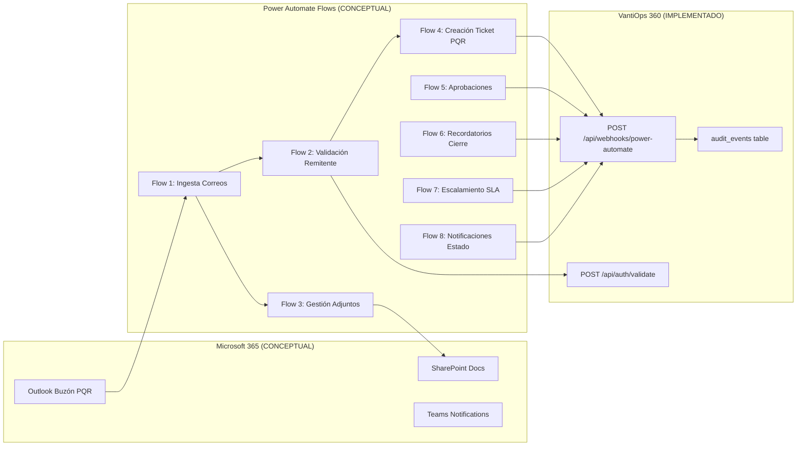
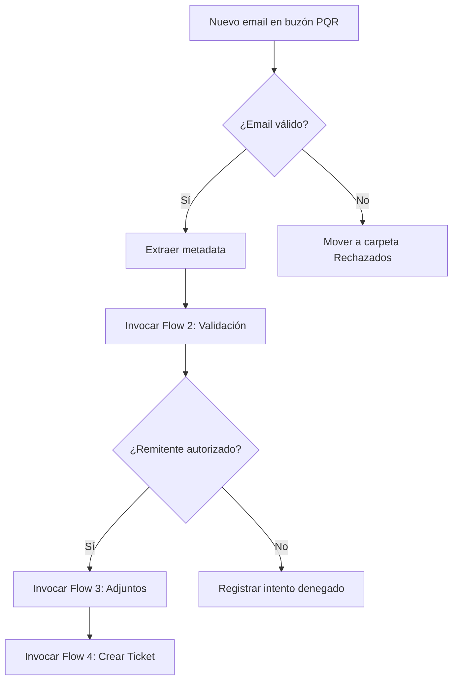
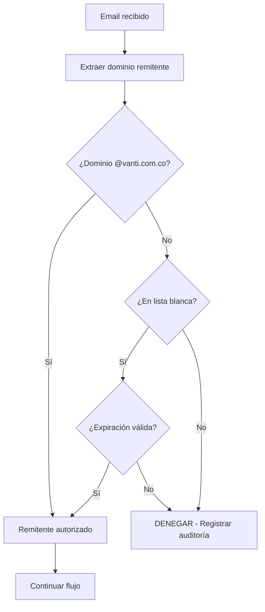
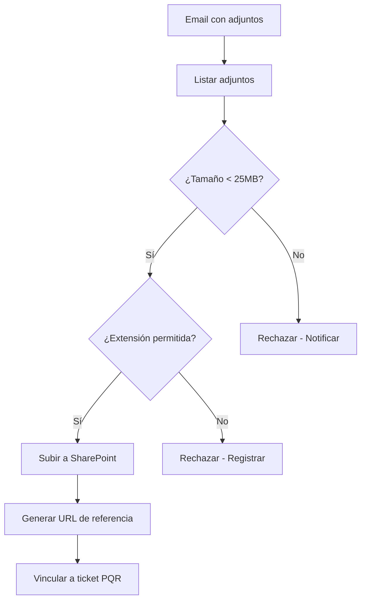
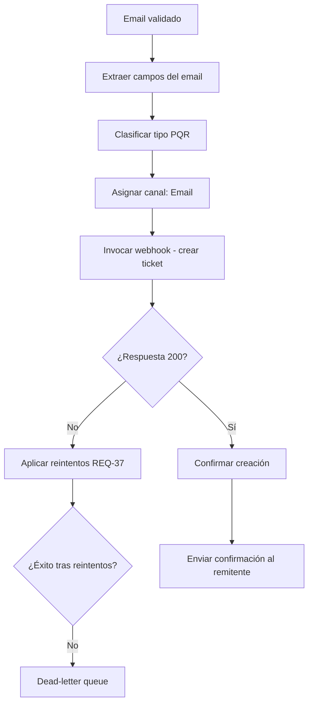
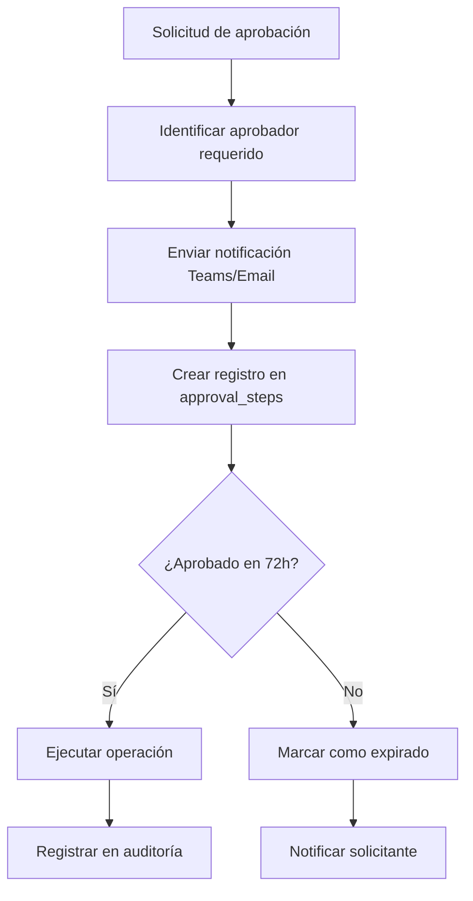
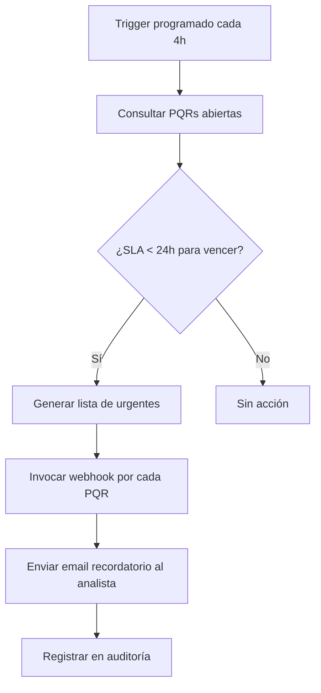
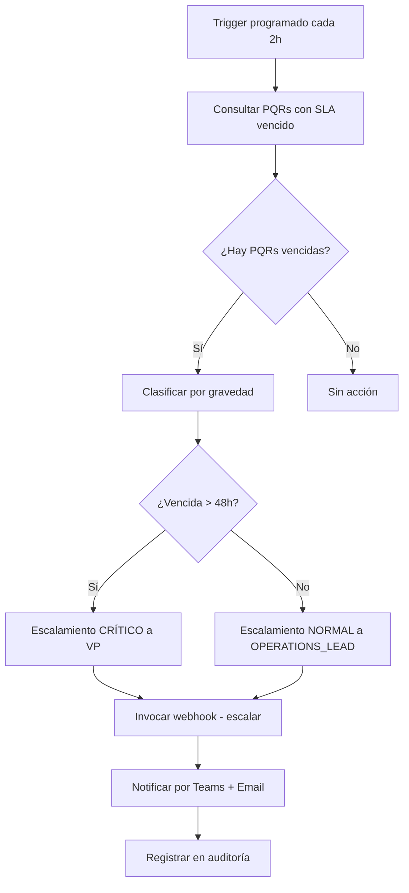
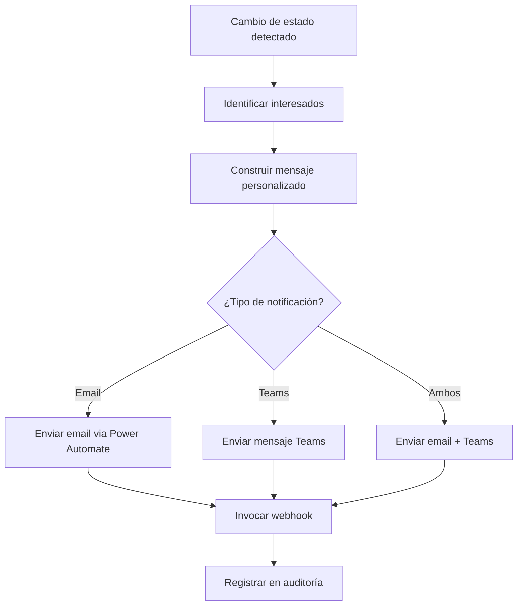

# Power Automate — Diseño Conceptual

> ⚠️ **CONCEPTUAL_DESIGN: Diseño conceptual; no conectado a Microsoft 365 productivo.**
>
> Este documento describe un diseño técnico planificado para integración con Microsoft Power Automate.
> No existe conexión productiva con Microsoft 365, Exchange, SharePoint ni ningún otro servicio Microsoft.
> El endpoint mock implementado (`/api/webhooks/power-automate`) es exclusivamente para demostración
> y validación de contratos de datos.

## 1. Resumen

Este documento define 8 flujos automatizados conceptuales de Power Automate para la gestión de PQR
en VantiOps 360. Cada flujo incluye diagrama, contratos de entrada/salida, tratamiento de errores,
seguridad, reintentos y variables de entorno requeridas.

**Nivel de datos:** CONCEPTUAL_DESIGN

**Requisitos cubiertos:** REQ-24.1, REQ-24.2, REQ-24.3, REQ-24.4, REQ-24.5

---

## 2. Arquitectura General




---

## 3. Seguridad y Autenticación

### Bearer Token

Todos los flujos de Power Automate se autentican contra el webhook mediante Bearer token:

| Parámetro | Valor | Origen |
|-----------|-------|--------|
| Tipo de autenticación | Bearer Token | Header `Authorization` |
| Variable de entorno | `POWER_AUTOMATE_WEBHOOK_SECRET` | Vercel Environment |
| Rotación | Cada 90 días | Alerta 15 días antes a SYSTEM_ADMIN |
| Validación | Comparación en tiempo constante | Prevenir timing attacks |

### Correlation ID

Cada invocación genera un `correlationId` (UUID v4) que:
- Se incluye en la respuesta al flujo de Power Automate
- Se registra en `audit_events` para trazabilidad
- Permite rastrear el flujo completo de una operación

### Variables de Entorno Requeridas

```env
# Power Automate Webhook (CONCEPTUAL_DESIGN)
POWER_AUTOMATE_WEBHOOK_SECRET=<bearer-token-256-bit>
POWER_AUTOMATE_ENABLED=false
```

---

## 4. Política de Reintentos (Referencia REQ-37)

Todos los flujos aplican la Política_Reintentos centralizada:

| Parámetro | Valor |
|-----------|-------|
| Max retries | 3 |
| Backoff inicial | 2 segundos |
| Backoff máximo | 30 segundos |
| Jitter | ±500ms |
| Errores retriable | timeout, conexión rechazada, 5xx, error de red |
| Errores NO retriable | 4xx, 401, 403, errores de negocio |

---

## 5. Flujos Diseñados

### 5.1 Flow 1: Ingesta de Correos

**Trigger:** Nuevo email recibido en buzón PQR corporativo (`pqr@vanti.com.co`)

**Frecuencia:** Tiempo real (event-driven)



#### Contrato de entrada

```json
{
  "flowId": "PA-FLOW-001-INGESTA",
  "action": "EMAIL_RECEIVED",
  "payload": {
    "messageId": "string (Exchange Message ID)",
    "from": "string (email remitente)",
    "subject": "string",
    "receivedAt": "string (ISO-8601)",
    "hasAttachments": "boolean",
    "attachmentCount": "number",
    "bodyPreview": "string (primeros 500 chars)"
  }
}
```

#### Contrato de salida

```json
{
  "received": true,
  "timestamp": "string (ISO-8601)",
  "correlationId": "string (UUID v4)",
  "flowId": "PA-FLOW-001-INGESTA",
  "status": "ACCEPTED"
}
```

#### Tratamiento de errores

| Error | Acción | Reintento |
|-------|--------|-----------|
| Token inválido (401) | Registrar en auditoría, no reintentar | No |
| Timeout (5xx) | Aplicar política REQ-37 | Sí (3 intentos) |
| Payload inválido (400) | Registrar error, notificar admin | No |

#### Controles

- Validar que `from` sea un email con formato correcto
- Verificar que `messageId` no sea duplicado (idempotencia)
- Registrar invocación en `audit_events`

---

### 5.2 Flow 2: Validación de Remitente

**Trigger:** Invocado por Flow 1 tras recepción exitosa de email

**Frecuencia:** Por evento (cada email recibido)



#### Contrato de entrada

```json
{
  "flowId": "PA-FLOW-002-VALIDACION",
  "action": "VALIDATE_SENDER",
  "payload": {
    "email": "string (email remitente)",
    "messageId": "string (referencia al email original)",
    "ipAddress": "string (IP origen si disponible)"
  }
}
```

#### Contrato de salida

```json
{
  "received": true,
  "timestamp": "string (ISO-8601)",
  "correlationId": "string (UUID v4)",
  "flowId": "PA-FLOW-002-VALIDACION",
  "status": "AUTHORIZED | DENIED"
}
```

#### Tratamiento de errores

| Error | Acción | Reintento |
|-------|--------|-----------|
| Servicio de validación no disponible (5xx) | Aplicar política REQ-37 | Sí |
| Email con formato inválido (400) | Rechazar inmediatamente | No |
| Token expirado (401) | Renovar token y reintentar | Sí (1 vez) |

#### Controles

- Llamar a `POST /api/auth/validate` para validación corporativa
- Registrar todos los intentos denegados en auditoría (REQ-17.2)
- No almacenar PII del email más allá del registro de auditoría

---

### 5.3 Flow 3: Gestión de Adjuntos

**Trigger:** Email validado con `hasAttachments: true`

**Frecuencia:** Por evento (emails con archivos adjuntos)



#### Contrato de entrada

```json
{
  "flowId": "PA-FLOW-003-ADJUNTOS",
  "action": "PROCESS_ATTACHMENTS",
  "payload": {
    "messageId": "string",
    "attachments": [
      {
        "fileName": "string",
        "contentType": "string (MIME type)",
        "sizeBytes": "number",
        "contentId": "string (Exchange Content ID)"
      }
    ],
    "targetFolder": "string (SharePoint path)"
  }
}
```

#### Contrato de salida

```json
{
  "received": true,
  "timestamp": "string (ISO-8601)",
  "correlationId": "string (UUID v4)",
  "flowId": "PA-FLOW-003-ADJUNTOS",
  "status": "PROCESSED"
}
```

#### Tratamiento de errores

| Error | Acción | Reintento |
|-------|--------|-----------|
| SharePoint no disponible (5xx) | Aplicar política REQ-37 | Sí |
| Archivo excede tamaño (400) | Rechazar, notificar remitente | No |
| Extensión no permitida (400) | Rechazar, registrar auditoría | No |

#### Controles

- Extensiones permitidas: `.pdf`, `.xlsx`, `.docx`, `.png`, `.jpg`, `.msg`
- Tamaño máximo por archivo: 25 MB
- Escaneo antivirus conceptual antes de almacenamiento
- Registro de cada archivo procesado en auditoría

---

### 5.4 Flow 4: Creación de Ticket PQR

**Trigger:** Email validado y adjuntos procesados exitosamente

**Frecuencia:** Por evento (cada email válido genera un ticket)



#### Contrato de entrada

```json
{
  "flowId": "PA-FLOW-004-TICKET",
  "action": "CREATE_PQR_TICKET",
  "payload": {
    "subject": "string (asunto del email)",
    "description": "string (cuerpo del email, sanitizado)",
    "senderEmail": "string",
    "senderName": "string",
    "receivedAt": "string (ISO-8601)",
    "channel": "Email",
    "tipoPqr": "Petición | Queja | Reclamo",
    "attachmentUrls": ["string (SharePoint URLs)"],
    "priority": "normal | high (basado en keywords)"
  }
}
```

#### Contrato de salida

```json
{
  "received": true,
  "timestamp": "string (ISO-8601)",
  "correlationId": "string (UUID v4)",
  "flowId": "PA-FLOW-004-TICKET",
  "status": "CREATED"
}
```

#### Tratamiento de errores

| Error | Acción | Reintento |
|-------|--------|-----------|
| Servicio no disponible (5xx) | Aplicar política REQ-37, DLQ si falla | Sí |
| Datos incompletos (400) | Registrar en auditoría, notificar admin | No |
| Duplicado detectado (409) | Omitir, registrar idempotencia | No |

#### Controles

- Verificar que no existe ticket duplicado por `messageId` (idempotencia)
- Sanitizar contenido HTML del cuerpo del email
- Clasificación automática de tipo PQR por keywords en subject
- Registro completo en `audit_events`

---

### 5.5 Flow 5: Aprobaciones Legal/VP

**Trigger:** Ticket PQR requiere aprobación de LEGAL_APPROVER o VP_APPROVER

**Frecuencia:** Por evento (cuando se solicita aprobación)



#### Contrato de entrada

```json
{
  "flowId": "PA-FLOW-005-APROBACIONES",
  "action": "REQUEST_APPROVAL",
  "payload": {
    "operationType": "PRODUCTION_MIGRATION | RBAC_CHANGE | DATA_DELETION | SECURITY_CONFIG_CHANGE",
    "requesterId": "string (UUID)",
    "requesterEmail": "string",
    "approverRole": "LEGAL_APPROVER | VP_APPROVER",
    "description": "string (descripción de la operación)",
    "urgency": "normal | high",
    "expiresAt": "string (ISO-8601, +72h desde solicitud)"
  }
}
```

#### Contrato de salida

```json
{
  "received": true,
  "timestamp": "string (ISO-8601)",
  "correlationId": "string (UUID v4)",
  "flowId": "PA-FLOW-005-APROBACIONES",
  "status": "NOTIFICATION_SENT"
}
```

#### Tratamiento de errores

| Error | Acción | Reintento |
|-------|--------|-----------|
| Teams API no disponible (5xx) | Aplicar política REQ-37 | Sí |
| Aprobador no encontrado (404) | Escalar a SYSTEM_ADMIN | No |
| Operación inválida (400) | Rechazar, registrar | No |

#### Controles

- Validar que `operationType` esté en la lista de operaciones autorizadas (REQ-15.3)
- Calcular `expiresAt` como solicitud + 72 horas (REQ-15.4)
- Enviar recordatorio a las 48h si no hay respuesta
- Registrar solicitud y resultado en `audit_events`

---

### 5.6 Flow 6: Recordatorios de Cierre

**Trigger:** Programado (cada 4 horas) — verifica PQRs próximos a vencer SLA

**Frecuencia:** Recurrente (cron: `0 */4 * * *`)



#### Contrato de entrada

```json
{
  "flowId": "PA-FLOW-006-RECORDATORIOS",
  "action": "SLA_REMINDER",
  "payload": {
    "pqrId": "string",
    "radicado": "string",
    "assignedAnalyst": "string (email)",
    "slaDeadline": "string (ISO-8601)",
    "hoursRemaining": "number",
    "tipoPqr": "string",
    "causa": "string"
  }
}
```

#### Contrato de salida

```json
{
  "received": true,
  "timestamp": "string (ISO-8601)",
  "correlationId": "string (UUID v4)",
  "flowId": "PA-FLOW-006-RECORDATORIOS",
  "status": "REMINDER_QUEUED"
}
```

#### Tratamiento de errores

| Error | Acción | Reintento |
|-------|--------|-----------|
| Servicio email no disponible (5xx) | Aplicar política REQ-37 | Sí |
| Analista no encontrado (404) | Escalar a OPERATIONS_LEAD | No |
| Rate limit excedido (429) | Esperar y reintentar con backoff | Sí |

#### Controles

- Throttling: máximo 100 notificaciones por ejecución (REQ-22.3)
- No enviar duplicados en la misma ventana de 4 horas
- Registrar cada recordatorio enviado en `audit_events`
- Priorizar PQRs con menor tiempo restante

---

### 5.7 Flow 7: Escalamiento por SLA

**Trigger:** SLA excedido (PQR no cerrada dentro del tiempo establecido)

**Frecuencia:** Recurrente (cron: `0 */2 * * *`) — cada 2 horas



#### Contrato de entrada

```json
{
  "flowId": "PA-FLOW-007-ESCALAMIENTO",
  "action": "SLA_ESCALATION",
  "payload": {
    "pqrId": "string",
    "radicado": "string",
    "slaDeadline": "string (ISO-8601)",
    "hoursOverdue": "number",
    "escalationLevel": "NORMAL | CRITICAL",
    "escalateTo": "OPERATIONS_LEAD | VP_APPROVER",
    "assignedAnalyst": "string (email)",
    "tipoPqr": "string",
    "causa": "string"
  }
}
```

#### Contrato de salida

```json
{
  "received": true,
  "timestamp": "string (ISO-8601)",
  "correlationId": "string (UUID v4)",
  "flowId": "PA-FLOW-007-ESCALAMIENTO",
  "status": "ESCALATED"
}
```

#### Tratamiento de errores

| Error | Acción | Reintento |
|-------|--------|-----------|
| Servicio de notificación caído (5xx) | Aplicar política REQ-37 | Sí |
| Destinatario no encontrado (404) | Escalar a SYSTEM_ADMIN | No |
| Error de formato (400) | Registrar y omitir | No |

#### Controles

- Umbral NORMAL: SLA vencido entre 0-48 horas → notificar OPERATIONS_LEAD
- Umbral CRITICAL: SLA vencido > 48 horas → notificar VP_APPROVER
- No duplicar escalamientos en la misma ventana de 2 horas
- Registro completo en `audit_events` con nivel de severidad

---

### 5.8 Flow 8: Notificaciones de Estado

**Trigger:** Cambio de estado en un ticket PQR o anulación

**Frecuencia:** Por evento (cada cambio de estado)



#### Contrato de entrada

```json
{
  "flowId": "PA-FLOW-008-NOTIFICACIONES",
  "action": "STATE_CHANGE_NOTIFICATION",
  "payload": {
    "entityType": "PQR | ANNULATION",
    "entityId": "string",
    "radicado": "string",
    "previousState": "string",
    "newState": "string",
    "changedBy": "string (email del usuario que hizo el cambio)",
    "changedAt": "string (ISO-8601)",
    "notifyTo": ["string (emails de interesados)"],
    "notificationChannel": "EMAIL | TEAMS | BOTH",
    "message": "string (mensaje personalizado)"
  }
}
```

#### Contrato de salida

```json
{
  "received": true,
  "timestamp": "string (ISO-8601)",
  "correlationId": "string (UUID v4)",
  "flowId": "PA-FLOW-008-NOTIFICACIONES",
  "status": "NOTIFICATION_SENT"
}
```

#### Tratamiento de errores

| Error | Acción | Reintento |
|-------|--------|-----------|
| Servicio Teams no disponible (5xx) | Aplicar política REQ-37 | Sí |
| Email inválido en destinatarios (400) | Omitir ese destinatario, continuar | No |
| Rate limit (429) | Backoff exponencial | Sí |

#### Controles

- Throttling: máximo 100 notificaciones/minuto (REQ-22.3)
- No notificar al mismo usuario más de 1 vez por el mismo evento
- Sanitizar contenido del mensaje antes de envío
- Registrar éxito/fallo de cada notificación en `audit_events`

---

## 6. Resumen de Flujos

| # | Flujo | Trigger | Endpoint | Acción Principal |
|---|-------|---------|----------|-----------------|
| 1 | Ingesta de Correos | Nuevo email en buzón | POST /api/webhooks/power-automate | Registrar recepción |
| 2 | Validación Remitente | Email recibido | POST /api/auth/validate | Verificar dominio autorizado |
| 3 | Gestión de Adjuntos | Email con archivos | POST /api/webhooks/power-automate | Procesar y almacenar |
| 4 | Creación Ticket PQR | Email validado | POST /api/webhooks/power-automate | INSERT en pqr_records |
| 5 | Aprobaciones Legal/VP | Operación requiere aprobación | POST /api/webhooks/power-automate | Notificar aprobador |
| 6 | Recordatorios Cierre | Cron cada 4h | POST /api/webhooks/power-automate | Email recordatorio |
| 7 | Escalamiento SLA | Cron cada 2h | POST /api/webhooks/power-automate | Escalar a supervisor |
| 8 | Notificaciones Estado | Cambio de estado | POST /api/webhooks/power-automate | Notificar interesados |

---

## 7. Matriz de Seguridad

| Flujo | Autenticación | Rol Requerido | Auditoría | Datos Sensibles |
|-------|---------------|---------------|-----------|-----------------|
| Ingesta Correos | Bearer Token | N/A (sistema) | Sí | Email remitente |
| Validación Remitente | Bearer Token | N/A (sistema) | Sí | Email |
| Gestión Adjuntos | Bearer Token | N/A (sistema) | Sí | Nombres archivo |
| Creación Ticket | Bearer Token | N/A (sistema) | Sí | Datos PQR |
| Aprobaciones | Bearer Token | LEGAL/VP | Sí | Operación |
| Recordatorios | Bearer Token | N/A (sistema) | Sí | Email analista |
| Escalamiento | Bearer Token | N/A (sistema) | Sí | Datos PQR |
| Notificaciones | Bearer Token | N/A (sistema) | Sí | Estado + emails |

---

## 8. Mock Funcional Implementado

### Endpoint: `POST /api/webhooks/power-automate`

**Ubicación:** `frontend/app/api/webhooks/power-automate/route.ts`

**Comportamiento:**
1. Valida Bearer token del header `Authorization`
2. Genera `correlationId` (UUID v4) para trazabilidad
3. Registra la invocación en `audit_events`
4. Retorna acknowledgment con timestamp y correlationId

**Este endpoint es funcional para demostración y pruebas de contrato.**
No ejecuta las acciones reales (no crea tickets, no envía emails, no escala).

---

## 9. Pseudocódigo por Flujo

### Flow 1 — Ingesta de Correos (pseudocódigo)

```
WHEN new_email IN mailbox("pqr@vanti.com.co"):
    metadata = extract_metadata(email)
    IF NOT is_valid_email_format(metadata.from):
        MOVE email TO "Rechazados"
        RETURN
    
    validation = CALL flow_2_validate(metadata.from)
    IF validation.status == "DENIED":
        LOG audit_event(action="EMAIL_DENIED", email=metadata.from)
        RETURN
    
    IF metadata.hasAttachments:
        CALL flow_3_attachments(metadata)
    
    CALL flow_4_create_ticket(metadata)
```

### Flow 5 — Aprobaciones (pseudocódigo)

```
WHEN approval_requested(operation, requester):
    approver = LOOKUP approver_for(operation.type)
    expires_at = NOW() + 72_HOURS
    
    notification = BUILD notification(
        to=approver.email,
        subject="Aprobación requerida: " + operation.description,
        body=format_approval_body(operation, requester, expires_at)
    )
    
    SEND notification VIA teams_and_email
    
    SCHEDULE reminder AT (expires_at - 24_HOURS):
        IF approval.status == "pending":
            SEND reminder TO approver
    
    SCHEDULE expiration AT expires_at:
        IF approval.status == "pending":
            SET approval.status = "expired"
            NOTIFY requester "Aprobación expirada, solicitar nuevamente"
```

---

> ⚠️ **CONCEPTUAL_DESIGN: Este documento es un diseño conceptual planificado.**
> No existe integración productiva con Microsoft 365, Power Automate, Teams ni Exchange.
> El mock endpoint es funcional exclusivamente para validación de contratos de datos
> y demostración del diseño propuesto.
