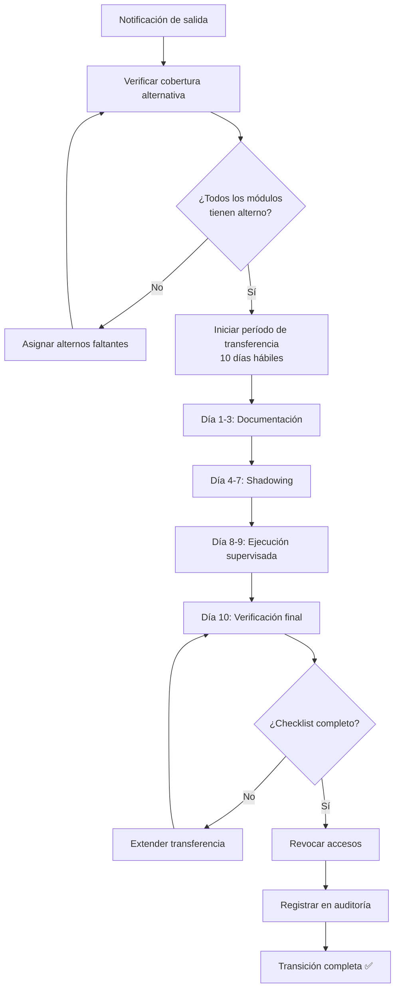

# Plan de Transición de Contratistas — VantiOps 360

> **Requisito:** REQ-28 (Bloque C-10)  
> **Nivel de datos:** REAL_DATA (proceso)  
> **Última actualización:** 2025-01-15

## 1. Introducción

Este documento define el plan estructurado de transición para contratistas (rol `CONTRACTOR_OPERATOR`) que finalizan su participación en VantiOps 360. El objetivo es garantizar la continuidad operativa, transferencia completa de conocimiento y revocación segura de accesos.

## 2. Mapeo de Responsabilidades por Contratista

### 2.1 Estructura de Responsabilidades

Cada contratista (`CONTRACTOR_OPERATOR`) debe tener documentadas sus responsabilidades con el siguiente esquema:

| Campo | Descripción | Ejemplo |
|-------|-------------|---------|
| `contractor_id` | UUID del usuario en `app_users` | `uuid-1234-...` |
| `contractor_name` | Nombre del contratista | "Juan Pérez" |
| `email` | Email corporativo / autorizado | "jperez@partner.com" |
| `start_date` | Fecha de inicio del contrato | 2024-06-01 |
| `end_date` | Fecha programada de fin (`expires_at`) | 2025-03-31 |
| `partner_id` | Organización asociada | UUID del partner |
| `modules_owned` | Módulos bajo responsabilidad | ["etl", "quality"] |
| `functions_owned` | Funcionalidades específicas | Lista detallada |
| `alternate_responsible` | Responsable alterno asignado | UUID + nombre |
| `knowledge_status` | Estado de transferencia | pending / in_progress / completed |

### 2.2 Mapeo de Funcionalidades por Módulo

| Módulo | Funcionalidades | Roles que operan | Cobertura requerida |
|--------|----------------|-----------------|---------------------|
| Pipeline ETL | Ingesta, profiling, validación, curación | CONTRACTOR_OPERATOR, ANALYST | ≥ 2 personas capacitadas |
| Análisis Pareto | Consulta y filtrado de causas principales | CONTRACTOR_OPERATOR, ANALYST | ≥ 2 personas capacitadas |
| Quality Score | Evaluación de calidad de datos | CONTRACTOR_OPERATOR, ANALYST | ≥ 1 persona capacitada |
| Estadísticas | Descriptivas e inferenciales | CONTRACTOR_OPERATOR, ANALYST | ≥ 1 persona capacitada |
| Reportes | Generación y exportación | CONTRACTOR_OPERATOR, BUSINESS_OWNER | ≥ 2 personas capacitadas |
| Ingesta de datos | Carga de archivos Excel | CONTRACTOR_OPERATOR, INTERN_READONLY | ≥ 2 personas capacitadas |

### 2.3 Plantilla de Responsabilidad Individual

```markdown
## Contratista: [Nombre]

**Email:** [email]
**Partner:** [Organización]
**Período:** [inicio] — [fin]
**Rol RBAC:** CONTRACTOR_OPERATOR

### Funcionalidades asignadas

| # | Funcionalidad | Módulo | Frecuencia | Criticidad | Alterno asignado |
|---|---------------|--------|-----------|-----------|-----------------|
| 1 | Ejecutar pipeline ETL semanal | backend/pipeline | Semanal | Alta | [Nombre] |
| 2 | Revisar quarantine y resolver | backend/pipeline | Diaria | Media | [Nombre] |
| 3 | Generar reportes de KPIs | frontend/reportes | Mensual | Media | [Nombre] |

### Documentación creada por el contratista
- [ ] Runbooks operativos
- [ ] Notas de configuración
- [ ] Scripts auxiliares documentados

### Accesos concedidos
- [ ] Repositorio GitHub (lectura + análisis)
- [ ] Dashboard VantiOps 360 (lectura)
- [ ] Base de datos Neon (lectura via app)
```

## 3. Proceso de Transición

### 3.1 Activación del Proceso

El proceso de transición se activa cuando:

1. El contratista notifica su salida (renuncia, fin de contrato)
2. El campo `expires_at` del usuario se acerca (≤ 15 días hábiles)
3. El partner notifica finalización del contrato
4. SYSTEM_ADMIN decide no renovar

### 3.2 Flujo de Transición



### 3.3 Regla de No-Desactivación sin Cobertura

**CRÍTICO:** No se permite la desactivación de un contratista sin cobertura alternativa completa, sin excepciones (REQ-28.4).

Antes de revocar accesos, se debe verificar:

- [ ] Cada funcionalidad del contratista tiene al menos 1 responsable alterno asignado
- [ ] El alterno ha completado el entrenamiento sobre la funcionalidad
- [ ] El alterno ha ejecutado la funcionalidad al menos 1 vez supervisado
- [ ] La documentación de cada funcionalidad está actualizada

## 4. Checklist de Transferencia — 10 Días Hábiles

### Día 1: Kick-off y Documentación Inicial

| # | Actividad | Responsable | Verificador | Estado |
|---|-----------|-------------|-------------|--------|
| 1.1 | Reunión de kick-off con contratista y alterno(s) | OPERATIONS_LEAD | OPERATIONS_LEAD | ☐ |
| 1.2 | Confirmar fecha de expiración en `app_users.expires_at` | SYSTEM_ADMIN | SYSTEM_ADMIN | ☐ |
| 1.3 | Identificar todas las funcionalidades del contratista | Contratista | OPERATIONS_LEAD | ☐ |
| 1.4 | Asignar responsable alterno para cada funcionalidad | OPERATIONS_LEAD | SYSTEM_ADMIN | ☐ |
| 1.5 | Crear calendario de transferencia detallado | OPERATIONS_LEAD | — | ☐ |

### Día 2: Documentación de Procesos

| # | Actividad | Responsable | Verificador | Estado |
|---|-----------|-------------|-------------|--------|
| 2.1 | Documentar procedimientos operativos (runbooks) | Contratista | Alterno | ☐ |
| 2.2 | Documentar configuraciones especiales | Contratista | SYSTEM_ADMIN | ☐ |
| 2.3 | Listar scripts y herramientas auxiliares usadas | Contratista | Alterno | ☐ |
| 2.4 | Documentar problemas conocidos y workarounds | Contratista | OPERATIONS_LEAD | ☐ |

### Día 3: Documentación de Conocimiento Tácito

| # | Actividad | Responsable | Verificador | Estado |
|---|-----------|-------------|-------------|--------|
| 3.1 | Sesión de Q&A con alterno sobre flujos diarios | Contratista | Alterno | ☐ |
| 3.2 | Documentar decisiones de diseño y rationale | Contratista | OPERATIONS_LEAD | ☐ |
| 3.3 | Mapear contactos clave y canales de comunicación | Contratista | OPERATIONS_LEAD | ☐ |
| 3.4 | Documentar métricas y umbrales operativos | Contratista | Alterno | ☐ |

### Día 4-5: Shadowing (Observación)

| # | Actividad | Responsable | Verificador | Estado |
|---|-----------|-------------|-------------|--------|
| 4.1 | Alterno observa ejecución de pipeline ETL | Alterno | Contratista | ☐ |
| 4.2 | Alterno observa resolución de quarantine | Alterno | Contratista | ☐ |
| 4.3 | Alterno observa generación de reportes | Alterno | Contratista | ☐ |
| 4.4 | Alterno observa manejo de incidentes/errores | Alterno | Contratista | ☐ |
| 4.5 | Registrar preguntas y áreas de confusión | Alterno | OPERATIONS_LEAD | ☐ |

### Día 6-7: Shadowing (Hands-on supervisado)

| # | Actividad | Responsable | Verificador | Estado |
|---|-----------|-------------|-------------|--------|
| 6.1 | Alterno ejecuta pipeline ETL con supervisión | Alterno | Contratista | ☐ |
| 6.2 | Alterno resuelve quarantine records supervisado | Alterno | Contratista | ☐ |
| 6.3 | Alterno genera reportes con supervisión | Alterno | Contratista | ☐ |
| 6.4 | Alterno maneja escenario de error simulado | Alterno | Contratista | ☐ |
| 6.5 | Sesión de retroalimentación sobre ejecución | Contratista + Alterno | OPERATIONS_LEAD | ☐ |

### Día 8-9: Ejecución Independiente

| # | Actividad | Responsable | Verificador | Estado |
|---|-----------|-------------|-------------|--------|
| 8.1 | Alterno ejecuta funcionalidades de forma independiente | Alterno | OPERATIONS_LEAD | ☐ |
| 8.2 | Contratista disponible solo para consultas | Contratista | — | ☐ |
| 8.3 | Verificar que no hay bloqueos sin intervención | OPERATIONS_LEAD | SYSTEM_ADMIN | ☐ |
| 8.4 | Documentar gaps identificados durante ejecución | Alterno | OPERATIONS_LEAD | ☐ |
| 8.5 | Resolver gaps con sesión adicional si es necesario | Contratista + Alterno | OPERATIONS_LEAD | ☐ |

### Día 10: Verificación Final y Cierre

| # | Actividad | Responsable | Verificador | Estado |
|---|-----------|-------------|-------------|--------|
| 10.1 | Verificar checklist completo (todos ☑) | OPERATIONS_LEAD | SYSTEM_ADMIN | ☐ |
| 10.2 | Confirmar cobertura alternativa para CADA funcionalidad | OPERATIONS_LEAD | SYSTEM_ADMIN | ☐ |
| 10.3 | Verificar documentación completa y accesible | OPERATIONS_LEAD | Alterno | ☐ |
| 10.4 | Reunión de cierre con contratista | OPERATIONS_LEAD | SYSTEM_ADMIN | ☐ |
| 10.5 | Confirmar revocación de accesos en fecha de expiración | SYSTEM_ADMIN | AUDITOR | ☐ |
| 10.6 | Registrar transición completa en Sistema_Auditoría | SYSTEM_ADMIN | AUDITOR | ☐ |

## 5. Revocación de Accesos

### 5.1 Proceso Automático

El sistema revoca accesos automáticamente basándose en el campo `expires_at` de la tabla `app_users`:

```
WHEN NOW() >= app_users.expires_at
  THEN SET app_users.is_active = false
  AND INSERT INTO audit_events (
    action: 'DEACTIVATE',
    resource: 'app_users/{id}',
    result: 'success',
    details: { reason: 'contract_expiration', expires_at: '...' }
  )
```

### 5.2 Accesos a Revocar

| Recurso | Método de revocación | Verificación |
|---------|---------------------|--------------|
| Dashboard VantiOps 360 | `is_active = false` → middleware deniega | Intentar login post-expiración |
| Repositorio GitHub | Remover del team en GitHub | Verificar acceso al repo |
| Neon PostgreSQL (via app) | App-level: middleware bloquea | Query con token expirado |
| Vercel Preview | Remover acceso al proyecto | Intentar acceso a preview URL |
| Canales de comunicación | Remover de grupos | Verificar membresía |

### 5.3 Auditoría de Revocación

Cada revocación genera un registro en `audit_events`:

```json
{
  "timestamp": "2025-03-31T23:59:59.000Z",
  "userId": "system",
  "action": "DEACTIVATE",
  "resource": "app_users/uuid-contractor-123",
  "result": "success",
  "ipAddress": "system",
  "details": {
    "reason": "contract_expiration",
    "contractor_name": "Juan Pérez",
    "partner": "Partner XYZ",
    "coverage_verified": true,
    "alternate_responsible": "uuid-alterno-456"
  }
}
```

## 6. Plan de Contingencia

### 6.1 Si la transferencia no se completa en 10 días

| Situación | Acción | Responsable |
|-----------|--------|-------------|
| Gaps menores (< 3 items) | Extender 3 días hábiles | OPERATIONS_LEAD |
| Gaps mayores (≥ 3 items) | Extender hasta completar | SYSTEM_ADMIN + VP_APPROVER |
| Contratista no coopera | Escalar a PARTNER_ADMIN | OPERATIONS_LEAD |
| No hay alterno disponible | Bloquear desactivación hasta asignar | SYSTEM_ADMIN |

### 6.2 Si se detecta conocimiento no transferido post-salida

1. Identificar funcionalidad afectada
2. Consultar documentación existente
3. Si es insuficiente: contactar al contratista vía partner (si aplica SLA)
4. Si no hay respuesta: reconstruir conocimiento a partir del código y logs
5. Documentar la lección aprendida para futuras transiciones

## 7. Métricas de Transición

| Métrica | Objetivo | Cálculo |
|---------|----------|---------|
| Tasa de transferencia exitosa | 100% | Transiciones completas / total transiciones |
| Días promedio de transferencia | ≤ 10 | Promedio de días usados |
| Funcionalidades con cobertura | 100% | Funcionalidades con alterno / total funcionalidades |
| Incidentes post-transición (30 días) | 0 | Incidentes atribuibles a falta de conocimiento |
| Documentación actualizada | 100% | Docs actualizados antes de cierre / total docs requeridos |

## 8. Responsabilidades por Rol en la Transición

| Rol | Responsabilidades en transición |
|-----|--------------------------------|
| **SYSTEM_ADMIN** | Gestionar `expires_at`, verificar revocación, aprobar extensiones |
| **OPERATIONS_LEAD** | Coordinar transferencia, asignar alternos, verificar checklist |
| **CONTRACTOR_OPERATOR** (saliente) | Documentar, entrenar, transferir conocimiento activamente |
| **Alterno** (cualquier rol interno) | Aprender, practicar, confirmar capacidad de operar |
| **PARTNER_ADMIN** | Coordinar con su organización, escalar si necesario |
| **AUDITOR** | Verificar que la revocación se registró correctamente |

## 9. Integración con RBAC y Auditoría

### 9.1 Eventos de Auditoría Generados

| Evento | Trigger | Detalle |
|--------|---------|---------|
| `TRANSITION_INITIATED` | Se activa el proceso | Contratista ID, fecha fin, alternos |
| `TRANSITION_DAY_COMPLETED` | Fin de cada día del checklist | Día #, items completados |
| `COVERAGE_VERIFIED` | Todos los alternos confirmados | Lista de alternos por función |
| `ACCESS_REVOKED` | `expires_at` alcanzado | Usuario desactivado, timestamp |
| `TRANSITION_COMPLETED` | Checklist 100% + accesos revocados | Resumen completo |

### 9.2 Validaciones del Sistema

El sistema impide la desactivación si:

- Existe al menos una funcionalidad sin alterno asignado
- El checklist de transferencia no está al 100%
- No se ha verificado la cobertura alternativa

```typescript
// Pseudocódigo de validación pre-desactivación
function canDeactivateContractor(userId: string): boolean {
  const responsibilities = getResponsibilities(userId);
  const allCovered = responsibilities.every(r => r.alternate_responsible !== null);
  const checklistComplete = getTransferChecklist(userId).every(item => item.completed);
  
  if (!allCovered || !checklistComplete) {
    auditLog('DEACTIVATION_BLOCKED', userId, { reason: 'incomplete_coverage' });
    return false;
  }
  return true;
}
```

---

*Documento generado como parte de REQ-28 (Transición de Contratistas). Actualizar al iniciar cada proceso de transición.*
